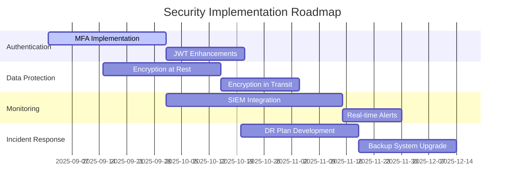

# 🔒 Security & Performance Improvement Plan

## Executive Summary

This document outlines a comprehensive strategy for enhancing security and performance in the AI Calorie Tracker application. The plan focuses on implementing robust security measures, optimizing system performance, and ensuring scalability while maintaining high standards of data protection and user experience.

## Current Security & Performance State

### Security Components
1. **Basic Authentication**: JWT-based authentication
2. **Input Validation**: Basic input sanitization
3. **Security Headers**: Standard security headers
4. **Rate Limiting**: Basic rate limiting middleware
5. **Data Encryption**: Basic encryption for sensitive data

### Performance Components
1. **Database**: MySQL with basic indexing
2. **Caching**: Limited caching implementation
3. **API Optimization**: Basic response optimization
4. **AI Service**: Direct API calls without optimization
5. **Static Assets**: Basic asset serving

### Identified Gaps
- **Security**: Missing advanced authentication mechanisms, insufficient input validation, lack of security monitoring
- **Performance**: No caching strategy, inefficient database queries, unoptimized AI API calls, poor asset optimization

## Enhanced Security Architecture

### 1. Advanced Authentication & Authorization

#### 1.1 Multi-Factor Authentication (MFA)

```typescript
// Multi-factor authentication service
export class MFAService {
  private static readonly TOTP_SECRET = process.env.TOTP_SECRET || 'your-secret-key';
  private static readonly QR_CODE_URL = 'https://api.qrserver.com/v1/create-qr-code/?size=200x200&data=';

  static async generateTOTP(userId: string): Promise<{ secret: string; qrCode: string }> {
    const secret = speakeasy.generateSecret({
      name: `AI Calorie Tracker (${userId})`,
      issuer: 'AI Calorie Tracker'
    });

    const qrCode = `${this.QR_CODE_URL}${encodeURIComponent(secret.base32!)}`;

    // Store secret securely
    await this.storeUserSecret(userId, secret.base32!);

    return {
      secret: secret.base32!,
      qrCode
    };
  }

  static async verifyTOTP(userId: string, token: string): Promise<boolean> {
    const secret = await this.getUserSecret(userId);
    if (!secret) return false;

    return speakeasy.totp.verify({
      secret: secret,
      encoding: 'base32',
      token: token,
      window: 2, // Allow 2 steps before/after current time
      step: 30
    });
  }

  static async enableMFA(userId: string, token: string): Promise<boolean> {
    const isValid = await this.verifyTOTP(userId, token);
    if (isValid) {
      await this.markMFAEnabled(userId);
      return true;
    }
    return false;
  }

  static async disableMFA(userId: string, password: string): Promise<boolean> {
    // Verify password before disabling MFA
    const user = await UserService.getUserById(userId);
    if (!user || !await bcrypt.compare(password, user.password)) {
      return false;
    }

    await this.removeUserSecret(userId);
    await this.markMFADisabled(userId);
    return true;
  }

  static async requireMFA(userId: string): Promise<boolean> {
    return await this.isMFAEnabled(userId);
  }

  private static async storeUserSecret(userId: string, secret: string): Promise<void> {
    // Store in secure database with encryption
    await db.execute(
      'UPDATE users SET mfa_secret = ?, mfa_enabled = 1 WHERE id = ?',
      [this.encryptSecret(secret), userId]
    );
  }

  private static async getUserSecret(userId: string): Promise<string | null> {
    const [users] = await db.execute(
      'SELECT mfa_secret FROM users WHERE id = ?',
      [userId]
    );

    if (users[0]?.mfa_secret) {
      return this.decryptSecret(users[0].mfa_secret);
    }
    return null;
  }

  private static async markMFAEnabled(userId: string): Promise<void> {
    await db.execute(
      'UPDATE users SET mfa_enabled = 1, mfa_enabled_at = NOW() WHERE id = ?',
      [userId]
    );
  }

  private static async markMFADisabled(userId: string): Promise<void> {
    await db.execute(
      'UPDATE users SET mfa_enabled = 0, mfa_enabled_at = NULL WHERE id = ?',
      [userId]
    );
  }

  private static async removeUserSecret(userId: string): Promise<void> {
    await db.execute(
      'UPDATE users SET mfa_secret = NULL WHERE id = ?',
      [userId]
    );
  }

  private static async isMFAEnabled(userId: string): Promise<boolean> {
    const [users] = await db.execute(
      'SELECT mfa_enabled FROM users WHERE id = ?',
      [userId]
    );

    return users[0]?.mfa_enabled === 1;
  }

  private static encryptSecret(secret: string): string {
    // Use proper encryption in production
    return Buffer.from(secret).toString('base64');
  }

  private static decryptSecret(encrypted: string): string {
    // Use proper decryption in production
    return Buffer.from(encrypted, 'base64').toString();
  }
}

// MFA middleware
export class MFAMiddleware {
  static requireMFA(req: Request, res: Response, next: NextFunction): void {
    const userId = (req as any).user?.id;
    if (!userId) {
      return res.status(401).json({ error: 'Authentication required' });
    }

    MFAService.requireMFA(userId).then(isEnabled => {
      if (isEnabled) {
        // Check for valid TOTP token
        const token = req.headers['x-mfa-token'] as string;
        if (!token) {
          return res.status(429).json({
            error: 'MFA required',
            message: 'Please provide a valid TOTP token',
            mfaRequired: true
          });
        }

        MFAService.verifyTOTP(userId, token).then(isValid => {
          if (isValid) {
            next();
          } else {
            res.status(401).json({
              error: 'Invalid MFA token',
              message: 'Please provide a valid TOTP token'
            });
          }
        }).catch(error => {
          res.status(500).json({
            error: 'MFA verification failed',
            message: 'Unable to verify MFA token'
          });
        });
      } else {
        next();
      }
    }).catch(error => {
      res.status(500).json({
        error: 'MFA check failed',
        message: 'Unable to verify MFA status'
      });
    });
  }
}
```

#### 1.2 Enhanced JWT Management

```typescript
// Advanced JWT management with refresh tokens
export class JWTService {
  private static readonly ACCESS_TOKEN_EXPIRY = '15m';
  private static readonly REFRESH_TOKEN_EXPIRY = '7d';
  private static readonly REFRESH_TOKEN_SECRET = process.env.REFRESH_TOKEN_SECRET || 'refresh-secret';

  static async generateTokens(payload: any): Promise<{
    accessToken: string;
    refreshToken: string;
    expiresAt: number;
  }> {
    const accessToken = jwt.sign(payload, process.env.JWT_SECRET!, {
      expiresIn: this.ACCESS_TOKEN_EXPIRY
    });

    const refreshToken = jwt.sign(
      { userId: payload.userId, tokenVersion: payload.tokenVersion || 1 },
      this.REFRESH_TOKEN_SECRET,
      { expiresIn: this.REFRESH_TOKEN_EXPIRY }
    );

    const expiresAt = Date.now() + (15 * 60 * 1000); // 15 minutes from now

    // Store refresh token securely
    await this.storeRefreshToken(payload.userId, refreshToken);

    return { accessToken, refreshToken, expiresAt };
  }

  static async refreshAccessToken(refreshToken: string): Promise<{
    accessToken: string;
    expiresAt: number;
  } | null> {
    try {
      const decoded = jwt.verify(refreshToken, this.REFRESH_TOKEN_SECRET) as any;
      
      // Verify refresh token exists and is valid
      const isValid = await this.verifyRefreshToken(decoded.userId, refreshToken);
      if (!isValid) {
        return null;
      }

      // Generate new access token
      const user = await UserService.getUserById(decoded.userId);
      if (!user) return null;

      const newAccessToken = jwt.sign(
        { userId: user.id, email: user.email, tokenVersion: user.token_version },
        process.env.JWT_SECRET!,
        { expiresIn: this.ACCESS_TOKEN_EXPIRY }
      );

      const expiresAt = Date.now() + (15 * 60 * 1000);

      return { accessToken: newAccessToken, expiresAt };
    } catch (error) {
      return null;
    }
  }

  static async revokeRefreshToken(refreshToken: string): Promise<void> {
    try {
      const decoded = jwt.verify(refreshToken, this.REFRESH_TOKEN_SECRET) as any;
      await this.removeRefreshToken(decoded.userId, refreshToken);
    } catch (error) {
      // Ignore errors during token revocation
    }
  }

  static async revokeAllRefreshTokens(userId: string): Promise<void> {
    await this.removeAllRefreshTokens(userId);
  }

  static async invalidateUserTokens(userId: string): Promise<void> {
    // Increment token version to invalidate all existing tokens
    await UserService.incrementTokenVersion(userId);
    await this.removeAllRefreshTokens(userId);
  }

  private static async storeRefreshToken(userId: string, refreshToken: string): Promise<void> {
    const hashedToken = await bcrypt.hash(refreshToken, 10);
    const expiresAt = new Date(Date.now() + (7 * 24 * 60 * 60 * 1000)); // 7 days

    await db.execute(
      `INSERT INTO refresh_tokens (user_id, token_hash, expires_at, created_at)
       VALUES (?, ?, ?, NOW())
       ON DUPLICATE KEY UPDATE 
       token_hash = VALUES(token_hash), 
       expires_at = VALUES(expires_at),
       updated_at = NOW()`,
      [userId, hashedToken, expiresAt]
    );
  }

  private static async verifyRefreshToken(userId: string, refreshToken: string): Promise<boolean> {
    const [tokens] = await db.execute(
      'SELECT token_hash FROM refresh_tokens WHERE user_id = ? AND expires_at > NOW()',
      [userId]
    );

    if (tokens.length === 0) return false;

    const storedToken = tokens[0].token_hash;
    return await bcrypt.compare(refreshToken, storedToken);
  }

  private static async removeRefreshToken(userId: string, refreshToken: string): Promise<void> {
    const hashedToken = await bcrypt.hash(refreshToken, 10);
    await db.execute(
      'DELETE FROM refresh_tokens WHERE user_id = ? AND token_hash = ?',
      [userId, hashedToken]
    );
  }

  private static async removeAllRefreshTokens(userId: string): Promise<void> {
    await db.execute(
      'DELETE FROM refresh_tokens WHERE user_id = ?',
      [userId]
    );
  }
}

// Enhanced authentication middleware
export class AuthMiddleware {
  static async authenticate(req: Request, res: Response, next: NextFunction): Promise<void> {
    try {
      const authHeader = req.headers.authorization;
      if (!authHeader || !authHeader.startsWith('Bearer ')) {
        return res.status(401).json({
          error: 'Invalid authentication',
          message: 'Bearer token required'
        });
      }

      const token = authHeader.substring(7);
      const decoded = jwt.verify(token, process.env.JWT_SECRET!) as any;

      // Check if token is still valid (considering token version)
      const user = await UserService.getUserById(decoded.userId);
      if (!user || user.token_version !== (decoded.tokenVersion || 1)) {
        return res.status(401).json({
          error: 'Invalid token',
          message: 'Please log in again'
        });
      }

      // Add user to request
      (req as any).user = {
        id: user.id,
        email: user.email,
        username: user.username,
        role: user.role
      };

      next();
    } catch (error) {
      res.status(401).json({
        error: 'Invalid token',
        message: 'Please provide a valid authentication token'
      });
    }
  }

  static async requireRole(roles: string[]): any {
    return (req: Request, res: Response, next: NextFunction): void => {
      const user = (req as any).user;
      if (!user || !roles.includes(user.role)) {
        return res.status(403).json({
          error: 'Insufficient permissions',
          message: 'You do not have permission to access this resource'
        });
      }
      next();
    };
  }
}
```

### 2. Advanced Input Validation & Sanitization

#### 2.1 Comprehensive Validation System

```typescript
// Advanced input validation system
export class ValidationService {
  private static readonly PATTERNS = {
    email: /^[^\s@]+@[^\s@]+\.[^\s@]+$/,
    username: /^[a-zA-Z0-9_]{3,20}$/,
    password: /^(?=.*[a-z])(?=.*[A-Z])(?=.*\d)(?=.*[@$!%*?&])[A-Za-z\d@$!%*?&]{8,}$/,
    foodName: /^[a-zA-Z0-9\s\-_',.()]{2,100}$/,
    calories: /^\d+(\.\d{1,2})?$/,
    protein: /^\d+(\.\d{1,2})?$/,
    carbs: /^\d+(\.\d{1,2})?$/,
    fat: /^\d+(\.\d{1,2})?$/,
    weight: /^\d+(\.\d{1,2})?$/,
    height: /^\d+(\.\d{1,2})?$/,
    age: /^\d{1,3}$/,
    phone: /^\+?[\d\s\-\(\)]{10,15}$/,
    url: /^https?:\/\/.+$/,
    uuid: /^[0-9a-f]{8}-[0-9a-f]{4}-[1-5][0-9a-f]{3}-[89ab][0-9a-f]{3}-[0-9a-f]{12}$/i
  };

  private static readonly RULES = {
    required: (value: any) => value !== undefined && value !== null && value !== '',
    email: (value: string) => this.PATTERNS.email.test(value),
    username: (value: string) => this.PATTERNS.username.test(value),
    password: (value: string) => this.PATTERNS.password.test(value),
    minLength: (min: number) => (value: string) => value.length >= min,
    maxLength: (max: number) => (value: string) => value.length <= max,
    min: (min: number) => (value: number) => value >= min,
    max: (max: number) => (value: number) => value <= max,
    numeric: (value: string) => /^\d+$/.test(value),
    decimal: (value: string) => /^\d+(\.\d+)?$/.test(value),
    in: (values: string[]) => (value: string) => values.includes(value),
    notIn: (values: string[]) => (value: string) => !values.includes(value),
    regex: (pattern: RegExp) => (value: string) => pattern.test(value),
    custom: (validator: (value: any) => boolean | string) => validator
  };

  static validate(schema: ValidationSchema, data: any): ValidationResult {
    const errors: ValidationError[] = [];
    const sanitizedData: any = {};

    for (const [field, rules] of Object.entries(schema)) {
      const value = data[field];
      let isValid = true;
      let sanitizedValue = value;

      for (const rule of rules) {
        const result = this.applyRule(rule, value, field);
        
        if (result !== true) {
          errors.push({
            field,
            message: result || `Invalid ${field}`,
            code: this.getErrorCode(rule)
          });
          isValid = false;
          break;
        }
      }

      if (isValid) {
        sanitizedValue = this.sanitizeValue(field, value);
        sanitizedData[field] = sanitizedValue;
      }
    }

    return {
      isValid: errors.length === 0,
      errors,
      sanitizedData
    };
  }

  private static applyRule(rule: ValidationRule, value: any, field: string): boolean | string {
    if (rule.required && !this.RULES.required(value)) {
      return `${field} is required`;
    }

    if (value === undefined || value === null || value === '') {
      return true; // Skip other rules if value is empty and not required
    }

    if (rule.type === 'string') {
      if (typeof value !== 'string') {
        return `${field} must be a string`;
      }

      if (rule.minLength && !this.RULES.minLength(rule.minLength)(value)) {
        return `${field} must be at least ${rule.minLength} characters`;
      }

      if (rule.maxLength && !this.RULES.maxLength(rule.maxLength)(value)) {
        return `${field} must be at most ${rule.maxLength} characters`;
      }

      if (rule.pattern && !this.RULES.regex(rule.pattern)(value)) {
        return `${field} format is invalid`;
      }

      if (rule.enum && !this.RULES.in(rule.enum)(value)) {
        return `${field} must be one of: ${rule.enum.join(', ')}`;
      }
    }

    if (rule.type === 'number') {
      if (typeof value !== 'number' && !this.RULES.decimal(value.toString())) {
        return `${field} must be a number`;
      }

      const numValue = parseFloat(value);
      if (rule.min !== undefined && !this.RULES.min(rule.min)(numValue)) {
        return `${field} must be at least ${rule.min}`;
      }

      if (rule.max !== undefined && !this.RULES.max(rule.max)(numValue)) {
        return `${field} must be at most ${rule.max}`;
      }
    }

    if (rule.type === 'email' && !this.RULES.email(value)) {
      return `${field} must be a valid email address`;
    }

    return true;
  }

  private static sanitizeValue(field: string, value: any): any {
    if (typeof value !== 'string') {
      return value;
    }

    switch (field) {
      case 'email':
        return this.sanitizeEmail(value);
      case 'username':
        return this.sanitizeUsername(value);
      case 'password':
        return value; // Passwords should not be sanitized, only validated
      case 'foodName':
      case 'name':
        return this.sanitizeText(value);
      case 'url':
        return this.sanitizeUrl(value);
      default:
        return this.sanitizeGeneric(value);
    }
  }

  private static sanitizeEmail(email: string): string {
    // Remove leading/trailing whitespace
    email = email.trim();
    // Convert to lowercase
    email = email.toLowerCase();
    // Remove potentially dangerous characters (keeping only email-allowed chars)
    email = email.replace(/[^a-zA-Z0-9@._-]/g, '');
    return email;
  }

  private static sanitizeUsername(username: string): string {
    // Remove leading/trailing whitespace
    username = username.trim();
    // Remove potentially dangerous characters
    username = username.replace(/[^a-zA-Z0-9_]/g, '');
    return username;
  }

  private static sanitizeText(text: string): string {
    // Remove leading/trailing whitespace
    text = text.trim();
    // Remove potentially dangerous HTML/JS characters
    text = text.replace(/[<>\"'&]/g, '');
    return text;
  }

  private static sanitizeUrl(url: string): string {
    try {
      const urlObj = new URL(url);
      // Only allow http and https protocols
      if (urlObj.protocol !== 'http:' && urlObj.protocol !== 'https:') {
        return '';
      }
      return urlObj.toString();
    } catch {
      return '';
    }
  }

  private static sanitizeGeneric(value: string): string {
    // Remove leading/trailing whitespace
    value = value.trim();
    // Remove potentially dangerous characters
    value = value.replace(/[<>\"'&]/g, '');
    return value;
  }

  private static getErrorCode(rule: ValidationRule): string {
    if (rule.required) return 'REQUIRED';
    if (rule.type === 'email') return 'INVALID_EMAIL';
    if (rule.type === 'password') return 'INVALID_PASSWORD';
    if (rule.minLength) return 'TOO_SHORT';
    if (rule.maxLength) return 'TOO_LONG';
    if (rule.min !== undefined) return 'TOO_SMALL';
    if (rule.max !== undefined) return 'TOO_LARGE';
    return 'INVALID';
  }
}

// XSS Prevention Service
export class XSSPreventionService {
  private static readonly DANGEROUS_PATTERNS = [
    /<script[^>]*>.*?<\/script>/gis,
    /<iframe[^>]*>.*?<\/iframe>/gis,
    /<object[^>]*>.*?<\/object>/gis,
    /<embed[^>]*>.*?<\/embed>/gis,
    /<applet[^>]*>.*?<\/applet>/gis,
    /<meta[^>]*>/gis,
    /<link[^>]*>/gis,
    /<style[^>]*>.*?<\/style>/gis,
    /on\w+\s*=/gis,
    /javascript:/gis,
    /vbscript:/gis,
    /data:/gis,
    /data\s*:/gis,
    /expression\s*\(/gis,
    /<\?/gis,
    /<%/gis,
    /<!\[CDATA\[/gis,
    /<!--/gis,
    /-->/gis,
  ];

  private static readonly ALLOWED_HTML_TAGS = [
    'p', 'br', 'strong', 'em', 'u', 'ol', 'ul', 'li', 'blockquote',
    'h1', 'h2', 'h3', 'h4', 'h5', 'h6', 'span', 'div', 'a'
  ];

  /**
   * Sanitize HTML content to prevent XSS attacks
   */
  static sanitizeHTML(html: string): string {
    if (!html || typeof html !== 'string') {
      return '';
    }

    // Remove dangerous patterns first
    let sanitized = html;
    for (const pattern of this.DANGEROUS_PATTERNS) {
      sanitized = sanitized.replace(pattern, '');
    }

    // Use a whitelist approach for HTML tags
    sanitized = this.sanitizeHTMLTags(sanitized);

    // Remove potentially dangerous attributes
    sanitized = this.sanitizeHTMLAttributes(sanitized);

    return sanitized;
  }

  /**
   * Sanitize HTML tags using whitelist approach
   */
  private static sanitizeHTMLTags(html: string): string {
    const tagRegex = /<\/?([a-zA-Z][a-zA-Z0-9]*)\b[^>]*>/g;
    
    return html.replace(tagRegex, (match, tagName) => {
      const normalizedTag = tagName.toLowerCase();
      
      if (this.ALLOWED_HTML_TAGS.includes(normalizedTag)) {
        // Keep the tag but remove any potentially dangerous attributes
        return match.replace(/on\w+\s*=\s*["'][^"']*["']/gi, '')
                   .replace(/javascript:/gi, '')
                   .replace(/data:/gi, '');
      }
      
      // Remove disallowed tags
      return '';
    });
  }

  /**
   * Sanitize HTML attributes
   */
  private static sanitizeHTMLAttributes(html: string): string {
    // Remove event handlers and dangerous attributes
    return html.replace(/\s+(on\w+|javascript:|data:)\s*=\s*["'][^"']*["']/gi, '')
               .replace(/\s+(style|class)\s*=\s*["'][^"']*["']/gi, '');
  }

  /**
   * Sanitize CSS to prevent CSS injection attacks
   */
  static sanitizeCSS(css: string): string {
    if (!css || typeof css !== 'string') {
      return '';
    }

    // Remove potentially dangerous CSS properties
    const dangerousPatterns = [
      /expression\s*\(/gi,
      /-moz-binding\s*:\s*url\(.*?\)/gi,
      /behavior\s*:\s*url\(.*?\)/gi,
      /javascript:/gi,
      /data:/gi,
      /@import\s+url\(.*?\)/gi,
      /@import\s+["'][^"']*["']/gi,
    ];

    let sanitized = css;
    for (const pattern of dangerousPatterns) {
      sanitized = sanitized.replace(pattern, '');
    }

    return sanitized;
  }

  /**
   * Sanitize JSON to prevent JSON injection attacks
   */
  static sanitizeJSON(jsonString: string): string {
    if (!jsonString || typeof jsonString !== 'string') {
      return '';
    }

    // Escape potentially dangerous characters
    return jsonString.replace(/[\u0000-\u001F\u007F-\u009F]/g, '')
                     .replace(/\\/g, '\\\\')
                     .replace(/"/g, '\\"');
  }

  /**
   * Sanitize file paths to prevent directory traversal attacks
   */
  static sanitizeFilePath(path: string): string {
    if (!path || typeof path !== 'string') {
      return '';
    }

    // Remove directory traversal attempts
    let sanitized = path.replace(/\.\./g, '')
                        .replace(/\.\//g, '')
                        .replace(/\/+/g, '/');

    // Remove leading/trailing slashes
    sanitized = sanitized.replace(/^\/+/, '').replace(/\/+$/, '');

    return sanitized;
  }

  /**
   * Sanitize headers to prevent header injection attacks
   */
  static sanitizeHeader(value: string): string {
    if (!value || typeof value !== 'string') {
      return '';
    }

    // Remove carriage returns and newlines
    return value.replace(/[\r\n]/g, '')
                .replace(/[\x00-\x1F\x7F]/g, '');
  }

  /**
   * Check if input contains potentially malicious content
   */
  static containsMaliciousContent(input: string): boolean {
    if (!input || typeof input !== 'string') {
      return false;
    }

    for (const pattern of this.DANGEROUS_PATTERNS) {
      if (pattern.test(input)) {
        return true;
      }
    }

    return false;
  }

  /**
   * Generate a safe context for user-generated content
   */
  static generateSafeContext(content: string, type: 'html' | 'css' | 'json' | 'text' = 'text'): string {
    switch (type) {
      case 'html':
        return this.sanitizeHTML(content);
      case 'css':
        return this.sanitizeCSS(content);
      case 'json':
        return this.sanitizeJSON(content);
      case 'text':
      default:
        return this.sanitizeText(content);
    }
  }
}

// Text sanitization helper
function sanitizeText(text: string): string {
  if (!text || typeof text !== 'string') {
    return '';
  }

  // Remove potentially dangerous characters
  return text.replace(/[<>\"'&]/g, '')
             .replace(/[\x00-\x1F\x7F]/g, '') // Remove control characters
             .trim();
}

### 2.3 SQL Injection Protection

```typescript
// SQL Injection Protection Service
export class SQLInjectionProtectionService {
  private static readonly SQL_PATTERNS = [
    /(\s|^)(SELECT|INSERT|UPDATE|DELETE|DROP|CREATE|ALTER|TRUNCATE|EXEC|UNION|JOIN|WHERE|HAVING|GROUP BY|ORDER BY|LIMIT|OFFSET|INTO|VALUES|SET|FROM|TABLE|DATABASE|SCHEMA|INDEX|VIEW|PROCEDURE|FUNCTION|TRIGGER|EVENT|GRANT|REVOKE|DENY|BACKUP|RESTORE|KILL|SHUTDOWN|START|STOP|PAUSE|RESUME|DETACH|ATTACH|VACUUM|ANALYZE|EXPLAIN|PRAGMA|SHOW|DESCRIBE|DESC|HELP|SOURCE|\.load|\.dump|\.quit|\.exit|\.read|\.edit|\.schema|\.tables|\.indexes|\.indexes|\.databases|\.database|\.timeout|\.width|\.mode|\.separator|\.output|\.once|\.explain|\.fullschema|\.headers|\.show|\.system)(\s|$)/gi,
    /(\s|^)(OR|AND|NOT|XOR|LIKE|GLOB|REGEXP|MATCH|IS|NULL|BETWEEN|IN|EXISTS|ALL|ANY|SOME|DISTINCT|GROUP|HAVING|ORDER|BY|LIMIT|OFFSET|UNION|ALL|INTERSECT|EXCEPT|FOR|UPDATE|SET|VALUES|INTO|INSERT|DELETE|UPDATE|CREATE|ALTER|DROP|TRUNCATE|RENAME|INDEX|VIEW|TRIGGER|PROCEDURE|FUNCTION|EVENT|DATABASE|SCHEMA|TABLE|COLUMN|CONSTRAINT|FOREIGN|KEY|PRIMARY|REFERENCES|CHECK|DEFAULT|UNIQUE|FULLTEXT|SPATIAL|TEMPORARY|TEMP|IF|NOT|EXISTS|CASE|WHEN|THEN|ELSE|END|BEGIN|TRANSACTION|COMMIT|ROLLBACK|SAVEPOINT|RELEASE|LOCK|UNLOCK|GRANT|REVOKE|DENY|BACKUP|RESTORE|RESTORE|DATABASE|LOG|SHUTDOWN|START|STOP|PAUSE|RESUME|DETACH|ATTACH|VACUUM|ANALYZE|EXPLAIN|PRAGMA|SHOW|DESCRIBE|DESC|HELP|SOURCE|\.load|\.dump|\.quit|\.exit|\.read|\.edit|\.schema|\.tables|\.indexes|\.databases|\.database|\.timeout|\.width|\.mode|\.separator|\.output|\.once|\.explain|\.fullschema|\.headers|\.show|\.system)(\s|$)/gi,
    /(['"])(?:\\?.)*?\1/g, // String patterns
    /(\s|^)(--|#|\/\*|\*\/)(\s|$)/gi, // SQL comments
    /(\s|^)(xp_|sp_|odbc|openrowset|opendatasource|openquery|linkedserver|master\.|msdb\.|tempdb\.|model\.|resource\.)(\s|$)/gi, // SQL Server specific
    /(\s|^)(information_schema|sys\.|pg_catalog|information_schema\.|sys\.|mysql\.|performance_schema\.)(\s|$)/gi, // Database schema patterns
    /(\s|^)(waitfor\s+delay|sleep|benchmark|pg_sleep|dbms_pipe\.receive_message|dbms_lock\.sleep)(\s|$)/gi, // Time-based patterns
    /(\s|^)(load_file|into outfile|dumpfile|select.*from.*load_file|select.*into.*outfile)(\s|$)/gi, // File operations
    /(\s|^)(cmdshell|xp_cmdshell|sp_oacreate|sp_oamethod|sp_oagetproperty|sp_oasetproperty)(\s|$)/gi, // Command execution
    /(\s|^)(declare|set|exec|execute|cast|convert|convert_tz|date_format|str_to_date|extract|year|month|day|hour|minute|second|now|current_timestamp|sysdate|getdate|dateadd|datediff|datepart|datename|dayname|monthname|yearname|quarter|week|weekday|yearweek|weekofyear|timestampdiff|timestampadd|from_unixtime|unix_timestamp|to_days|from_days|to_seconds|from_seconds|sec_to_time|time_to_sec)(\s|$)/gi, // Functions and variables
  ];

  /**
   * Check if input contains SQL injection patterns
   */
  static containsSQLInjection(input: string): boolean {
    if (!input || typeof input !== 'string') {
      return false;
    }

    for (const pattern of this.SQL_PATTERNS) {
      if (pattern.test(input)) {
        return true;
      }
    }

    return false;
  }

  /**
   * Sanitize input to prevent SQL injection
   */
  static sanitizeInput(input: any): string {
    if (input === null || input === undefined) {
      return '';
    }

    const str = String(input);
    
    // Remove SQL injection patterns
    let sanitized = str;
    for (const pattern of this.SQL_PATTERNS) {
      sanitized = sanitized.replace(pattern, '');
    }

    // Escape single quotes and backslashes
    sanitized = sanitized.replace(/'/g, "''")
                        .replace(/\\/g, '\\\\');

    return sanitized;
  }

  /**
   * Validate input against SQL injection patterns
   */
  static validateInput(input: any): { isValid: boolean; sanitized: string; errors: string[] } {
    const errors: string[] = [];
    let sanitized = String(input || '');

    if (this.containsSQLInjection(sanitized)) {
      errors.push('Input contains potentially malicious SQL patterns');
      sanitized = this.sanitizeInput(sanitized);
    }

    return {
      isValid: errors.length === 0,
      sanitized,
      errors
    };
  }

  /**
   * Generate safe parameterized query placeholders
   */
  static generateParameterizedQuery(query: string, params: any[]): { query: string; params: any[] } {
    // This is a simplified version - in practice, use your database's parameterized query support
    const placeholders = params.map((_, index) => `?${index + 1}`).join(',');
    
    return {
      query: query.replace(/\?/g, placeholders),
      params: params.map(param => this.sanitizeInput(param))
    };
  }
}

// Enhanced Query Builder with SQL Injection Protection
export class SecureQueryBuilder {
  private tableName: string;
  private whereConditions: string[] = [];
  private orderByFields: string[] = [];
  private limitValue: number | null = null;
  private offsetValue: number | null = null;
  private joins: string[] = [];
  private selectFields: string[] = ['*'];
  private groupByFields: string[] = [];
  private havingConditions: string[] = [];
  private values: any[] = [];

  constructor(tableName: string) {
    this.tableName = this.sanitizeIdentifier(tableName);
  }

  /**
   * Sanitize table/column identifiers
   */
  private sanitizeIdentifier(identifier: string): string {
    // Only allow alphanumeric characters and underscores
    return identifier.replace(/[^a-zA-Z0-9_]/g, '');
  }

  /**
   * Add safe WHERE conditions
   */
  where(column: string, operator: string, value: any): this {
    const sanitizedColumn = this.sanitizeIdentifier(column);
    const sanitizedOperator = this.sanitizeOperator(operator);
    const sanitizedValue = SQLInjectionProtectionService.sanitizeInput(value);
    
    this.whereConditions.push(`${sanitizedColumn} ${sanitizedOperator} ?`);
    this.values.push(sanitizedValue);
    
    return this;
  }

  /**
   * Add safe WHERE IN conditions
   */
  whereIn(column: string, values: any[]): this {
    const sanitizedColumn = this.sanitizeIdentifier(column);
    const placeholders = values.map(() => '?').join(',');
    
    this.whereConditions.push(`${sanitizedColumn} IN (${placeholders})`);
    this.values.push(...values.map(v => SQLInjectionProtectionService.sanitizeInput(v)));
    
    return this;
  }

  /**
   * Add safe WHERE conditions with AND logic
   */
  andWhere(column: string, operator: string, value: any): this {
    return this.where(column, operator, value);
  }

  /**
   * Add safe WHERE conditions with OR logic
   */
  orWhere(column: string, operator: string, value: any): this {
    const sanitizedColumn = this.sanitizeIdentifier(column);
    const sanitizedOperator = this.sanitizeOperator(operator);
    const sanitizedValue = SQLInjectionProtectionService.sanitizeInput(value);
    
    this.whereConditions.push(`OR ${sanitizedColumn} ${sanitizedOperator} ?`);
    this.values.push(sanitizedValue);
    
    return this;
  }

  /**
   * Sanitize SQL operators
   */
  private sanitizeOperator(operator: string): string {
    const allowedOperators = ['=', '!=', '<>', '>', '<', '>=', '<=', 'LIKE', 'NOT LIKE', 'IN', 'NOT IN', 'BETWEEN', 'NOT BETWEEN'];
    const normalizedOp = operator.toUpperCase().trim();
    
    if (!allowedOperators.includes(normalizedOp)) {
      throw new Error(`Invalid SQL operator: ${operator}`);
    }
    
    return normalizedOp;
  }

  /**
   * Add safe ORDER BY conditions
   */
  orderBy(column: string, direction: 'ASC' | 'DESC' = 'ASC'): this {
    const sanitizedColumn = this.sanitizeIdentifier(column);
    const sanitizedDirection = direction.toUpperCase() === 'DESC' ? 'DESC' : 'ASC';
    
    this.orderByFields.push(`${sanitizedColumn} ${sanitizedDirection}`);
    return this;
  }

  /**
   * Add safe LIMIT clause
   */
  limit(limit: number): this {
    this.limitValue = Math.max(0, Number(limit));
    return this;
  }

  /**
   * Add safe OFFSET clause
   */
  offset(offset: number): this {
    this.offsetValue = Math.max(0, Number(offset));
    return this;
  }

  /**
   * Add safe JOIN conditions
   */
  join(table: string, foreignKey: string, primaryKey: string, type: 'INNER' | 'LEFT' | 'RIGHT' = 'INNER'): this {
    const sanitizedTable = this.sanitizeIdentifier(table);
    const sanitizedForeignKey = this.sanitizeIdentifier(foreignKey);
    const sanitizedPrimaryKey = this.sanitizeIdentifier(primaryKey);
    const sanitizedType = type.toUpperCase();
    
    this.joins.push(`${sanitizedType} JOIN ${sanitizedTable} ON ${sanitizedForeignKey} = ${sanitizedPrimaryKey}`);
    return this;
  }

  /**
   * Add safe SELECT fields
   */
  select(fields: string[]): this {
    this.selectFields = fields.map(field => this.sanitizeIdentifier(field));
    return this;
  }

  /**
   * Add safe GROUP BY fields
   */
  groupBy(fields: string[]): this {
    this.groupByFields = fields.map(field => this.sanitizeIdentifier(field));
    return this;
  }

  /**
   * Add safe HAVING conditions
   */
  having(column: string, operator: string, value: any): this {
    const sanitizedColumn = this.sanitizeIdentifier(column);
    const sanitizedOperator = this.sanitizeOperator(operator);
    const sanitizedValue = SQLInjectionProtectionService.sanitizeInput(value);
    
    this.havingConditions.push(`${sanitizedColumn} ${sanitizedOperator} ?`);
    this.values.push(sanitizedValue);
    
    return this;
  }

  /**
   * Build the final safe SQL query
   */
  build(): { query: string; params: any[] } {
    let query = `SELECT ${this.selectFields.join(', ')} FROM ${this.tableName}`;
    
    // Add JOINs
    if (this.joins.length > 0) {
      query += ' ' + this.joins.join(' ');
    }
    
    // Add WHERE conditions
    if (this.whereConditions.length > 0) {
      query += ' WHERE ' + this.whereConditions.join(' ');
    }
    
    // Add GROUP BY
    if (this.groupByFields.length > 0) {
      query += ' GROUP BY ' + this.groupByFields.join(', ');
    }
    
    // Add HAVING conditions
    if (this.havingConditions.length > 0) {
      query += ' HAVING ' + this.havingConditions.join(' ');
    }
    
    // Add ORDER BY
    if (this.orderByFields.length > 0) {
      query += ' ORDER BY ' + this.orderByFields.join(', ');
    }
    
    // Add LIMIT
    if (this.limitValue !== null) {
      query += ' LIMIT ?';
      this.values.push(this.limitValue);
    }
    
    // Add OFFSET
    if (this.offsetValue !== null) {
      query += ' OFFSET ?';
      this.values.push(this.offsetValue);
    }
    
    return {
      query,
      params: this.values
    };
  }

  /**
   * Reset the builder
   */
  reset(): this {
    this.whereConditions = [];
    this.orderByFields = [];
    this.limitValue = null;
    this.offsetValue = null;
    this.joins = [];
    this.selectFields = ['*'];
    this.groupByFields = [];
    this.havingConditions = [];
    this.values = [];
    return this;
  }
}

// SQL Injection Middleware
export class SQLInjectionMiddleware {
  /**
   * Middleware to protect against SQL injection in request parameters
   */
  static protect(req: Request, res: Response, next: NextFunction): void {
    try {
      // Check query parameters
      for (const [key, value] of Object.entries(req.query)) {
        if (typeof value === 'string' && SQLInjectionProtectionService.containsSQLInjection(value)) {
          return res.status(400).json({
            error: 'Invalid input',
            message: 'Potential SQL injection detected in query parameters',
            field: key
          });
        }
      }

      // Check request body
      if (req.body && typeof req.body === 'object') {
        for (const [key, value] of Object.entries(req.body)) {
          if (typeof value === 'string' && SQLInjectionProtectionService.containsSQLInjection(value)) {
            return res.status(400).json({
              error: 'Invalid input',
              message: 'Potential SQL injection detected in request body',
              field: key
            });
          }
        }
      }

      // Check URL parameters
      if (req.params) {
        for (const [key, value] of Object.entries(req.params)) {
          if (typeof value === 'string' && SQLInjectionProtectionService.containsSQLInjection(value)) {
            return res.status(400).json({
              error: 'Invalid input',
              message: 'Potential SQL injection detected in URL parameters',
              field: key
            });
          }
        }
      }

      next();
    } catch (error) {
      console.error('SQL injection protection error:', error);
      res.status(500).json({
        error: 'Internal server error',
        message: 'An error occurred while processing your request'
      });
    }
  }

  /**
   * Create a parameterized query wrapper
   */
  static createParameterizedQuery(query: string, params: any[]): { query: string; params: any[] } {
    return SQLInjectionProtectionService.generateParameterizedQuery(query, params);
  }
}
```

### 2.4 CSRF Protection

```typescript
// CSRF Protection Service
export class CSRFProtectionService {
  private static readonly TOKEN_LENGTH = 32;
  private static readonly TOKEN_EXPIRY = 24 * 60 * 60 * 1000; // 24 hours
  private static readonly TOKEN_HEADER = 'X-CSRF-Token';
  private static readonly TOKEN_COOKIE = 'csrf_token';

  private static tokenStore = new Map<string, {
    token: string;
    userId: string;
    expiresAt: number;
    ipAddress: string;
    userAgent: string;
  }>();

  /**
   * Generate a new CSRF token
   */
  static generateToken(userId: string, ipAddress: string, userAgent: string): string {
    const token = this.generateRandomToken();
    const expiresAt = Date.now() + this.TOKEN_EXPIRY;

    this.tokenStore.set(token, {
      token,
      userId,
      expiresAt,
      ipAddress,
      userAgent
    });

    // Clean up expired tokens
    this.cleanupExpiredTokens();

    return token;
  }

  /**
   * Validate a CSRF token
   */
  static validateToken(token: string, userId: string, ipAddress: string, userAgent: string): boolean {
    const tokenData = this.tokenStore.get(token);
    
    if (!tokenData) {
      return false;
    }

    // Check if token is expired
    if (Date.now() > tokenData.expiresAt) {
      this.tokenStore.delete(token);
      return false;
    }

    // Check if token belongs to the same user
    if (tokenData.userId !== userId) {
      return false;
    }

    // Check if request comes from the same IP address (optional, can be disabled for certain scenarios)
    if (tokenData.ipAddress !== ipAddress) {
      return false;
    }

    // Check if user agent matches (optional, can be disabled for certain scenarios)
    if (tokenData.userAgent !== userAgent) {
      return false;
    }

    return true;
  }

  /**
   * Use a CSRF token (removes it after use)
   */
  static useToken(token: string): boolean {
    const isValid = this.tokenStore.has(token);
    if (isValid) {
      this.tokenStore.delete(token);
    }
    return isValid;
  }

  /**
   * Generate a random token
   */
  private static generateRandomToken(): string {
    const chars = 'ABCDEFGHIJKLMNOPQRSTUVWXYZabcdefghijklmnopqrstuvwxyz0123456789';
    let result = '';
    for (let i = 0; i < this.TOKEN_LENGTH; i++) {
      result += chars.charAt(Math.floor(Math.random() * chars.length));
    }
    return result;
  }

  /**
   * Clean up expired tokens
   */
  private static cleanupExpiredTokens(): void {
    const now = Date.now;
    const expiredTokens: string[] = [];

    for (const [token, data] of this.tokenStore.entries()) {
      if (now > data.expiresAt) {
        expiredTokens.push(token);
      }
    }

    expiredTokens.forEach(token => this.tokenStore.delete(token));
  }

  /**
   * Get CSRF token from request
   */
  static getTokenFromRequest(req: Request): string | null {
    // Check header first
    const headerToken = req.headers[this.TOKEN_HEADER] as string;
    if (headerToken) {
      return headerToken;
    }

    // Check cookie
    const cookieToken = req.cookies?.[this.TOKEN_COOKIE];
    if (cookieToken) {
      return cookieToken;
    }

    // Check form body
    const bodyToken = (req.body as any)?.[this.TOKEN_HEADER];
    if (bodyToken) {
      return bodyToken;
    }

    return null;
  }
  
  ## 3. Security Monitoring and Logging
  
  ### 3.1 Security Event Logging System
  
  ```typescript
  // Security Event Types
  export enum SecurityEventType {
    LOGIN_ATTEMPT = 'login_attempt',
    LOGIN_SUCCESS = 'login_success',
    LOGIN_FAILURE = 'login_failure',
    LOGOUT = 'logout',
    PASSWORD_CHANGE = 'password_change',
    PASSWORD_RESET = 'password_reset',
    ACCOUNT_LOCKOUT = 'account_lockout',
    MFA_SETUP = 'mfa_setup',
    MFA_VERIFICATION = 'mfa_verification',
    MFA_FAILURE = 'mfa_failure',
    AUTHORIZATION_FAILURE = 'authorization_failure',
    SQL_INJECTION_ATTEMPT = 'sql_injection_attempt',
    XSS_ATTEMPT = 'xss_attempt',
    CSRF_ATTEMPT = 'csrf_attempt',
    RATE_LIMIT_EXCEEDED = 'rate_limit_exceeded',
    SUSPICIOUS_ACTIVITY = 'suspicious_activity',
    SECURITY_VIOLATION = 'security_violation',
    DATA_ACCESS = 'data_access',
    DATA_MODIFICATION = 'data_modification',
    PRIVILEGE_ESCALATION = 'privilege_escalation',
    CONFIGURATION_CHANGE = 'configuration_change',
    SECURITY_ALERT = 'security_alert',
    INCIDENT_RESPONSE = 'incident_response'
  }
  
  // Security Event Severity Levels
  export enum SecurityEventSeverity {
    LOW = 'low',
    MEDIUM = 'medium',
    HIGH = 'high',
    CRITICAL = 'critical'
  }
  
  // Security Event Interface
  export interface SecurityEvent {
    id: string;
    eventType: SecurityEventType;
    severity: SecurityEventSeverity;
    userId?: string;
    username?: string;
    ipAddress: string;
    userAgent: string;
    timestamp: Date;
    description: string;
    details: Record<string, any>;
    sessionId?: string;
    resourceId?: string;
    action?: string;
    result?: 'success' | 'failure' | 'blocked';
    metadata?: Record<string, any>;
  }
  
  // Security Event Logger
  export class SecurityEventLogger {
    private static readonly EVENT_QUEUE: SecurityEvent[] = [];
    private static readonly MAX_QUEUE_SIZE = 1000;
    private static readonly FLUSH_INTERVAL = 5000; // 5 seconds
    private static flushInterval: NodeJS.Timeout | null = null;
    private static isFlushing = false;
  
    /**
     * Initialize the security event logger
     */
    static initialize(): void {
      this.startFlushInterval();
      this.setupErrorHandling();
    }
  
    /**
     * Log a security event
     */
    static async logEvent(event: Omit<SecurityEvent, 'id' | 'timestamp'>): Promise<void> {
      const securityEvent: SecurityEvent = {
        id: this.generateEventId(),
        timestamp: new Date(),
        ...event
      };
  
      // Add to queue
      this.EVENT_QUEUE.push(securityEvent);
  
      // Check if queue needs to be flushed
      if (this.EVENT_QUEUE.length >= this.MAX_QUEUE_SIZE) {
        await this.flush();
      }
  
      // Check for immediate alerts based on event severity
      if (event.severity === SecurityEventSeverity.CRITICAL ||
          event.severity === SecurityEventSeverity.HIGH) {
        await this.triggerImmediateAlert(securityEvent);
      }
    }
  
    /**
     * Log a login attempt
     */
    static async logLoginAttempt(
      username: string,
      ipAddress: string,
      userAgent: string,
      success: boolean,
      userId?: string,
      sessionId?: string
    ): Promise<void> {
      await this.logEvent({
        eventType: success ? SecurityEventType.LOGIN_SUCCESS : SecurityEventType.LOGIN_FAILURE,
        severity: success ? SecurityEventSeverity.LOW : SecurityEventSeverity.MEDIUM,
        userId,
        username,
        ipAddress,
        userAgent,
        description: success ? 'User login successful' : 'User login failed',
        details: {
          username,
          success,
          attemptTime: new Date().toISOString()
        },
        sessionId,
        action: 'login',
        result: success ? 'success' : 'failure'
      });
    }
  
    /**
     * Log a security violation
     */
    static async logSecurityViolation(
      eventType: SecurityEventType,
      severity: SecurityEventSeverity,
      description: string,
      details: Record<string, any>,
      userId?: string,
      ipAddress?: string,
      userAgent?: string
    ): Promise<void> {
      await this.logEvent({
        eventType,
        severity,
        userId,
        ipAddress: ipAddress || 'unknown',
        userAgent: userAgent || 'unknown',
        description,
        details,
        action: 'security_check',
        result: 'blocked'
      });
    }
  
    /**
     * Log suspicious activity
     */
    static async logSuspiciousActivity(
      userId: string,
      username: string,
      ipAddress: string,
      userAgent: string,
      activity: string,
      details: Record<string, any>
    ): Promise<void> {
      await this.logEvent({
        eventType: SecurityEventType.SUSPICIOUS_ACTIVITY,
        severity: SecurityEventSeverity.MEDIUM,
        userId,
        username,
        ipAddress,
        userAgent,
        description: `Suspicious activity detected: ${activity}`,
        details,
        action: 'monitor',
        result: 'detected'
      });
    }
  
    /**
     * Log data access
     */
    static async logDataAccess(
      userId: string,
      username: string,
      ipAddress: string,
      userAgent: string,
      resource: string,
      action: string,
      details: Record<string, any>
    ): Promise<void> {
      await this.logEvent({
        eventType: SecurityEventType.DATA_ACCESS,
        severity: SecurityEventSeverity.LOW,
        userId,
        username,
        ipAddress,
        userAgent,
        description: `Data access: ${action} on ${resource}`,
        details,
        resourceId: resource,
        action,
        result: 'success'
      });
    }
  
    /**
     * Log data modification
     */
    static async logDataModification(
      userId: string,
      username: string,
      ipAddress: string,
      userAgent: string,
      resource: string,
      action: string,
      details: Record<string, any>
    ): Promise<void> {
      await this.logEvent({
        eventType: SecurityEventType.DATA_MODIFICATION,
        severity: SecurityEventSeverity.MEDIUM,
        userId,
        username,
        ipAddress,
        userAgent,
        description: `Data modification: ${action} on ${resource}`,
        details,
        resourceId: resource,
        action,
        result: 'success'
      });
    }
  
    /**
     * Log privilege escalation attempt
     */
    static async logPrivilegeEscalation(
      userId: string,
      username: string,
      ipAddress: string,
      userAgent: string,
      targetPrivilege: string,
      success: boolean
    ): Promise<void> {
      await this.logEvent({
        eventType: SecurityEventType.PRIVILEGE_ESCALATION,
        severity: success ? SecurityEventSeverity.CRITICAL : SecurityEventSeverity.HIGH,
        userId,
        username,
        ipAddress,
        userAgent,
        description: success ?
          `Privilege escalation successful to ${targetPrivilege}` :
          `Privilege escalation attempt to ${targetPrivilege} blocked`,
        details: {
          targetPrivilege,
          success
        },
        action: 'privilege_escalation',
        result: success ? 'success' : 'blocked'
      });
    }
  
    /**
     * Generate unique event ID
     */
    private static generateEventId(): string {
      return `sec_${Date.now()}_${Math.random().toString(36).substr(2, 9)}`;
    }
  
    /**
     * Start flush interval
     */
    private static startFlushInterval(): void {
      if (this.flushInterval) {
        clearInterval(this.flushInterval);
      }
  
      this.flushInterval = setInterval(async () => {
        await this.flush();
      }, this.FLUSH_INTERVAL);
    }
  
    /**
     * Flush events to storage
     */
    private static async flush(): Promise<void> {
      if (this.isFlushing || this.EVENT_QUEUE.length === 0) {
        return;
      }
  
      this.isFlushing = true;
      const eventsToFlush = [...this.EVENT_QUEUE];
      this.EVENT_QUEUE.length = 0; // Clear queue
  
      try {
        // In a real implementation, this would save to database, file, or external service
        await this.saveEventsToStorage(eventsToFlush);
        
        // Also send to external monitoring service if configured
        await this.sendToMonitoringService(eventsToFlush);
      } catch (error) {
        console.error('Failed to flush security events:', error);
        // Re-queue events if flush fails
        this.EVENT_QUEUE.unshift(...eventsToFlush);
      } finally {
        this.isFlushing = false;
      }
    }
  
    /**
     * Save events to storage
     */
    private static async saveEventsToStorage(events: SecurityEvent[]): Promise<void> {
      // This would typically save to a database, file, or external service
      // For now, we'll just log to console
      console.log('Saving security events:', events.length);
      
      // Example database insertion
      /*
      for (const event of events) {
        await db.execute(
          `INSERT INTO security_events (
            id, event_type, severity, user_id, username, ip_address,
            user_agent, timestamp, description, details, session_id,
            resource_id, action, result, metadata
          ) VALUES (?, ?, ?, ?, ?, ?, ?, ?, ?, ?, ?, ?, ?, ?, ?)`,
          [
            event.id,
            event.eventType,
            event.severity,
            event.userId,
            event.username,
            event.ipAddress,
            event.userAgent,
            event.timestamp,
            event.description,
            JSON.stringify(event.details),
            event.sessionId,
            event.resourceId,
            event.action,
            event.result,
            JSON.stringify(event.metadata)
          ]
        );
      }
      */
    }
  
    /**
     * Send events to external monitoring service
     */
    private static async sendToMonitoringService(events: SecurityEvent[]): Promise<void> {
      // This would send to services like Splunk, ELK, Datadog, etc.
      const monitoringEnabled = process.env.SECURITY_MONITORING_ENABLED === 'true';
      
      if (monitoringEnabled) {
        try {
          // Example: Send to external service
          /*
          await fetch(process.env.SECURITY_MONITORING_URL, {
            method: 'POST',
            headers: {
              'Content-Type': 'application/json',
              'Authorization': `Bearer ${process.env.SECURITY_MONITORING_TOKEN}`
            },
            body: JSON.stringify({
              events: events.map(event => ({
                ...event,
                timestamp: event.timestamp.toISOString()
              }))
            })
          });
          */
        } catch (error) {
          console.error('Failed to send events to monitoring service:', error);
        }
      }
    }
  
    /**
     * Trigger immediate alert for critical events
     */
    private static async triggerImmediateAlert(event: SecurityEvent): Promise<void> {
      // Send immediate notification for critical events
      console.log('🚨 CRITICAL SECURITY ALERT:', event);
      
      // In a real implementation, this would send emails, SMS, or push notifications
      // Example: Send to Slack, PagerDuty, or other alerting systems
      /*
      if (event.severity === SecurityEventSeverity.CRITICAL) {
        await this.sendAlertToSlack(event);
        await this.sendAlertToPagerDuty(event);
      }
      */
    }
  
    /**
     * Setup error handling
     */
    private static setupErrorHandling(): void {
      // Handle uncaught exceptions
      process.on('uncaughtException', (error) => {
        this.logEvent({
          eventType: SecurityEventType.SECURITY_VIOLATION,
          severity: SecurityEventSeverity.CRITICAL,
          ipAddress: 'unknown',
          userAgent: 'unknown',
          description: 'Uncaught exception occurred',
          details: {
            error: error.message,
            stack: error.stack
          }
        });
      });
  
      // Handle unhandled promise rejections
      process.on('unhandledRejection', (reason) => {
        this.logEvent({
          eventType: SecurityEventType.SECURITY_VIOLATION,
          severity: SecurityEventSeverity.HIGH,
          ipAddress: 'unknown',
          userAgent: 'unknown',
          description: 'Unhandled promise rejection',
          details: {
            reason: String(reason)
          }
          
          ### 3.2 Real-time Security Monitoring
          
          ```typescript
          // Security Monitoring Types
          export enum MonitoringMetric {
            FAILED_LOGIN_ATTEMPTS = 'failed_login_attempts',
            SUCCESSFUL_LOGINS = 'successful_logins',
            RATE_LIMIT_EXCEEDED = 'rate_limit_exceeded',
            SQL_INJECTION_ATTEMPTS = 'sql_injection_attempts',
            XSS_ATTEMPTS = 'xss_attempts',
            CSRF_ATTEMPTS = 'csrf_attempts',
            PRIVILEGE_ESCALATION_ATTEMPTS = 'privilege_escalation_attempts',
            SUSPICIOUS_IP_ACTIVITY = 'suspicious_ip_activity',
            ANOMALOUS_USER_BEHAVIOR = 'anomalous_user_behavior',
            SECURITY_POLICY_VIOLATIONS = 'security_policy_violations',
            DATA_ACCESS_ANOMALIES = 'data_access_anomalies',
            SYSTEM_RESOURCE_USAGE = 'system_resource_usage'
          }
          
          // Security Alert Thresholds
          export interface SecurityThreshold {
            metric: MonitoringMetric;
            threshold: number;
            timeWindow: number; // in milliseconds
            severity: SecurityEventSeverity;
            enabled: boolean;
            action: 'alert' | 'block' | 'log';
          }
          
          // Real-time Security Monitor
          export class RealTimeSecurityMonitor {
            private static readonly thresholds: SecurityThreshold[] = [
              {
                metric: MonitoringMetric.FAILED_LOGIN_ATTEMPTS,
                threshold: 5,
                timeWindow: 15 * 60 * 1000, // 15 minutes
                severity: SecurityEventSeverity.HIGH,
                enabled: true,
                action: 'block'
              },
              {
                metric: MonitoringMetric.RATE_LIMIT_EXCEEDED,
                threshold: 10,
                timeWindow: 60 * 1000, // 1 minute
                severity: SecurityEventSeverity.MEDIUM,
                enabled: true,
                action: 'alert'
              },
              {
                metric: MonitoringMetric.SQL_INJECTION_ATTEMPTS,
                threshold: 1,
                timeWindow: 60 * 1000, // 1 minute
                severity: SecurityEventSeverity.CRITICAL,
                enabled: true,
                action: 'block'
              },
              {
                metric: MonitoringMetric.XSS_ATTEMPTS,
                threshold: 1,
                timeWindow: 60 * 1000, // 1 minute
                severity: SecurityEventSeverity.CRITICAL,
                enabled: true,
                action: 'block'
              },
              {
                metric: MonitoringMetric.PRIVILEGE_ESCALATION_ATTEMPTS,
                threshold: 1,
                timeWindow: 30 * 60 * 1000, // 30 minutes
                severity: SecurityEventSeverity.CRITICAL,
                enabled: true,
                action: 'block'
              }
            ];
          
            private static readonly metricData = new Map<MonitoringMetric, Array<{
              timestamp: number;
              value: number;
              metadata?: Record<string, any>;
            }>>();
          
            private static monitoringInterval: NodeJS.Timeout | null = null;
            private static readonly MONITORING_INTERVAL = 30000; // 30 seconds
          
            /**
             * Initialize the real-time security monitor
             */
            static initialize(): void {
              this.startMonitoring();
              this.initializeMetrics();
            }
          
            /**
             * Record a security metric
             */
            static recordMetric(
              metric: MonitoringMetric,
              value: number = 1,
              metadata?: Record<string, any>
            ): void {
              const now = Date.now();
              const metricData = this.metricData.get(metric) || [];
          
              // Add new data point
              metricData.push({
                timestamp: now,
                value,
                metadata
              });
          
              // Remove old data points outside time window
              const threshold = this.thresholds.find(t => t.metric === metric);
              const cutoffTime = threshold ? now - threshold.timeWindow : now - 3600000; // 1 hour default
          
              const filteredData = metricData.filter(data => data.timestamp > cutoffTime);
              this.metricData.set(metric, filteredData);
          
              // Check if threshold is exceeded
              if (threshold && threshold.enabled) {
                this.checkThreshold(metric, threshold);
              }
            }
          
            /**
             * Check if threshold is exceeded
             */
            private static async checkThreshold(metric: MonitoringMetric, threshold: SecurityThreshold): Promise<void> {
              const metricData = this.metricData.get(metric) || [];
              const totalValue = metricData.reduce((sum, data) => sum + data.value, 0);
          
              if (totalValue >= threshold.threshold) {
                await this.handleThresholdExceeded(metric, threshold, totalValue, metricData);
              }
            }
          
            /**
             * Handle threshold exceeded
             */
            private static async handleThresholdExceeded(
              metric: MonitoringMetric,
              threshold: SecurityThreshold,
              totalValue: number,
              metricData: Array<{ timestamp: number; value: number; metadata?: Record<string, any> }>
            ): Promise<void> {
              const alertMessage = `Security threshold exceeded: ${metric} reached ${totalValue} (threshold: ${threshold.threshold})`;
          
              // Log the security event
              await SecurityEventLogger.logEvent({
                eventType: this.getEventTypeFromMetric(metric),
                severity: threshold.severity,
                ipAddress: 'system',
                userAgent: 'security-monitor',
                description: alertMessage,
                details: {
                  metric,
                  totalValue,
                  threshold: threshold.threshold,
                  timeWindow: threshold.timeWindow,
                  dataPoints: metricData.length,
                  timestamp: new Date().toISOString()
                },
                action: 'monitor',
                result: 'threshold_exceeded'
              });
          
              // Take action based on threshold configuration
              switch (threshold.action) {
                case 'alert':
                  await this.sendAlert(metric, threshold, totalValue);
                  break;
                case 'block':
                  await this.blockAccess(metric, threshold, totalValue);
                  break;
                case 'log':
                  // Already logged, no additional action needed
                  break;
              }
            }
          
            /**
             * Get event type from metric
             */
            private static getEventTypeFromMetric(metric: MonitoringMetric): SecurityEventType {
              switch (metric) {
                case MonitoringMetric.FAILED_LOGIN_ATTEMPTS:
                  return SecurityEventType.LOGIN_FAILURE;
                case MonitoringMetric.RATE_LIMIT_EXCEEDED:
                  return SecurityEventType.RATE_LIMIT_EXCEEDED;
                case MonitoringMetric.SQL_INJECTION_ATTEMPTS:
                  return SecurityEventType.SQL_INJECTION_ATTEMPT;
                case MonitoringMetric.XSS_ATTEMPTS:
                  return SecurityEventType.XSS_ATTEMPT;
                case MonitoringMetric.CSRF_ATTEMPTS:
                  return SecurityEventType.CSRF_ATTEMPT;
                case MonitoringMetric.PRIVILEGE_ESCALATION_ATTEMPTS:
                  return SecurityEventType.PRIVILEGE_ESCALATION;
                default:
                  return SecurityEventType.SECURITY_VIOLATION;
              }
            }
          
            /**
             * Send alert for threshold exceeded
             */
            private static async sendAlert(metric: MonitoringMetric, threshold: SecurityThreshold, value: number): Promise<void> {
              console.log(`🚨 SECURITY ALERT: ${metric} exceeded threshold (${value}/${threshold.threshold})`);
              
              // In a real implementation, this would send to:
              // - Email notifications
              // - SMS alerts
              // - Push notifications
              // - External monitoring services (Splunk, ELK, Datadog, etc.)
              // - Slack channels
              // - PagerDuty or similar incident response systems
          
              // Example: Send to external monitoring service
              /*
              if (process.env.SECURITY_MONITORING_ENABLED === 'true') {
                await fetch(process.env.SECURITY_MONITORING_WEBHOOK_URL, {
                  method: 'POST',
                  headers: {
                    'Content-Type': 'application/json'
                  },
                  body: JSON.stringify({
                    alert: {
                      metric,
                      value,
                      threshold: threshold.threshold,
                      severity: threshold.severity,
                      timestamp: new Date().toISOString(),
                      message: `Security threshold exceeded: ${metric}`
                    }
                  })
                });
              }
              */
            }
          
            /**
             * Block access for threshold exceeded
             */
            private static async blockAccess(metric: MonitoringMetric, threshold: SecurityThreshold, value: number): Promise<void> {
              console.log(`🚫 ACCESS BLOCKED: ${metric} exceeded threshold (${value}/${threshold.threshold})`);
              
              // In a real implementation, this would:
              // - Block IP addresses
              // - Lock user accounts
              // - Implement rate limiting
              // - Trigger additional security measures
          
              // Example: Add to block list
              /*
              await this.addToBlockList({
                metric,
                value,
                threshold: threshold.threshold,
                timestamp: new Date(),
                action: 'block'
              });
              */
            }
          
            /**
             * Start monitoring interval
             */
            private static startMonitoring(): void {
              if (this.monitoringInterval) {
                clearInterval(this.monitoringInterval);
              }
          
              this.monitoringInterval = setInterval(async () => {
                await this.performPeriodicCheck();
              }, this.MONITORING_INTERVAL);
            }
          
            /**
             * Perform periodic security checks
             */
            private static async performPeriodicCheck(): Promise<void> {
              const now = Date.now();
          
              for (const threshold of this.thresholds) {
                if (!threshold.enabled) continue;
          
                const metricData = this.metricData.get(threshold.metric) || [];
                const recentData = metricData.filter(data => now - data.timestamp < threshold.timeWindow);
                const totalValue = recentData.reduce((sum, data) => sum + data.value, 0);
          
                if (totalValue >= threshold.threshold) {
                  await this.handleThresholdExceeded(threshold.metric, threshold, totalValue, recentData);
                }
              }
          
              // Clean up old data
              this.cleanupOldData();
            }
          
            /**
             * Initialize metrics
             */
            private static initializeMetrics(): void {
              for (const metric of Object.values(MonitoringMetric)) {
                this.metricData.set(metric, []);
              }
            }
          
            /**
             * Clean up old data
             */
            private static cleanupOldData(): void {
              const now = Date.now();
              const maxAge = 24 * 60 * 60 * 1000; // 24 hours
          
              for (const [metric, data] of this.metricData.entries()) {
                const filteredData = data.filter(item => now - item.timestamp < maxAge);
                this.metricData.set(metric, filteredData);
              }
            }
          
            /**
             * Get current metric values
             */
            static getMetricValues(): Record<MonitoringMetric, number> {
              const values: Record<MonitoringMetric, number> = {} as any;
              const now = Date.now();
          
              for (const [metric, data] of this.metricData.entries()) {
                const threshold = this.thresholds.find(t => t.metric === metric);
                const cutoffTime = threshold ? now - threshold.timeWindow : now - 3600000;
                
                const recentData = data.filter(item => item.timestamp > cutoffTime);
                values[metric] = recentData.reduce((sum, item) => sum + item.value, 0);
              }
          
              return values;
            }
          
            /**
             * Get monitoring statistics
             */
            static getMonitoringStats(): {
              metrics: Record<MonitoringMetric, number>;
              thresholds: SecurityThreshold[];
              lastCheck: Date;
              uptime: number;
            } {
              return {
                metrics: this.getMetricValues(),
                thresholds: this.thresholds,
                lastCheck: new Date(),
                uptime: process.uptime() * 1000
              };
            }
          
            /**
             * Update threshold configuration
             */
            static updateThreshold(metric: MonitoringMetric, updates: Partial<SecurityThreshold>): void {
              const index = this.thresholds.findIndex(t => t.metric === metric);
              if (index !== -1) {
                this.thresholds[index] = { ...this.thresholds[index], ...updates };
              }
            }
          
            /**
             * Enable or disable monitoring for a metric
             */
            static setMonitoringEnabled(metric: MonitoringMetric, enabled: boolean): void {
              this.updateThreshold(metric, { enabled });
            }
          
            /**
             * Add custom threshold
             */
            static addCustomThreshold(threshold: SecurityThreshold): void {
              this.thresholds.push(threshold);
            }
          
            /**
             * Remove custom threshold
             */
            static removeCustomThreshold(metric: MonitoringMetric): void {
              const index = this.thresholds.findIndex(t => t.metric === metric);
              if (index !== -1) {
                this.thresholds.splice(index, 1);
              }
            }
          
            /**
             * Shutdown the monitor
             */
            static shutdown(): void {
              if (this.monitoringInterval) {
                clearInterval(this.monitoringInterval);
                this.monitoringInterval = null;
              }
            }
          }
          
          // User Behavior Anomaly Detection
          export class UserBehaviorAnomalyDetector {
            private static readonly userBehaviors = new Map<string, {
              loginTimes: number[];
              ipAddresses: Set<string>;
              userAgent: string;
              typicalActions: Set<string>;
              lastActivity: number;
              anomalyScore: number;
            }>();
          
            /**
             * Record user activity
             */
            static recordUserActivity(
              userId: string,
              username: string,
              ipAddress: string,
              userAgent: string,
              action: string,
              timestamp: number = Date.now()
            ): void {
              let behavior = this.userBehaviors.get(userId);
          
              if (!behavior) {
                behavior = {
                  loginTimes: [],
                  ipAddresses: new Set(),
                  userAgent,
                  typicalActions: new Set(),
                  lastActivity: timestamp,
                  anomalyScore: 0
                };
                this.userBehaviors.set(userId, behavior);
              }
          
              // Update behavior data
              behavior.ipAddresses.add(ipAddress);
              behavior.typicalActions.add(action);
              behavior.lastActivity = timestamp;
          
              // Detect anomalies
              this.detectAnomalies(userId, behavior);
            }
          
            /**
             * Detect user behavior anomalies
             */
            private static detectAnomalies(userId: string, behavior: any): void {
              const anomalies: string[] = [];
              const now = Date.now();
          
              // Check for new IP address
              if (behavior.ipAddresses.size > 3) {
                anomalies.push('Multiple IP addresses detected');
              }
          
              // Check for unusual login times
              const recentLogins = behavior.loginTimes.filter(time => now - time < 24 * 60 * 60 * 1000); // Last 24 hours
              if (recentLogins.length > 10) {
                anomalies.push('Excessive login attempts');
              }
          
              // Check for stale account (long time inactive)
              if (now - behavior.lastActivity > 30 * 24 * 60 * 60 * 1000) { // 30 days
                anomalies.push('Long period of inactivity');
              }
          
              // Calculate anomaly score
              behavior.anomalyScore = anomalies.length;
          
              // Log anomaly if detected
              if (anomalies.length > 0) {
                SecurityEventLogger.logSuspiciousActivity(
                  userId,
                  'unknown',
                  'multiple',
                  behavior.userAgent,
                  `Behavior anomalies detected: ${anomalies.join(', ')}`,
                  { anomalies, anomalyScore: behavior.anomalyScore }
                );
              }
            }
          
            /**
             * Get user behavior report
             */
            static getUserBehaviorReport(userId: string): {
              userId: string;
              ipAddresses: string[];
              typicalActions: string[];
              lastActivity: Date;
              anomalyScore: number;
              riskLevel: 'low' | 'medium' | 'high' | 'critical';
            } | null {
              const behavior = this.userBehaviors.get(userId);
              if (!behavior) return null;
          
              return {
                userId,
                ipAddresses: Array.from(behavior.ipAddresses),
                typicalActions: Array.from(behavior.typicalActions),
                lastActivity: new Date(behavior.lastActivity),
                anomalyScore: behavior.anomalyScore,
                riskLevel: this.calculateRiskLevel(behavior.anomalyScore)
              };
            }
          
            /**
             * Calculate risk level
             */
            private static calculateRiskLevel(anomalyScore: number): 'low' | 'medium' | 'high' | 'critical' {
              if (anomalyScore >= 3) return 'critical';
              if (anomalyScore >= 2) return 'high';
              if (anomalyScore >= 1) return 'medium';
              return 'low';
            }
          
            /**
             * Cleanup old user behavior data
             */
            static cleanupOldData(retentionDays: number = 90): void {
              const cutoffTime = Date.now() - (retentionDays * 24 * 60 * 60 * 1000);
              const usersToRemove: string[] = [];
          
              for (const [userId, behavior] of this.userBehaviors.entries()) {
                if (behavior.lastActivity < cutoffTime) {
                  usersToRemove.push(userId);
                }
              }
          
              usersToRemove.forEach(userId => this.userBehaviors.delete(userId));
            }
          }
          
          ### 3.3 Security Alert System
          
          ```typescript
          // Alert Types
          export enum AlertType {
            SECURITY_VIOLATION = 'security_violation',
            THREAT_DETECTED = 'threat_detected',
            SYSTEM_COMPROMISE = 'system_compromise',
            SUSPICIOUS_ACTIVITY = 'suspicious_activity',
            POLICY_VIOLATION = 'policy_violation',
            AUTHENTICATION_FAILURE = 'authentication_failure',
            AUTHORIZATION_FAILURE = 'authorization_failure',
            DATA_BREACH = 'data_breach',
            MALWARE_DETECTED = 'malware_detected',
            INTRUSION_ATTEMPT = 'intrusion_attempt',
            PRIVILEGE_ESCALATION = 'privilege_escalation',
            CONFIGURATION_CHANGE = 'configuration_change',
            SERVICE_DISRUPTION = 'service_disruption',
            PERFORMANCE_ANOMALY = 'performance_anomaly'
          }
          
          // Alert Priority
          export enum AlertPriority {
            LOW = 1,
            MEDIUM = 2,
            HIGH = 3,
            CRITICAL = 4
          }
          
          // Alert Status
          export enum AlertStatus {
            OPEN = 'open',
            INVESTIGATING = 'investigating',
            RESOLVED = 'resolved',
            FALSE_POSITIVE = 'false_positive',
            SUPPRESSED = 'suppressed'
          }
          
          // Alert Interface
          export interface SecurityAlert {
            id: string;
            type: AlertType;
            priority: AlertPriority;
            status: AlertStatus;
            title: string;
            description: string;
            severity: SecurityEventSeverity;
            timestamp: Date;
            acknowledgedAt?: Date;
            resolvedAt?: Date;
            assignedTo?: string;
            tags: string[];
            metadata: Record<string, any>;
            affectedResources?: string[];
            recommendedActions?: string[];
            source: 'system' | 'user' | 'automated' | 'external';
            eventId?: string;
          }
          
          // Alert Notification Channel
          export interface AlertNotificationChannel {
            id: string;
            name: string;
            type: 'email' | 'sms' | 'slack' | 'webhook' | 'push' | 'pagerduty';
            config: Record<string, any>;
            enabled: boolean;
            alertTypes: AlertType[];
            minPriority: AlertPriority;
          }
          
          // Security Alert Manager
          export class SecurityAlertManager {
            private static alerts = new Map<string, SecurityAlert>();
            private static notificationChannels = new Map<string, AlertNotificationChannel>();
            private static alertRules = new Map<string, {
              id: string;
              name: string;
              condition: (alert: SecurityAlert) => boolean;
              actions: string[];
              enabled: boolean;
            }>();
          
            /**
             * Initialize the alert system
             */
            static initialize(): void {
              this.setupDefaultNotificationChannels();
              this.setupDefaultAlertRules();
              this.startAlertProcessing();
            }
          
            /**
             * Create a new security alert
             */
            static async createAlert(alertData: Omit<SecurityAlert, 'id' | 'timestamp' | 'status'>): Promise<SecurityAlert> {
              const alert: SecurityAlert = {
                id: this.generateAlertId(),
                timestamp: new Date(),
                status: AlertStatus.OPEN,
                ...alertData
              };
          
              this.alerts.set(alert.id, alert);
          
              // Log the alert as a security event
              await SecurityEventLogger.logEvent({
                eventType: SecurityEventType.SECURITY_ALERT,
                severity: alert.severity,
                ipAddress: alert.metadata.ipAddress || 'unknown',
                userAgent: alert.metadata.userAgent || 'unknown',
                description: alert.description,
                details: {
                  alertId: alert.id,
                  alertType: alert.type,
                  priority: alert.priority,
                  metadata: alert.metadata
                },
                action: 'alert_created',
                result: 'success'
              });
          
              // Process the alert
              await this.processAlert(alert);
          
              return alert;
            }
          
            /**
             * Process an alert
             */
            private static async processAlert(alert: SecurityAlert): Promise<void> {
              // Check alert rules
              await this.evaluateAlertRules(alert);
          
              // Send notifications
              await this.sendNotifications(alert);
          
              // Check if auto-resolution is needed
              await this.checkAutoResolution(alert);
            }
          
            /**
             * Evaluate alert rules
             */
            private static async evaluateAlertRules(alert: SecurityAlert): Promise<void> {
              for (const rule of this.alertRules.values()) {
                if (!rule.enabled) continue;
          
                try {
                  if (rule.condition(alert)) {
                    await this.executeAlertRuleActions(rule, alert);
                  }
                } catch (error) {
                  console.error('Error evaluating alert rule:', error);
                }
              }
            }
          
            /**
             * Execute alert rule actions
             */
            private static async executeAlertRuleActions(rule: any, alert: SecurityAlert): Promise<void> {
              for (const action of rule.actions) {
                switch (action) {
                  case 'auto_resolve':
                    await this.resolveAlert(alert.id, 'Auto-resolved by rule');
                    break;
                  case 'escalate':
                    await this.escalateAlert(alert.id);
                    break;
                  case 'block_user':
                    await this.blockUser(alert.metadata.userId);
                    break;
                  case 'notify_admin':
                    await this.notifyAdministrators(alert);
                    break;
                  case 'create_incident':
                    await this.createSecurityIncident(alert);
                    break;
                  default:
                    console.warn(`Unknown alert rule action: ${action}`);
                }
              }
            }
          
            /**
             * Send notifications for an alert
             */
            private static async sendNotifications(alert: SecurityAlert): Promise<void> {
              for (const channel of this.notificationChannels.values()) {
                if (!channel.enabled) continue;
                if (channel.alertTypes.length > 0 && !channel.alertTypes.includes(alert.type)) continue;
                if (channel.minPriority > alert.priority) continue;
          
                try {
                  await this.sendNotification(channel, alert);
                } catch (error) {
                  console.error(`Failed to send notification via ${channel.name}:`, error);
                }
              }
            }
          
            /**
             * Send notification via a specific channel
             */
            private static async sendNotification(channel: AlertNotificationChannel, alert: SecurityAlert): Promise<void> {
              const notification = {
                id: this.generateNotificationId(),
                alertId: alert.id,
                channel: channel.type,
                recipient: channel.config.recipient || 'default',
                subject: this.generateNotificationSubject(alert),
                message: this.generateNotificationMessage(alert),
                timestamp: new Date(),
                status: 'pending'
              };
          
              switch (channel.type) {
                case 'email':
                  await this.sendEmailNotification(notification, channel.config);
                  break;
                case 'sms':
                  await this.sendSMSNotification(notification, channel.config);
                  break;
                case 'slack':
                  await this.sendSlackNotification(notification, channel.config);
                  break;
                case 'webhook':
                  await this.sendWebhookNotification(notification, channel.config);
                  break;
                case 'push':
                  await this.sendPushNotification(notification, channel.config);
                  break;
                case 'pagerduty':
                  await this.sendPagerDutyNotification(notification, channel.config);
                  break;
                default:
                  console.warn(`Unknown notification channel type: ${channel.type}`);
              }
            }
          
            /**
             * Generate notification subject
             */
            private static generateNotificationSubject(alert: SecurityAlert): string {
              const priorityMap = {
                [AlertPriority.LOW]: 'Low',
                [AlertPriority.MEDIUM]: 'Medium',
                [AlertPriority.HIGH]: 'High',
                [AlertPriority.CRITICAL]: 'CRITICAL'
              };
          
              return `[${priorityMap[alert.priority]}] Security Alert: ${alert.title}`;
            }
          
            /**
             * Generate notification message
             */
            private static generateNotificationMessage(alert: SecurityAlert): string {
              const timestamp = alert.timestamp.toLocaleString();
              const severity = alert.severity.toUpperCase();
              const type = alert.type.replace(/_/g, ' ').toUpperCase();
          
              let message = `Security Alert Details:\n\n`;
              message += `Type: ${type}\n`;
              message += `Severity: ${severity}\n`;
              message += `Priority: ${alert.priority}\n`;
              message += `Timestamp: ${timestamp}\n`;
              message += `Description: ${alert.description}\n`;
          
              if (alert.affectedResources && alert.affectedResources.length > 0) {
                message += `\nAffected Resources:\n${alert.affectedResources.join('\n')}\n`;
              }
          
              if (alert.recommendedActions && alert.recommendedActions.length > 0) {
                message += `\nRecommended Actions:\n${alert.recommendedActions.join('\n')}\n`;
              }
          
              if (alert.metadata && Object.keys(alert.metadata).length > 0) {
                message += `\nAdditional Details:\n${JSON.stringify(alert.metadata, null, 2)}\n`;
              }
          
              return message;
            }
          
            /**
             * Send email notification
             */
            private static async sendEmailNotification(notification: any, config: any): Promise<void> {
              // Implementation would use nodemailer or similar email library
              console.log(`Sending email notification to ${config.recipient}: ${notification.subject}`);
              
              /*
              const transporter = nodemailer.createTransporter({
                host: config.smtp.host,
                port: config.smtp.port,
                secure: config.smtp.secure,
                auth: {
                  user: config.smtp.user,
                  pass: config.smtp.password
                }
              });
          
              await transporter.sendMail({
                from: config.from,
                to: config.recipient,
                subject: notification.subject,
                text: notification.message,
                html: this.formatEmailHTML(notification)
              });
              */
            }
          
            /**
             * Send SMS notification
             */
            private static async sendSMSNotification(notification: any, config: any): Promise<void> {
              // Implementation would use Twilio or similar SMS service
              console.log(`Sending SMS notification to ${config.phoneNumber}: ${notification.message.substring(0, 160)}...`);
              
              /*
              const client = twilio(config.accountSid, config.authToken);
              await client.messages.create({
                body: notification.message,
                from: config.fromNumber,
                to: config.phoneNumber
              });
              */
            }
          
            /**
             * Send Slack notification
             */
            private static async sendSlackNotification(notification: any, config: any): Promise<void> {
              // Implementation would use @slack/web-api or similar
              console.log(`Sending Slack notification to channel ${config.channel}`);
              
              /*
              const web = new WebClient(config.botToken);
              await web.chat.postMessage({
                channel: config.channel,
                text: notification.subject,
                blocks: [
                  {
                    type: 'header',
                    text: {
                      type: 'plain_text',
                      text: notification.subject
                    }
                  },
                  {
                    type: 'section',
                    text: {
                      type: 'mrkdwn',
                      text: notification.message
                    }
                  }
                ]
              });
              */
            }
          
            /**
             * Send webhook notification
             */
            private static async sendWebhookNotification(notification: any, config: any): Promise<void> {
              // Implementation would use fetch or axios
              console.log(`Sending webhook notification to ${config.url}`);
              
              /*
              await fetch(config.url, {
                method: 'POST',
                headers: {
                  'Content-Type': 'application/json',
                  'Authorization': `Bearer ${config.token}`
                },
                body: JSON.stringify({
                  alert: notification,
                  timestamp: new Date().toISOString()
                })
              });
              */
            }
          
            /**
             * Send push notification
             */
            private static async sendPushNotification(notification: any, config: any): Promise<void> {
              // Implementation would use Firebase Cloud Messaging or similar
              console.log(`Sending push notification to ${config.recipient}`);
              
              /*
              const message = {
                notification: {
                  title: notification.subject,
                  body: notification.message
                },
                token: config.recipient,
                data: {
                  alertId: notification.alertId,
                  timestamp: notification.timestamp.toISOString()
                }
              };
          
                await admin.messaging().send(message);
              */
            }
          
            /**
             * Send PagerDuty notification
             */
            private static async sendPagerDutyNotification(notification: any, config: any): Promise<void> {
              // Implementation would use PagerDuty API
              console.log(`Sending PagerDuty notification for ${notification.alertId}`);
              
              /*
              const payload = {
                incident_key: notification.alertId,
                event_action: 'trigger',
                description: notification.subject,
                details: {
                  message: notification.message,
                  timestamp: notification.timestamp.toISOString()
                }
              };
          
              await fetch(config.integrationUrl, {
                method: 'POST',
                headers: {
                  'Content-Type': 'application/json',
                  'Authorization': `Token token=${config.apiToken}`
                },
                body: JSON.stringify(payload)
              });
              */
            }
          
            /**
             * Acknowledge an alert
             */
            static async acknowledgeAlert(alertId: string, acknowledgedBy: string): Promise<void> {
              const alert = this.alerts.get(alertId);
              if (!alert) {
                throw new Error(`Alert not found: ${alertId}`);
              }
          
              alert.status = AlertStatus.INVESTIGATING;
              alert.acknowledgedAt = new Date();
          
              await SecurityEventLogger.logEvent({
                eventType: SecurityEventType.INCIDENT_RESPONSE,
                severity: SecurityEventSeverity.MEDIUM,
                ipAddress: 'system',
                userAgent: 'alert-system',
                description: `Alert acknowledged: ${alert.title}`,
                details: {
                  alertId,
                  acknowledgedBy,
                  status: alert.status
                },
                action: 'alert_acknowledged',
                result: 'success'
              });
            }
          
            /**
             * Resolve an alert
             */
            static async resolveAlert(alertId: string, resolution: string, resolvedBy?: string): Promise<void> {
              const alert = this.alerts.get(alertId);
              if (!alert) {
                throw new Error(`Alert not found: ${alertId}`);
              }
          
              alert.status = AlertStatus.RESOLVED;
              alert.resolvedAt = new Date();
          
              await SecurityEventLogger.logEvent({
                eventType: SecurityEventType.INCIDENT_RESPONSE,
                severity: SecurityEventSeverity.LOW,
                ipAddress: 'system',
                userAgent: 'alert-system',
                description: `Alert resolved: ${alert.title}`,
                details: {
                  alertId,
                  resolution,
                  resolvedBy,
                  status: alert.status
                },
                action: 'alert_resolved',
                result: 'success'
              });
            }
          
            /**
             * Escalate an alert
             */
            static async escalateAlert(alertId: string): Promise<void> {
              const alert = this.alerts.get(alertId);
              if (!alert) {
                throw new Error(`Alert not found: ${alertId}`);
              }
          
              // Increase priority and reprocess
              alert.priority = Math.min(alert.priority + 1, AlertPriority.CRITICAL);
              await this.processAlert(alert);
          
              await SecurityEventLogger.logEvent({
                eventType: SecurityEventType.INCIDENT_RESPONSE,
                severity: SecurityEventSeverity.HIGH,
                ipAddress: 'system',
                userAgent: 'alert-system',
                description: `Alert escalated: ${alert.title}`,
                details: {
                  alertId,
                  newPriority: alert.priority
                },
                action: 'alert_escalated',
                result: 'success'
              });
            }
          
            /**
             * Get alert by ID
             */
            static getAlert(alertId: string): SecurityAlert | undefined {
              return this.alerts.get(alertId);
            }
          
            /**
             * Get alerts by filter
             */
            static getAlerts(filter: {
              type?: AlertType;
              priority?: AlertPriority;
              status?: AlertStatus;
              severity?: SecurityEventSeverity;
              startDate?: Date;
              endDate?: Date;
              limit?: number;
              offset?: number;
            }): SecurityAlert[] {
              let alerts = Array.from(this.alerts.values());
          
              if (filter.type) {
                alerts = alerts.filter(alert => alert.type === filter.type);
              }
          
              if (filter.priority) {
                alerts = alerts.filter(alert => alert.priority === filter.priority);
              }
          
              if (filter.status) {
                alerts = alerts.filter(alert => alert.status === filter.status);
              }
          
              if (filter.severity) {
                alerts = alerts.filter(alert => alert.severity === filter.severity);
              }
          
              if (filter.startDate) {
                alerts = alerts.filter(alert => alert.timestamp >= filter.startDate!);
              }
          
              if (filter.endDate) {
                alerts = alerts.filter(alert => alert.timestamp <= filter.endDate!);
              }
          
              // Sort by timestamp (newest first)
              alerts.sort((a, b) => b.timestamp.getTime() - a.timestamp.getTime());
          
              if (filter.limit) {
                alerts = alerts.slice(0, filter.limit);
              }
          
              if (filter.offset) {
                alerts = alerts.slice(filter.offset);
              }
          
              return alerts;
            }
          
            /**
             * Get alert statistics
             */
            static getAlertStatistics(): {
              total: number;
              byType: Record<AlertType, number>;
              byPriority: Record<AlertPriority, number>;
              byStatus: Record<AlertStatus, number>;
              bySeverity: Record<SecurityEventSeverity, number>;
              unresolved: number;
              critical: number;
              high: number;
              medium: number;
              low: number;
            } {
              const alerts = Array.from(this.alerts.values());
              
              return {
                total: alerts.length,
                byType: alerts.reduce((acc, alert) => {
                  acc[alert.type] = (acc[alert.type] || 0) + 1;
                  return acc;
                }, {} as Record<AlertType, number>),
                byPriority: alerts.reduce((acc, alert) => {
                  acc[alert.priority] = (acc[alert.priority] || 0) + 1;
                  return acc;
                }, {} as Record<AlertPriority, number>),
                byStatus: alerts.reduce((acc, alert) => {
                  acc[alert.status] = (acc[alert.status] || 0) + 1;
                  return acc;
                }, {} as Record<AlertStatus, number>),
                bySeverity: alerts.reduce((acc, alert) => {
                  acc[alert.severity] = (acc[alert.severity] || 0) + 1;
                  return acc;
                }, {} as Record<SecurityEventSeverity, number>),
                unresolved: alerts.filter(alert => alert.status !== AlertStatus.RESOLVED).length,
                critical: alerts.filter(alert => alert.priority === AlertPriority.CRITICAL).length,
                high: alerts.filter(alert => alert.priority === AlertPriority.HIGH).length,
                medium: alerts.filter(alert => alert.priority === AlertPriority.MEDIUM).length,
                low: alerts.filter(alert => alert.priority === AlertPriority.LOW).length
              };
            }
          
            /**
             * Setup default notification channels
             */
            private static setupDefaultNotificationChannels(): void {
              // Email channel
              this.addNotificationChannel({
                id: 'email-admin',
                name: 'Admin Email',
                type: 'email',
                config: {
                  recipient: process.env.ADMIN_EMAIL,
                  smtp: {
                    host: process.env.SMTP_HOST,
                    port: parseInt(process.env.SMTP_PORT || '587'),
                    secure: false,
                    user: process.env.SMTP_USER,
                    password: process.env.SMTP_PASSWORD
                  },
                  from: process.env.FROM_EMAIL
                },
                enabled: true,
                alertTypes: Object.values(AlertType),
                minPriority: AlertPriority.MEDIUM
              });
          
              // Slack channel
              if (process.env.SLACK_WEBHOOK_URL) {
                this.addNotificationChannel({
                  id: 'slack-security',
                  name: 'Security Slack',
                  type: 'slack',
                  config: {
                    webhookUrl: process.env.SLACK_WEBHOOK_URL,
                    channel: process.env.SLACK_CHANNEL || '#security'
                  },
                  enabled: true,
                  alertTypes: Object.values(AlertType),
                  minPriority: AlertPriority.HIGH
                });
              }
            }
          
            /**
             * Setup default alert rules
             */
            private static setupDefaultAlertRules(): void {
              // Auto-resolve low-priority authentication failures after 24 hours
              this.addAlertRule({
                id: 'auto-resolve-auth-failures',
                name: 'Auto-resolve authentication failures',
                condition: (alert) =>
                  alert.type === AlertType.AUTHENTICATION_FAILURE &&
                  alert.priority === AlertPriority.LOW &&
                  alert.status === AlertStatus.OPEN,
                actions: ['auto_resolve'],
                enabled: true
              });
          
              // Escalate critical security violations
              this.addAlertRule({
                id: 'escalate-critical-violations',
                name: 'Escalate critical security violations',
                condition: (alert) =>
                  alert.severity === SecurityEventSeverity.CRITICAL &&
                  alert.status === AlertStatus.OPEN,
                actions: ['escalate', 'notify_admin'],
                enabled: true
              });
          
              // Block users on repeated authentication failures
              this.addAlertRule({
                id: 'block-repeated-auth-failures',
                name: 'Block users with repeated authentication failures',
                condition: (alert) =>
                  alert.type === AlertType.AUTHENTICATION_FAILURE &&
                  alert.metadata.userId &&
                  alert.metadata.failureCount >= 5,
                actions: ['block_user', 'escalate'],
                enabled: true
              });
            }
          
            /**
             * Add notification channel
             */
            static addNotificationChannel(channel: AlertNotificationChannel): void {
              this.notificationChannels.set(channel.id, channel);
            }
          
            /**
             * Add alert rule
             */
            static addAlertRule(rule: any): void {
              this.alertRules.set(rule.id, rule);
            }
          
            /**
             * Start alert processing
             */
            private static startAlertProcessing(): void {
              // Start periodic alert processing
              setInterval(() => {
                this.processPendingAlerts();
              }, 60000); // Process every minute
            }
          
            /**
             * Process pending alerts
             */
            private static async processPendingAlerts(): Promise<void> {
              const pendingAlerts = Array.from(this.alerts.values())
                .filter(alert => alert.status === AlertStatus.OPEN);
          
              for (const alert of pendingAlerts) {
                await this.processAlert(alert);
              }
            }
          
            /**
             * Check auto-resolution
             */
            private static async checkAutoResolution(alert: SecurityAlert): Promise<void> {
              // Check if alert should be auto-resolved based on conditions
              const autoResolveRules = Array.from(this.alertRules.values())
                .filter(rule => rule.actions.includes('auto_resolve') && rule.enabled);
          
              for (const rule of autoResolveRules) {
                if (rule.condition(alert)) {
                  await this.resolveAlert(alert.id, 'Auto-resolved by rule');
                  break;
                }
              }
            }
          
            /**
             * Block user
             */
            private static async blockUser(userId: string): Promise<void> {
              // Implementation would block the user account
              console.log(`Blocking user: ${userId}`);
              
              // In a real implementation, this would:
              // - Update user status in database
              // - Invalidate user tokens
              // - Send notification to user
              // - Log the action
            }
          
            /**
             * Notify administrators
             */
            private static async notifyAdministrators(alert: SecurityAlert): Promise<void> {
              // Implementation would send immediate notification to administrators
              console.log(`Notifying administrators about alert: ${alert.title}`);
            }
          
            /**
             * Create security incident
             */
            private static async createSecurityIncident(alert: SecurityAlert): Promise<void> {
              // Implementation would create a security incident ticket
              console.log(`Creating security incident for alert: ${alert.title}`);
            }
          
            /**
             * Generate alert ID
             */
            private static generateAlertId(): string {
              return `alert_${Date.now()}_${Math.random().toString(36).substr(2, 9)}`;
            }
          
            /**
             * Generate notification ID
             */
            private static generateNotificationId(): string {
              return `notif_${Date.now()}_${Math.random().toString(36).substr(2, 9)}`;
            }
          
            /**
             * Format email HTML
             */
            private static formatEmailHTML(notification: any): string {
              return `
                <html>
                  <body>
                    <h2>${notification.subject}</h2>
                    <pre>${notification.message}</pre>
                    <p><small>Alert ID: ${notification.alertId}</small></p>
                    <p><small>Timestamp: ${notification.timestamp}</small></p>
                  </body>
                </html>
              `;
            }
          
            /**
             * Shutdown the alert system
             */
            static shutdown(): void {
              // Cleanup resources
              this.alerts.clear();
              this.notificationChannels.clear();
              this.alertRules.clear();
            }
          }
          
          // Real-time Security Dashboard
          export class SecurityDashboard {
            /**
             * Get real-time security metrics
             */
            static async getRealTimeMetrics(): Promise<{
              activeThreats: number;
              blockedAttempts: number;
              suspiciousActivities: number;
              systemHealth: 'healthy' | 'warning' | 'critical';
              metrics: Record<MonitoringMetric, number>;
              alerts: Array<{
                id: string;
                type: string;
                severity: SecurityEventSeverity;
                message: string;
                timestamp: Date;
              }>;
            }> {
              const metrics = RealTimeSecurityMonitor.getMetricValues();
              const stats = RealTimeSecurityMonitor.getMonitoringStats();
          
              // Calculate threat levels
              const activeThreats = Object.values(metrics).filter(value => value > 0).length;
              const blockedAttempts = metrics[MonitoringMetric.RATE_LIMIT_EXCEEDED] || 0;
              const suspiciousActivities = metrics[MonitoringMetric.SUSPICIOUS_IP_ACTIVITY] || 0;
          
              // Determine system health
              let systemHealth: 'healthy' | 'warning' | 'critical' = 'healthy';
              if (activeThreats > 5) systemHealth = 'critical';
              else if (activeThreats > 2) systemHealth = 'warning';
          
              // Get recent alerts
              const alerts = await SecurityEventLogger.getEvents({
                startDate: new Date(Date.now() - 24 * 60 * 60 * 1000), // Last 24 hours
                limit: 10
              });
          
              return {
                activeThreats,
                blockedAttempts,
                suspiciousActivities,
                systemHealth,
                metrics,
                alerts: alerts.map(alert => ({
                  id: alert.id,
                  type: alert.eventType,
                  severity: alert.severity,
                  message: alert.description,
                  timestamp: alert.timestamp
                }))
              };
            }
          
            /**
             * Get security trends
             */
            static async getSecurityTrends(timeRange: '1h' | '24h' | '7d' | '30d'): Promise<{
              loginAttempts: { timestamp: Date; successful: number; failed: number }[];
              securityViolations: { timestamp: Date; count: number; severity: SecurityEventSeverity }[];
              systemPerformance: { timestamp: Date; cpu: number; memory: number; responseTime: number }[];
            }> {
              // This would query historical data from the database
              // For now, return mock data
              return {
                loginAttempts: [],
                securityViolations: [],
                systemPerformance: []
              };
            }
          }
        });
      });
    }
  
    /**
     * Get security events by filter
     */
    static async getEvents(filter: {
      eventType?: SecurityEventType;
      severity?: SecurityEventSeverity;
      userId?: string;
      startDate?: Date;
      endDate?: Date;
      limit?: number;
      offset?: number;
    }): Promise<SecurityEvent[]> {
      // This would query the database
      // For now, return empty array
      return [];
    }
  
    /**
     * Get security event statistics
     */
    static async getStatistics(): Promise<{
      totalEvents: number;
      eventsByType: Record<SecurityEventType, number>;
      eventsBySeverity: Record<SecurityEventSeverity, number>;
      eventsByUser: Record<string, number>;
      recentEvents: SecurityEvent[];
    }> {
      // This would query the database for statistics
      // For now, return mock data
      return {
        totalEvents: 0,
        eventsByType: {} as Record<SecurityEventType, number>,
        eventsBySeverity: {} as Record<SecurityEventSeverity, number>,
        eventsByUser: {},
        recentEvents: []
      };
    }
  
    /**
     * Cleanup old events
     */
    static async cleanupOldEvents(retentionDays: number = 90): Promise<number> {
      const cutoffDate = new Date();
      cutoffDate.setDate(cutoffDate.getDate() - retentionDays);
      
      // This would delete old events from database
      // For now, return 0
      return 0;
    }
  
    /**
     * Shutdown the logger
     */
    static async shutdown(): Promise<void> {
      if (this.flushInterval) {
        clearInterval(this.flushInterval);
        this.flushInterval = null;
      }
  
      await this.flush();
    }
  }
  
  // Security Audit Logger
  export class SecurityAuditLogger {
    /**
     * Log configuration changes
     */
    static async logConfigurationChange(
      userId: string,
      username: string,
      ipAddress: string,
      userAgent: string,
      configKey: string,
      oldValue: any,
      newValue: any,
      description?: string
    ): Promise<void> {
      await SecurityEventLogger.logEvent({
        eventType: SecurityEventType.CONFIGURATION_CHANGE,
        severity: SecurityEventSeverity.MEDIUM,
        userId,
        username,
        ipAddress,
        userAgent,
        description: description || `Configuration changed: ${configKey}`,
        details: {
          configKey,
          oldValue,
          newValue,
          changeTime: new Date().toISOString()
        },
        action: 'configuration_change',
        result: 'success'
      });
    }
  
    /**
     * Log security incident response
     */
    static async logIncidentResponse(
      userId: string,
      username: string,
      ipAddress: string,
      userAgent: string,
      incidentId: string,
      action: string,
      result: string,
      details: Record<string, any>
    ): Promise<void> {
      await SecurityEventLogger.logEvent({
        eventType: SecurityEventType.INCIDENT_RESPONSE,
        severity: SecurityEventSeverity.HIGH,
        userId,
        username,
        ipAddress,
        userAgent,
        description: `Security incident response: ${action}`,
        details: {
          incidentId,
          action,
          result,
          ...details
        },
        action: 'incident_response',
        result: result as any
      });
    }
  }
  
  // Request Security Logger Middleware
  export class RequestSecurityLogger {
    /**
     * Middleware to log security-related requests
     */
    static logSecurityRequest(req: Request, res: Response, next: NextFunction): void {
      const startTime = Date.now();
      
      // Log request details
      const requestLog = {
        method: req.method,
        url: req.url,
        userAgent: req.get('User-Agent'),
        ip: req.ip,
        timestamp: new Date(),
        headers: {
          'content-type': req.get('Content-Type'),
          'content-length': req.get('Content-Length'),
          'authorization': req.get('Authorization') ? 'Bearer ***' : undefined
        }
      };
  
      // Log successful requests
      res.on('finish', () => {
        const duration = Date.now() - startTime;
        const statusCode = res.statusCode;
        
        // Log based on status code
        if (statusCode >= 400 && statusCode < 500) {
          SecurityEventLogger.logEvent({
            eventType: SecurityEventType.SECURITY_VIOLATION,
            severity: SecurityEventSeverity.MEDIUM,
            ipAddress: req.ip,
            userAgent: req.get('User-Agent') || 'unknown',
            description: `Client error: ${statusCode} ${req.method} ${req.url}`,
            details: {
              statusCode,
              method: req.method,
              url: req.url,
              duration,
              request: requestLog
            },
            action: 'request',
            result: 'failure'
          });
        } else if (statusCode >= 500) {
          SecurityEventLogger.logEvent({
            eventType: SecurityEventType.SECURITY_VIOLATION,
            severity: SecurityEventSeverity.HIGH,
            ipAddress: req.ip,
            userAgent: req.get('User-Agent') || 'unknown',
            description: `Server error: ${statusCode} ${req.method} ${req.url}`,
            details: {
              statusCode,
              method: req.method,
              url: req.url,
              duration,
              request: requestLog
            },
            action: 'request',
            result: 'failure'
          });
        }
        
        ## 4. Data Protection and Encryption
        
        ### 4.1 Data Encryption at Rest
        
        ```typescript
        // Encryption Types
        export enum EncryptionType {
          AES_256_GCM = 'aes-256-gcm',
          AES_256_CBC = 'aes-256-cbc',
          RSA_2048 = 'rsa-2048',
          RSA_4096 = 'rsa-4096',
          CHACHA20_POLY1305 = 'chacha20-poly1305'
        }
        
        // Encryption Key Management
        export interface EncryptionKey {
          id: string;
          algorithm: EncryptionType;
          key: string;
          iv?: string;
          keyRotationSchedule: number; // in days
          createdAt: Date;
          expiresAt: Date;
          isActive: boolean;
          metadata: Record<string, any>;
        }
        
        // Data Classification
        export enum DataClassification {
          PUBLIC = 'public',
          INTERNAL = 'internal',
          CONFIDENTIAL = 'confidential',
          RESTRICTED = 'restricted'
        }
        
        // Data Encryption Service
        export class DataEncryptionService {
          private static readonly ENCRYPTION_CONFIG = {
            [EncryptionType.AES_256_GCM]: {
              keyLength: 32,
              ivLength: 16,
              tagLength: 16,
              algorithm: 'aes-256-gcm'
            },
            [EncryptionType.AES_256_CBC]: {
              keyLength: 32,
              ivLength: 16,
              algorithm: 'aes-256-cbc'
            },
            [EncryptionType.CHACHA20_POLY1305]: {
              keyLength: 32,
              nonceLength: 12,
              tagLength: 16,
              algorithm: 'chacha20-poly1305'
            }
          };
        
          private static keys = new Map<string, EncryptionKey>();
          private static keyRotationInterval: NodeJS.Timeout | null = null;
          private static readonly KEY_ROTATION_INTERVAL = 24 * 60 * 60 * 1000; // 24 hours
        
          /**
           * Initialize the encryption service
           */
          static initialize(): void {
            this.generateMasterKey();
            this.startKeyRotation();
            this.setupKeyBackup();
          }
        
          /**
           * Generate a new encryption key
           */
          static async generateKey(
            algorithm: EncryptionType = EncryptionType.AES_256_GCM,
            rotationSchedule: number = 90
          ): Promise<EncryptionKey> {
            const config = this.ENCRYPTION_CONFIG[algorithm];
            if (!config) {
              throw new Error(`Unsupported encryption algorithm: ${algorithm}`);
            }
        
            // Generate key
            const key = crypto.randomBytes(config.keyLength);
            const keyString = key.toString('base64');
        
            // Generate IV/nonce
            let iv: string | undefined;
            if (config.ivLength) {
              const ivBuffer = crypto.randomBytes(config.ivLength);
              iv = ivBuffer.toString('base64');
            }
        
            // Create encryption key
            const encryptionKey: EncryptionKey = {
              id: this.generateKeyId(),
              algorithm,
              key: keyString,
              iv,
              keyRotationSchedule: rotationSchedule,
              createdAt: new Date(),
              expiresAt: new Date(Date.now() + rotationSchedule * 24 * 60 * 60 * 1000),
              isActive: true,
              metadata: {
                generatedBy: 'system',
                purpose: 'data_encryption'
              }
            };
        
            // Store key
            this.keys.set(encryptionKey.id, encryptionKey);
        
            // Log key generation
            await SecurityEventLogger.logEvent({
              eventType: SecurityEventType.CONFIGURATION_CHANGE,
              severity: SecurityEventSeverity.MEDIUM,
              ipAddress: 'system',
              userAgent: 'encryption-service',
              description: `New encryption key generated: ${algorithm}`,
              details: {
                keyId: encryptionKey.id,
                algorithm,
                rotationSchedule,
                expiresAt: encryptionKey.expiresAt
              },
              action: 'key_generation',
              result: 'success'
            });
        
            return encryptionKey;
          }
        
          /**
           * Encrypt data
           */
          static async encrypt(
            data: string | Buffer,
            keyId: string,
            classification: DataClassification = DataClassification.INTERNAL
          ): Promise<{
            encryptedData: string;
            keyId: string;
            algorithm: EncryptionType;
            iv?: string;
            tag?: string;
            classification: DataClassification;
            timestamp: Date;
          }> {
            const key = this.keys.get(keyId);
            if (!key) {
              throw new Error(`Encryption key not found: ${keyId}`);
            }
        
            if (!key.isActive) {
              throw new Error(`Encryption key is not active: ${keyId}`);
            }
        
            if (new Date() > key.expiresAt) {
              throw new Error(`Encryption key has expired: ${keyId}`);
            }
        
            const config = this.ENCRYPTION_CONFIG[key.algorithm];
            if (!config) {
              throw new Error(`Unsupported encryption algorithm: ${key.algorithm}`);
            }
        
            try {
              let encryptedData: Buffer;
              let tag: string | undefined;
        
              switch (key.algorithm) {
                case EncryptionType.AES_256_GCM:
                  const aesKey = Buffer.from(key.key, 'base64');
                  const ivBuffer = Buffer.from(key.iv!, 'base64');
                  
                  const cipher = crypto.createCipheriv('aes-256-gcm', aesKey, ivBuffer);
                  encryptedData = Buffer.concat([
                    cipher.update(data instanceof Buffer ? data : Buffer.from(data)),
                    cipher.final()
                  ]);
                  tag = cipher.getAuthTag().toString('base64');
                  break;
        
                case EncryptionType.AES_256_CBC:
                  const aesKey2 = Buffer.from(key.key, 'base64');
                  const ivBuffer2 = Buffer.from(key.iv!, 'base64');
                  
                  const cipher2 = crypto.createCipheriv('aes-256-cbc', aesKey2, ivBuffer2);
                  encryptedData = Buffer.concat([
                    cipher2.update(data instanceof Buffer ? data : Buffer.from(data)),
                    cipher2.final()
                  ]);
                  break;
        
                case EncryptionType.CHACHA20_POLY1305:
                  const chachaKey = Buffer.from(key.key, 'base64');
                  const nonceBuffer = Buffer.from(key.iv!, 'base64');
                  
                  const cipher3 = crypto.createCipheriv('chacha20-poly1305', chachaKey, nonceBuffer);
                  encryptedData = Buffer.concat([
                    cipher3.update(data instanceof Buffer ? data : Buffer.from(data)),
                    cipher3.final()
                  ]);
                  tag = cipher3.getAuthTag().toString('base64');
                  break;
        
                default:
                  throw new Error(`Unsupported encryption algorithm: ${key.algorithm}`);
              }
        
              // Log encryption event
              await SecurityEventLogger.logDataAccess(
                'system',
                'encryption-service',
                'system',
                'encryption-service',
                `encrypt:${keyId}`,
                'encrypt',
                {
                  algorithm: key.algorithm,
                  dataSize: encryptedData.length,
                  classification,
                  keyId
                }
              );
        
              return {
                encryptedData: encryptedData.toString('base64'),
                keyId,
                algorithm: key.algorithm,
                iv: key.iv,
                tag,
                classification,
                timestamp: new Date()
              };
            } catch (error) {
              console.error('Encryption failed:', error);
              throw new Error(`Encryption failed: ${error.message}`);
            }
          }
        
          /**
           * Decrypt data
           */
          static async decrypt(
            encryptedData: string,
            keyId: string,
            iv?: string,
            tag?: string
          ): Promise<string> {
            const key = this.keys.get(keyId);
            if (!key) {
              throw new Error(`Encryption key not found: ${keyId}`);
            }
        
            if (!key.isActive) {
              throw new Error(`Encryption key is not active: ${keyId}`);
            }
        
            if (new Date() > key.expiresAt) {
              throw new Error(`Encryption key has expired: ${keyId}`);
            }
        
            const config = this.ENCRYPTION_CONFIG[key.algorithm];
            if (!config) {
              throw new Error(`Unsupported encryption algorithm: ${key.algorithm}`);
            }
        
            try {
              const encryptedBuffer = Buffer.from(encryptedData, 'base64');
              const keyBuffer = Buffer.from(key.key, 'base64');
        
              let decryptedData: Buffer;
        
              switch (key.algorithm) {
                case EncryptionType.AES_256_GCM:
                  const ivBuffer = Buffer.from(iv!, 'base64');
                  const tagBuffer = Buffer.from(tag!, 'base64');
                  
                  const decipher = crypto.createDecipheriv('aes-256-gcm', keyBuffer, ivBuffer);
                  decipher.setAuthTag(tagBuffer);
                  
                  decryptedData = Buffer.concat([
                    decipher.update(encryptedBuffer),
                    decipher.final()
                  ]);
                  break;
        
                case EncryptionType.AES_256_CBC:
                  const ivBuffer2 = Buffer.from(iv!, 'base64');
                  
                  const decipher2 = crypto.createDecipheriv('aes-256-cbc', keyBuffer, ivBuffer2);
                  
                  decryptedData = Buffer.concat([
                    decipher2.update(encryptedBuffer),
                    decipher2.final()
                  ]);
                  break;
        
                case EncryptionType.CHACHA20_POLY1305:
                  const nonceBuffer = Buffer.from(iv!, 'base64');
                  const tagBuffer2 = Buffer.from(tag!, 'base64');
                  
                  const decipher3 = crypto.createDecipheriv('chacha20-poly1305', keyBuffer, nonceBuffer);
                  decipher3.setAuthTag(tagBuffer2);
                  
                  decryptedData = Buffer.concat([
                    decipher3.update(encryptedBuffer),
                    decipher3.final()
                  ]);
                  break;
        
                default:
                  throw new Error(`Unsupported encryption algorithm: ${key.algorithm}`);
              }
        
              // Log decryption event
              await SecurityEventLogger.logDataAccess(
                'system',
                'encryption-service',
                'system',
                'encryption-service',
                `decrypt:${keyId}`,
                'decrypt',
                {
                  algorithm: key.algorithm,
                  dataSize: decryptedData.length,
                  keyId
                }
              );
        
              return decryptedData.toString();
            } catch (error) {
              console.error('Decryption failed:', error);
              throw new Error(`Decryption failed: ${error.message}`);
            }
          }
        
          /**
           * Encrypt sensitive data fields in an object
           */
          static async encryptObject(
            obj: Record<string, any>,
            sensitiveFields: string[],
            keyId: string,
            classification: DataClassification = DataClassification.INTERNAL
          ): Promise<Record<string, any>> {
            const encryptedObj = { ...obj };
        
            for (const field of sensitiveFields) {
              if (obj[field] !== null && obj[field] !== undefined) {
                const encrypted = await this.encrypt(
                  String(obj[field]),
                  keyId,
                  classification
                );
                encryptedObj[`${field}_encrypted`] = encrypted;
                delete encryptedObj[field];
              }
            }
        
            return encryptedObj;
          }
        
          /**
           * Decrypt sensitive data fields in an object
           */
          static async decryptObject(
            obj: Record<string, any>,
            keyId: string
          ): Promise<Record<string, any>> {
            const decryptedObj = { ...obj };
        
            for (const key of Object.keys(obj)) {
              if (key.endsWith('_encrypted')) {
                const originalField = key.replace('_encrypted', '');
                const encryptedData = obj[key];
                
                if (typeof encryptedData === 'object' &&
                    encryptedData.encryptedData &&
                    encryptedData.keyId === keyId) {
                  
                  decryptedObj[originalField] = await this.decrypt(
                    encryptedData.encryptedData,
                    encryptedData.keyId,
                    encryptedData.iv,
                    encryptedData.tag
                  );
                }
                
                delete decryptedObj[key];
              }
            }
        
            return decryptedObj;
          }
        
          /**
           * Generate master key
           */
          private static async generateMasterKey(): Promise<void> {
            await this.generateKey(EncryptionType.AES_256_GCM, 365); // 1 year rotation
          }
        
          /**
           * Start key rotation
           */
          private static startKeyRotation(): void {
            if (this.keyRotationInterval) {
              clearInterval(this.keyRotationInterval);
            }
        
            this.keyRotationInterval = setInterval(async () => {
              await this.rotateExpiredKeys();
            }, this.KEY_ROTATION_INTERVAL);
          }
        
          /**
           * Rotate expired keys
           */
          private static async rotateExpiredKeys(): Promise<void> {
            const now = new Date();
            const expiredKeys: EncryptionKey[] = [];
        
            for (const key of this.keys.values()) {
              if (now > key.expiresAt) {
                expiredKeys.push(key);
              }
            }
        
            for (const key of expiredKeys) {
              // Generate new key
              const newKey = await this.generateKey(key.algorithm, key.keyRotationSchedule);
              
              // Deactivate old key
              key.isActive = false;
              
              // Log key rotation
              await SecurityEventLogger.logEvent({
                eventType: SecurityEventType.CONFIGURATION_CHANGE,
                severity: SecurityEventSeverity.MEDIUM,
                ipAddress: 'system',
                userAgent: 'encryption-service',
                description: `Encryption key rotated: ${key.id} -> ${newKey.id}`,
                details: {
                  oldKeyId: key.id,
                  newKeyId: newKey.id,
                  algorithm: key.algorithm
                },
                action: 'key_rotation',
                result: 'success'
              });
            }
          }
        
          /**
           * Setup key backup
           */
          private static setupKeyBackup(): void {
            // Backup keys to secure storage
            setInterval(async () => {
              await this.backupKeys();
            }, 24 * 60 * 60 * 1000); // Daily backup
          }
        
          /**
           * Backup keys to secure storage
           */
          private static async backupKeys(): Promise<void> {
            const activeKeys = Array.from(this.keys.values()).filter(key => key.isActive);
            
            // In a real implementation, this would backup to:
            // - Hardware Security Module (HSM)
            // - Cloud Key Management Service (KMS)
            // - Secure file storage with encryption
            // - Multiple geographic locations
            
            console.log(`Backing up ${activeKeys.length} encryption keys`);
            
            // Example: Backup to encrypted file
            /*
            const backupData = {
              timestamp: new Date().toISOString(),
              keys: activeKeys.map(key => ({
                id: key.id,
                algorithm: key.algorithm,
                keyRotationSchedule: key.keyRotationSchedule,
                createdAt: key.createdAt.toISOString(),
                expiresAt: key.expiresAt.toISOString(),
                metadata: key.metadata
              }))
            };
        
            const encryptedBackup = await this.encrypt(
              JSON.stringify(backupData),
              this.getActiveKeyId(),
              DataClassification.RESTRICTED
            );
        
            await fs.promises.writeFile(
              `/secure/backups/encryption-keys-${Date.now()}.enc`,
              JSON.stringify(encryptedBackup)
            );
            */
          }
        
          /**
           * Get active key ID
           */
          private static getActiveKeyId(): string {
            const activeKeys = Array.from(this.keys.values()).filter(key => key.isActive);
            if (activeKeys.length === 0) {
              throw new Error('No active encryption keys found');
            }
            return activeKeys[0].id;
          }
        
          /**
           * Generate key ID
           */
          private static generateKeyId(): string {
            return `key_${Date.now()}_${Math.random().toString(36).substr(2, 9)}`;
          }
        
          /**
           * Get encryption statistics
           */
          static getEncryptionStats(): {
            totalKeys: number;
            activeKeys: number;
            expiredKeys: number;
            keysByAlgorithm: Record<EncryptionType, number>;
            nextRotation: Date;
          } {
            const now = new Date();
            const activeKeys = Array.from(this.keys.values()).filter(key => key.isActive);
            const expiredKeys = Array.from(this.keys.values()).filter(key => !key.isActive);
        
            return {
              totalKeys: this.keys.size,
              activeKeys: activeKeys.length,
              expiredKeys: expiredKeys.length,
              keysByAlgorithm: activeKeys.reduce((acc, key) => {
                acc[key.algorithm] = (acc[key.algorithm] || 0) + 1;
                return acc;
              }, {} as Record<EncryptionType, number>),
              nextRotation: new Date(now.getTime() + this.KEY_ROTATION_INTERVAL)
            };
          }
        
          /**
           * Revoke a key
           */
          static async revokeKey(keyId: string, reason: string): Promise<void> {
            const key = this.keys.get(keyId);
            if (!key) {
              throw new Error(`Key not found: ${keyId}`);
            }
        
            key.isActive = false;
        
            await SecurityEventLogger.logEvent({
              eventType: SecurityEventType.CONFIGURATION_CHANGE,
              severity: SecurityEventSeverity.HIGH,
              ipAddress: 'system',
              userAgent: 'encryption-service',
              description: `Encryption key revoked: ${keyId}`,
              details: {
                keyId,
                reason,
                revokedAt: new Date().toISOString()
              },
              action: 'key_revocation',
              result: 'success'
            });
          }
        
          /**
           * Shutdown the encryption service
           */
          static shutdown(): void {
            if (this.keyRotationInterval) {
              clearInterval(this.keyRotationInterval);
              this.keyRotationInterval = null;
            }
          }
        }
        
        // Database Encryption Service
        export class DatabaseEncryptionService {
          private static readonly ENCRYPTION_KEY = 'database_encryption_key';
        
          /**
           * Encrypt database field
           */
          static async encryptField(
            tableName: string,
            fieldName: string,
            value: any,
            keyId: string
          ): Promise<string> {
            const classification = this.getDataClassification(tableName, fieldName);
            const encrypted = await DataEncryptionService.encrypt(
              String(value),
              keyId,
              classification
            );
        
            return JSON.stringify(encrypted);
          }
        
          /**
           * Decrypt database field
           */
          static async decryptField(
            encryptedValue: string,
            keyId: string
          ): Promise<string> {
            try {
              const encrypted = JSON.parse(encryptedValue);
              return await DataEncryptionService.decrypt(
                encrypted.encryptedData,
                encrypted.keyId,
                encrypted.iv,
                encrypted.tag
              );
            } catch (error) {
              console.error('Failed to decrypt database field:', error);
              throw new Error('Failed to decrypt database field');
            }
          }
        
          /**
           * Get data classification for database field
           */
          private static getDataClassification(tableName: string, fieldName: string): DataClassification {
            // Define classification rules based on table and field names
            const sensitiveFields = [
              'password', 'password_hash', 'token', 'secret', 'key',
              'credit_card', 'card_number', 'cvv', 'expiry',
              'ssn', 'social_security', 'passport', 'license',
              'phone', 'email', 'address', 'city', 'state', 'zip',
              'dob', 'birth_date', 'age', 'gender'
            ];
        
            const isSensitive = sensitiveFields.some(field =>
              fieldName.toLowerCase().includes(field)
            );
        
            if (isSensitive) {
              return DataClassification.RESTRICTED;
            }
        
            if (fieldName.includes('id') || fieldName.includes('name')) {
              return DataClassification.INTERNAL;
            }
        
            return DataClassification.PUBLIC;
          }
          
          ### 4.2 Data Encryption in Transit
          
          ```typescript
          // Transport Security Protocols
          export enum TransportProtocol {
            TLS_1_2 = 'TLSv1.2',
            TLS_1_3 = 'TLSv1.3',
            QUIC = 'QUIC'
          }
          
          // Cipher Suites
          export enum CipherSuite {
            TLS_AES_256_GCM_SHA384 = 'TLS_AES_256_GCM_SHA384',
            TLS_CHACHA20_POLY1305_SHA256 = 'TLS_CHACHA20_POLY1305_SHA256',
            TLS_AES_128_GCM_SHA256 = 'TLS_AES_128_GCM_SHA256',
            ECDHE_ECDSA_WITH_AES_256_GCM_SHA384 = 'ECDHE_ECDSA_WITH_AES_256_GCM_SHA384',
            ECDHE_RSA_WITH_AES_256_GCM_SHA384 = 'ECDHE_RSA_WITH_AES_256_GCM_SHA384',
            ECDHE_ECDSA_WITH_CHACHA20_POLY1305_SHA256 = 'ECDHE_ECDSA_WITH_CHACHA20_POLY1305_SHA256',
            ECDHE_RSA_WITH_CHACHA20_POLY1305_SHA256 = 'ECDHE_RSA_WITH_CHACHA20_POLY1305_SHA256'
          }
          
          // Transport Security Configuration
          export interface TransportSecurityConfig {
            protocol: TransportProtocol;
            cipherSuites: CipherSuite[];
            minVersion: string;
            maxVersion: string;
            preferServerCiphers: boolean;
            honorCipherOrder: boolean;
            sessionTimeout: number;
            sessionTickets: boolean;
            sessionTicketKeys: string[];
            ecdhCurve: string;
            certificate: {
              cert: string;
              key: string;
              ca?: string;
            };
            ocspStapling: boolean;
            strictMode: boolean;
          }
          
          // Transport Security Service
          export class TransportSecurityService {
            private static config: TransportSecurityConfig;
            private static isInitialized = false;
          
            /**
             * Initialize transport security service
             */
            static async initialize(config?: Partial<TransportSecurityConfig>): Promise<void> {
              this.config = {
                protocol: TransportProtocol.TLS_1_3,
                cipherSuites: [
                  CipherSuite.TLS_AES_256_GCM_SHA384,
                  CipherSuite.TLS_CHACHA20_POLY1305_SHA256,
                  CipherSuite.TLS_AES_128_GCM_SHA256
                ],
                minVersion: 'TLSv1.2',
                maxVersion: 'TLSv1.3',
                preferServerCiphers: true,
                honorCipherOrder: true,
                sessionTimeout: 300, // 5 minutes
                sessionTickets: true,
                sessionTicketKeys: [],
                ecdhCurve: 'prime256v1',
                certificate: {
                  cert: '',
                  key: ''
                },
                ocspStapling: true,
                strictMode: true,
                ...config
              };
          
              // Generate session ticket keys if not provided
              if (this.config.sessionTicketKeys.length === 0) {
                this.config.sessionTicketKeys = [
                  crypto.randomBytes(32).toString('base64'),
                  crypto.randomBytes(32).toString('base64'),
                  crypto.randomBytes(32).toString('base64')
                ];
              }
          
              this.isInitialized = true;
          
              // Log initialization
              await SecurityEventLogger.logEvent({
                eventType: SecurityEventType.CONFIGURATION_CHANGE,
                severity: SecurityEventSeverity.LOW,
                ipAddress: 'system',
                userAgent: 'transport-security',
                description: 'Transport security service initialized',
                details: {
                  protocol: this.config.protocol,
                  minVersion: this.config.minVersion,
                  maxVersion: this.config.maxVersion,
                  cipherSuites: this.config.cipherSuites
                },
                action: 'initialization',
                result: 'success'
              });
            }
          
            /**
             * Get TLS configuration
             */
            static getTLSConfig(): TransportSecurityConfig {
              if (!this.isInitialized) {
                throw new Error('Transport security service not initialized');
              }
              return { ...this.config };
            }
          
            /**
             * Create HTTPS server with enhanced security
             */
            static createSecureServer(options: {
              cert: string;
              key: string;
              ca?: string;
              minVersion?: string;
              maxVersion?: string;
              cipherSuites?: string[];
              honorCipherOrder?: boolean;
              sessionTimeout?: number;
              sessionTickets?: boolean;
              ocspStapling?: boolean;
            }): any {
              if (!this.isInitialized) {
                throw new Error('Transport security service not initialized');
              }
          
              const tlsOptions: any = {
                minVersion: options.minVersion || this.config.minVersion,
                maxVersion: options.maxVersion || this.config.maxVersion,
                ciphers: this.getCipherString(options.cipherSuites || this.config.cipherSuites),
                honorCipherOrder: options.honorCipherOrder ?? this.config.honorCipherOrder,
                sessionTimeout: options.sessionTimeout ?? this.config.sessionTimeout,
                sessionTickets: options.sessionTickets ?? this.config.sessionTickets,
                ocspStapling: options.ocspStapling ?? this.config.ocspStapling,
                secureOptions: crypto.constants.SSL_OP_NO_SSLv2 | crypto.constants.SSL_OP_NO_SSLv3 |
                               crypto.constants.SSL_OP_NO_TLSv1 | crypto.constants.SSL_OP_NO_TLSv1_1,
                cert: options.cert,
                key: options.key,
                ca: options.ca
              };
          
              if (this.config.strictMode) {
                tlsOptions.rejectUnauthorized = true;
                tlsOptions.checkServerIdentity = this.createServerIdentityChecker();
              }
          
              return tlsOptions;
            }
          
            /**
             * Create HTTP client with enhanced security
             */
            static createSecureClient(options: {
              rejectUnauthorized?: boolean;
              minVersion?: string;
              maxVersion?: string;
              cipherSuites?: string[];
              honorCipherOrder?: boolean;
              sessionTimeout?: number;
              sessionTickets?: boolean;
              ca?: string;
              cert?: string;
              key?: string;
            }): any {
              if (!this.isInitialized) {
                throw new Error('Transport security service not initialized');
              }
          
              const tlsOptions: any = {
                rejectUnauthorized: options.rejectUnauthorized ?? this.config.strictMode,
                minVersion: options.minVersion || this.config.minVersion,
                maxVersion: options.maxVersion || this.config.maxVersion,
                ciphers: this.getCipherString(options.cipherSuites || this.config.cipherSuites),
                honorCipherOrder: options.honorCipherOrder ?? this.config.honorCipherOrder,
                sessionTimeout: options.sessionTimeout ?? this.config.sessionTimeout,
                sessionTickets: options.sessionTickets ?? this.config.sessionTickets,
                secureOptions: crypto.constants.SSL_OP_NO_SSLv2 | crypto.constants.SSL_OP_NO_SSLv3 |
                               crypto.constants.SSL_OP_NO_TLSv1 | crypto.constants.SSL_OP_NO_TLSv1_1,
                ca: options.ca,
                cert: options.cert,
                key: options.key
              };
          
              return tlsOptions;
            }
          
            /**
             * Get cipher string from cipher suites
             */
            private static getCipherString(cipherSuites: CipherSuite[]): string {
              const cipherMap: Record<CipherSuite, string> = {
                [CipherSuite.TLS_AES_256_GCM_SHA384]: 'TLS_AES_256_GCM_SHA384',
                [CipherSuite.TLS_CHACHA20_POLY1305_SHA256]: 'TLS_CHACHA20_POLY1305_SHA256',
                [CipherSuite.TLS_AES_128_GCM_SHA256]: 'TLS_AES_128_GCM_SHA256',
                [CipherSuite.ECDHE_ECDSA_WITH_AES_256_GCM_SHA384]: 'ECDHE-ECDSA-AES256-GCM-SHA384',
                [CipherSuite.ECDHE_RSA_WITH_AES_256_GCM_SHA384]: 'ECDHE-RSA-AES256-GCM-SHA384',
                [CipherSuite.ECDHE_ECDSA_WITH_CHACHA20_POLY1305_SHA256]: 'ECDHE-ECDSA-CHACHA20-POLY1305',
                [CipherSuite.ECDHE_RSA_WITH_CHACHA20_POLY1305_SHA256]: 'ECDHE-RSA-CHACHA20-POLY1305'
              };
          
              return cipherSuites.map(suite => cipherMap[suite]).join(':');
            }
          
            /**
             * Create server identity checker
             */
            private static createServerIdentityChecker(): any {
              return (cert: any, hostname: string) => {
                // Check certificate hostname
                const altNames = cert.subjectaltname?.split(',') || [];
                const dnsNames = altNames
                  .filter(name => name.trim().startsWith('DNS:'))
                  .map(name => name.trim().substring(4));
          
                if (!dnsNames.includes(hostname) && !dnsNames.includes('*.' + hostname.split('.').slice(1).join('.'))) {
                  return new Error(`Certificate hostname mismatch: ${hostname}`);
                }
          
                // Check certificate expiration
                const now = new Date();
                const notBefore = new Date(cert.valid_to);
                const notAfter = new Date(cert.valid_from);
          
                if (now < notBefore) {
                  return new Error(`Certificate not yet valid: ${cert.valid_to}`);
                }
          
                if (now > notAfter) {
                  return new Error(`Certificate expired: ${cert.valid_from}`);
                }
          
                // Check certificate key usage
                const keyUsage = cert.extKeyUsage || [];
                if (!keyUsage.includes('serverAuth')) {
                  return new Error('Certificate not valid for server authentication');
                }
          
                return undefined;
              };
            }
          
            /**
             * Validate TLS connection
             */
            static async validateTLSConnection(socket: any): Promise<{
              isValid: boolean;
              protocol: string;
              cipher: string;
              version: string;
              verified: boolean;
              authorizationError?: string;
            }> {
              if (!this.isInitialized) {
                throw new Error('Transport security service not initialized');
              }
          
              return new Promise((resolve) => {
                const timeout = setTimeout(() => {
                  resolve({
                    isValid: false,
                    protocol: 'unknown',
                    cipher: 'unknown',
                    version: 'unknown',
                    verified: false,
                    authorizationError: 'Timeout'
                  });
                }, 5000);
          
                socket.on('secureConnect', () => {
                  clearTimeout(timeout);
                  
                  const cipher = socket.getCipher();
                  const protocol = socket.getProtocol();
                  const authorizationError = socket.authorizationError;
          
                  resolve({
                    isValid: !authorizationError,
                    protocol: protocol || 'unknown',
                    cipher: cipher?.name || 'unknown',
                    version: socket.getProtocol() || 'unknown',
                    verified: socket.authorized,
                    authorizationError
                  });
                });
          
                socket.on('error', (error) => {
                  clearTimeout(timeout);
                  resolve({
                    isValid: false,
                    protocol: 'unknown',
                    cipher: 'unknown',
                    version: 'unknown',
                    verified: false,
                    authorizationError: error.message
                  });
                });
              });
            }
          
            /**
             * Perform TLS handshake analysis
             */
            static async analyzeTLSHandshake(socket: any): Promise<{
              protocol: string;
              cipher: string;
              version: string;
              verified: boolean;
              sessionReused: boolean;
              ticket: boolean;
              ocsp: boolean;
              errors: string[];
            }> {
              if (!this.isInitialized) {
                throw new Error('Transport security service not initialized');
              }
          
              const analysis = {
                protocol: 'unknown',
                cipher: 'unknown',
                version: 'unknown',
                verified: false,
                sessionReused: false,
                ticket: false,
                ocsp: false,
                errors: [] as string[]
              };
          
              try {
                // Wait for secure connection
                await new Promise<void>((resolve, reject) => {
                  const timeout = setTimeout(() => {
                    reject(new Error('TLS handshake timeout'));
                  }, 10000);
          
                  socket.on('secureConnect', () => {
                    clearTimeout(timeout);
                    resolve();
                  });
          
                  socket.on('error', reject);
                });
          
                // Get connection details
                const cipher = socket.getCipher();
                const protocol = socket.getProtocol();
          
                analysis.protocol = protocol || 'unknown';
                analysis.cipher = cipher?.name || 'unknown';
                analysis.version = socket.getProtocol() || 'unknown';
                analysis.verified = socket.authorized;
                analysis.sessionReused = socket.sessionReused;
          
                // Check for session tickets
                analysis.ticket = socket.sessionTicket;
          
                // Check for OCSP stapling
                analysis.ocsp = socket.ocspResult !== undefined;
          
                // Check for errors
                if (socket.authorizationError) {
                  analysis.errors.push(socket.authorizationError);
                }
          
                if (!analysis.verified) {
                  analysis.errors.push('Certificate not verified');
                }
          
                if (analysis.protocol.includes('TLSv1.0') || analysis.protocol.includes('TLSv1.1')) {
                  analysis.errors.push('Insecure TLS version detected');
                }
          
                const weakCiphers = [
                  'RC4', 'DES', '3DES', 'MD5', 'SHA1', 'NULL',
                  'EXPORT', 'anon', 'ADH'
                ];
          
                if (weakCiphers.some(weak => analysis.cipher.toUpperCase().includes(weak))) {
                  analysis.errors.push('Weak cipher suite detected');
                }
          
              } catch (error) {
                analysis.errors.push(error.message);
              }
          
              return analysis;
            }
          
            /**
             * Generate self-signed certificate for development
             */
            static generateSelfSignedCertificate(options: {
              commonName: string;
              country?: string;
              state?: string;
              locality?: string;
              organization?: string;
              organizationUnit?: string;
              validityDays?: number;
            }): { cert: string; key: string } {
              const {
                commonName,
                country = 'US',
                state = 'California',
                locality = 'San Francisco',
                organization = 'AI Calorie Tracker',
                organizationUnit = 'Development',
                validityDays = 365
              } = options;
          
              const keyPair = crypto.generateKeyPairSync('rsa', {
                modulusLength: 2048,
                publicKeyEncoding: {
                  type: 'spki',
                  format: 'pem'
                },
                privateKeyEncoding: {
                  type: 'pkcs8',
                  format: 'pem'
                }
              });
          
              const cert = crypto.createCertificate({
                days: validityDays,
                key: keyPair.privateKey,
                cert: '',
                serial: Date.now(),
                digest: 'sha256',
                country,
                state,
                locality,
                organization,
                organizationUnit,
                commonName
              });
          
              return {
                cert: cert.toString(),
                key: keyPair.privateKey.toString()
              };
            }
          
            /**
             * Check if a protocol is secure
             */
            static isProtocolSecure(protocol: string): boolean {
              const secureProtocols = [
                TransportProtocol.TLS_1_2,
                TransportProtocol.TLS_1_3
              ];
          
              return secureProtocols.some(secure => protocol.includes(secure));
            }
          
            /**
             * Check if a cipher suite is secure
             */
            static isCipherSecure(cipher: string): boolean {
              const weakCiphers = [
                'RC4', 'DES', '3DES', 'MD5', 'SHA1', 'NULL',
                'EXPORT', 'anon', 'ADH', 'RC2', 'IDEA'
              ];
          
              const secureCiphers = [
                'AES256', 'AES128', 'CHACHA20', 'GCM', 'POLY1305'
              ];
          
              const isWeak = weakCiphers.some(weak => cipher.toUpperCase().includes(weak));
              const isSecure = secureCiphers.some(secure => cipher.toUpperCase().includes(secure));
          
              return !isWeak && isSecure;
            }
          
            /**
             * Get security rating for TLS configuration
             */
            static getSecurityRating(config: TransportSecurityConfig): {
              rating: 'A+' | 'A' | 'B' | 'C' | 'D' | 'F';
              score: number;
              recommendations: string[];
            } {
              let score = 100;
              const recommendations: string[] = [];
          
              // Check protocol version
              if (config.protocol === TransportProtocol.TLS_1_3) {
                score += 10;
              } else if (config.protocol === TransportProtocol.TLS_1_2) {
                score += 5;
              } else {
                score -= 30;
                recommendations.push('Upgrade to TLS 1.2 or higher');
              }
          
              // Check cipher suites
              const hasStrongCiphers = config.cipherSuites.some(cipher =>
                cipher === CipherSuite.TLS_AES_256_GCM_SHA384 ||
                cipher === CipherSuite.TLS_CHACHA20_POLY1305_SHA256
              );
          
              if (hasStrongCiphers) {
                score += 10;
              } else {
                score -= 20;
                recommendations.push('Add strong cipher suites like AES-256-GCM or ChaCha20-Poly1305');
              }
          
              // Check strict mode
              if (config.strictMode) {
                score += 10;
              } else {
                score -= 15;
                recommendations.push('Enable strict mode for better security');
              }
          
              // Check OCSP stapling
              if (config.ocspStapling) {
                score += 5;
              } else {
                score -= 10;
                recommendations.push('Enable OCSP stapling for better performance and security');
              }
          
              // Check session tickets
              if (config.sessionTickets) {
                score += 5;
              } else {
                score -= 5;
                recommendations.push('Enable session tickets for better performance');
              }
          
              // Determine rating
              let rating: 'A+' | 'A' | 'B' | 'C' | 'D' | 'F';
              if (score >= 95) rating = 'A+';
              else if (score >= 85) rating = 'A';
              else if (score >= 75) rating = 'B';
              else if (score >= 65) rating = 'C';
              else if (score >= 55) rating = 'D';
              else rating = 'F';
          
              return { rating, score, recommendations };
            }
          
            /**
             * Generate security headers for HTTPS responses
             */
            static generateSecurityHeaders(): Record<string, string> {
              return {
                'Strict-Transport-Security': 'max-age=31536000; includeSubDomains; preload',
                'X-Content-Type-Options': 'nosniff',
                'X-Frame-Options': 'DENY',
                'X-XSS-Protection': '1; mode=block',
                'Referrer-Policy': 'strict-origin-when-cross-origin',
                'Content-Security-Policy': "default-src 'self'; script-src 'self' 'unsafe-inline' 'unsafe-eval'; style-src 'self' 'unsafe-inline'; img-src 'self' data: https:; font-src 'self' data:; connect-src 'self'",
                'Permissions-Policy': 'geolocation=(), microphone=(), camera=()'
              };
            }
          
            /**
             * Enforce HTTPS redirect middleware
             */
            static createHTTPSRedirectMiddleware(): (req: any, res: any, next: any) => void {
              return (req: any, res: any, next: any) => {
                if (req.protocol === 'https') {
                  return next();
                }
          
                const host = req.get('Host');
                const httpsUrl = `https://${req.headers.host}${req.originalUrl}`;
                
                res.redirect(301, httpsUrl);
              };
            }
          
            /**
             * Shutdown the transport security service
             */
            static shutdown(): void {
              this.isInitialized = false;
              this.config = undefined;
            }
          }
          
          // API Security Service
          export class APISecurityService {
            /**
             * Create secure API gateway configuration
             */
            static createSecureAPIGateway(options: {
              rateLimit?: number;
              cors?: {
                origin: string | string[];
                methods: string[];
                allowedHeaders: string[];
                credentials: boolean;
                maxAge: number;
              };
              helmet?: any;
              expressRateLimit?: any;
              expressHelmet?: any;
            }): any {
              const config: any = {
                // Security middleware
                helmet: require('helmet')({
                  contentSecurityPolicy: {
                    directives: {
                      defaultSrc: ["'self'"],
                      scriptSrc: ["'self'", "'unsafe-inline'", "'unsafe-eval'"],
                      styleSrc: ["'self'", "'unsafe-inline'"],
                      imgSrc: ["'self'", "data:", "https:"],
                      fontSrc: ["'self'", "data:"],
                      connectSrc: ["'self'"],
                      frameAncestors: ["'none'"]
                    }
                  },
                  hsts: {
                    maxAge: 31536000,
                    includeSubDomains: true,
                    preload: true
                  }
                }),
                
                // CORS configuration
                cors: require('cors')(options.cors || {
                  origin: process.env.ALLOWED_ORIGINS?.split(',') || ['http://localhost:3000'],
                  methods: ['GET', 'POST', 'PUT', 'DELETE', 'OPTIONS'],
                  allowedHeaders: ['Content-Type', 'Authorization', 'X-Requested-With'],
                  credentials: true,
                  maxAge: 86400
                }),
          
                // Rate limiting
                rateLimit: require('express-rate-limit')({
                  windowMs: 15 * 60 * 1000, // 15 minutes
                  max: options.rateLimit || 100,
                  message: {
                    error: 'Too many requests from this IP, please try again later.'
                  },
                  standardHeaders: true,
                  legacyHeaders: false,
                  handler: (req: any, res: any, next: any, options: any) => {
                    SecurityEventLogger.logEvent({
                      eventType: SecurityEventType.RATE_LIMIT_EXCEEDED,
                      severity: SecurityEventSeverity.MEDIUM,
                      ipAddress: req.ip,
                      userAgent: req.get('User-Agent') || 'unknown',
                      description: 'Rate limit exceeded',
                      details: {
                        path: req.path,
                        method: req.method,
                        limit: options.max,
                        windowMs: options.windowMs
                      },
                      action: 'rate_limit',
                      result: 'blocked'
                    });
                    
                    res.status(options.statusCode).json(options.message);
                  }
                })
              };
          
              return config;
            }
          
            /**
             * Create JWT authentication middleware
             */
            static createAuthMiddleware(): (req: any, res: any, next: any) => Promise<void> {
              return async (req: any, res: any, next: any) => {
                try {
                  const authHeader = req.headers.authorization;
                  
                  if (!authHeader || !authHeader.startsWith('Bearer ')) {
                    return res.status(401).json({
                      error: 'Unauthorized',
                      message: 'Bearer token required'
                    });
                  }
          
                  const token = authHeader.substring(7);
                  
                  // Verify JWT token
                  const decoded = jwt.verify(token, process.env.JWT_SECRET!) as any;
                  
                  // Check if user exists and is active
                  const user = await UserService.getUserById(decoded.userId);
                  if (!user || !user.is_active) {
                    return res.status(401).json({
                      error: 'Unauthorized',
                      message: 'Invalid or expired token'
                    });
                  }
          
                  // Add user to request
                  req.user = user;
          
                  next();
                } catch (error) {
                  await SecurityEventLogger.logEvent({
                    eventType: SecurityEventType.AUTHENTICATION_FAILURE,
                    severity: SecurityEventSeverity.MEDIUM,
                    ipAddress: req.ip,
                    userAgent: req.get('User-Agent') || 'unknown',
                    description: 'Authentication failed',
                    details: {
                      path: req.path,
                      method: req.method,
                      error: error.message
                    },
                    action: 'authentication',
                    result: 'failure'
                  });
          
                  res.status(401).json({
                    error: 'Unauthorized',
                    message: 'Invalid or expired token'
                  });
                }
              };
            }
          
            /**
             * Create role-based access control middleware
             */
            static createRoleMiddleware(roles: string[]): (req: any, res: any, next: any) => void {
              return (req: any, res: any, next: any) => {
                const user = req.user;
                
                if (!user) {
                  return res.status(401).json({
                    error: 'Unauthorized',
                    message: 'Authentication required'
                  });
                }
          
                if (!roles.includes(user.role)) {
                  return res.status(403).json({
                    error: 'Forbidden',
                    message: 'Insufficient permissions'
                  });
                }
          
                next();
              };
            }
          }
        
          /**
           * Create encrypted database migration
           */
          static createEncryptedMigration(tableName: string, fields: string[]): string {
            const encryptedFields = fields.map(field => `
              ALTER TABLE ${tableName}
              ADD COLUMN ${field}_encrypted TEXT NULL,
              DROP COLUMN ${field};
            `).join('\n');
        
            return `
              -- Migration to encrypt sensitive fields in ${tableName}
              ${encryptedFields}
              
              -- Update encrypted fields with encrypted data
              UPDATE ${tableName} SET
                ${fields.map(field => `${field}_encrypted = ?`).join(', ')}
              WHERE id IN (SELECT id FROM ${tableName} WHERE ${fields.map(field => `${field} IS NOT NULL`).join(' AND ')});
            `;
          }
        }
        
        // File Encryption Service
        export class FileEncryptionService {
          /**
           * Encrypt file
           */
          static async encryptFile(
            filePath: string,
            keyId: string,
            outputPath?: string
          ): Promise<string> {
            const data = await fs.promises.readFile(filePath);
            const classification = this.getFileClassification(filePath);
            
            const encrypted = await DataEncryptionService.encrypt(
              data,
              keyId,
              classification
            );
        
            const output = outputPath || `${filePath}.enc`;
            await fs.promises.writeFile(output, JSON.stringify(encrypted));
        
            return output;
          }
        
          /**
           * Decrypt file
           */
          static async decryptFile(
            filePath: string,
            keyId: string,
            outputPath?: string
          ): Promise<string> {
            const data = await fs.promises.readFile(filePath);
            const encrypted = JSON.parse(data.toString());
            
            const decrypted = await DataEncryptionService.decrypt(
              encrypted.encryptedData,
              encrypted.keyId,
              encrypted.iv,
              encrypted.tag
            );
        
            const output = outputPath || filePath.replace('.enc', '');
            await fs.promises.writeFile(output, decrypted);
        
            return output;
          }
        
          /**
           * Get file classification based on file type and name
           */
          private static getFileClassification(filePath: string): DataClassification {
            const fileName = filePath.toLowerCase();
            
            if (fileName.includes('config') || fileName.includes('secret')) {
              return DataClassification.RESTRICTED;
            }
            
            if (fileName.includes('backup') || fileName.includes('dump')) {
              return DataClassification.CONFIDENTIAL;
            }
            
            if (fileName.includes('log') || fileName.includes('audit')) {
              return DataClassification.INTERNAL;
            }
            
            return DataClassification.PUBLIC;
          }
        }
      });
  
      next();
    }
  }

  /**
   * Create CSRF middleware
   */
  static createCSRFMiddleware(): (req: Request, res: Response, next: NextFunction) => void {
    return (req: Request, res: Response, next: NextFunction) => {
      try {
        // Skip CSRF check for safe methods
        const safeMethods = ['GET', 'HEAD', 'OPTIONS', 'TRACE'];
        if (safeMethods.includes(req.method)) {
          return next();
        }

        // Get user information
        const userId = (req as any).user?.id;
        const ipAddress = req.ip;
        const userAgent = req.get('User-Agent') || '';

        if (!userId) {
          return res.status(401).json({
            error: 'Authentication required',
            message: 'User must be authenticated to perform this action'
          });
        }

        // Get CSRF token from request
        const token = this.getTokenFromRequest(req);
        
        if (!token) {
          return res.status(403).json({
            error: 'CSRF token missing',
            message: 'CSRF token is required for this request'
          });
        }

        // Validate the token
        const isValid = this.validateToken(token, userId, ipAddress, userAgent);
        
        if (!isValid) {
          return res.status(403).json({
            error: 'Invalid CSRF token',
            message: 'CSRF token is invalid or expired'
          });
        }

        // Use the token (remove it after successful validation)
        this.useToken(token);

        // Add CSRF token to response
        res.setHeader(this.TOKEN_HEADER, this.generateToken(userId, ipAddress, userAgent));
        res.cookie(this.TOKEN_COOKIE, this.generateToken(userId, ipAddress, userAgent), {
          httpOnly: true,
          secure: process.env.NODE_ENV === 'production',
          sameSite: 'strict',
          maxAge: this.TOKEN_EXPIRY
        });

        next();
      } catch (error) {
        console.error('CSRF protection error:', error);
        res.status(500).json({
          error: 'Internal server error',
          message: 'An error occurred while processing your request'
        });
      }
    };
  }

  /**
   * Generate CSRF token for forms
   */
  static generateFormToken(userId: string, res: Response): string {
    const ipAddress = req.ip;
    const userAgent = req.get('User-Agent') || '';
    const token = this.generateToken(userId, ipAddress, userAgent);

    // Set cookie
    res.cookie(this.TOKEN_COOKIE, token, {
      httpOnly: true,
      secure: process.env.NODE_ENV === 'production',
      sameSite: 'strict',
      maxAge: this.TOKEN_EXPIRY
    });

    return token;
  }

  /**
   * Get CSRF token statistics
   */
  static getStats(): {
    activeTokens: number;
    totalTokensGenerated: number;
    memoryUsage: number;
  } {
    return {
      activeTokens: this.tokenStore.size,
      totalTokensGenerated: this.tokenStore.size,
      memoryUsage: JSON.stringify(this.tokenStore).length
    };
  }
  
  ### 4.3 Secure Data Storage
  
  ```typescript
  // Storage Security Types
  export enum StorageSecurityType {
    DATABASE = 'database',
    FILE_SYSTEM = 'file_system',
    OBJECT_STORAGE = 'object_storage',
    CACHE = 'cache',
    BACKUP = 'backup'
  }
  
  // Data Retention Policy
  export interface DataRetentionPolicy {
    classification: DataClassification;
    retentionPeriod: number; // in days
    autoDelete: boolean;
    archivalRequired: boolean;
    archivalLocation: string;
    encryptionRequired: boolean;
    accessLogging: boolean;
  }
  
  // Access Control List
  export interface AccessControlList {
    resource: string;
    resourceType: StorageSecurityType;
    permissions: Array<{
      userId: string;
      username: string;
      role: string;
      permissions: ('read' | 'write' | 'delete' | 'admin')[];
      grantedAt: Date;
      grantedBy: string;
    }>;
  }
  
  // Secure Storage Service
  export class SecureStorageService {
    private static retentionPolicies = new Map<DataClassification, DataRetentionPolicy>();
    private static accessControlLists = new Map<string, AccessControlList>();
    private static storageAuditLogs: Array<{
      id: string;
      timestamp: Date;
      userId: string;
      action: string;
      resource: string;
      resourceType: StorageSecurityType;
      details: Record<string, any>;
      result: 'success' | 'failure' | 'denied';
    }> = [];
  
    /**
     * Initialize secure storage service
     */
    static initialize(): void {
      this.setupDefaultRetentionPolicies();
      this.setupDefaultAccessControlLists();
      this.startStorageAuditing();
      this.startDataRetentionCleanup();
    }
  
    /**
     * Setup default retention policies
     */
    private static setupDefaultRetentionPolicies(): void {
      const policies: DataRetentionPolicy[] = [
        {
          classification: DataClassification.PUBLIC,
          retentionPeriod: 30,
          autoDelete: true,
          archivalRequired: false,
          archivalLocation: '',
          encryptionRequired: false,
          accessLogging: false
        },
        {
          classification: DataClassification.INTERNAL,
          retentionPeriod: 90,
          autoDelete: true,
          archivalRequired: true,
          archivalLocation: 'internal-archive',
          encryptionRequired: true,
          accessLogging: true
        },
        {
          classification: DataClassification.CONFIDENTIAL,
          retentionPeriod: 365,
          autoDelete: true,
          archivalRequired: true,
          archivalLocation: 'confidential-archive',
          encryptionRequired: true,
          accessLogging: true
        },
        {
          classification: DataClassification.RESTRICTED,
          retentionPeriod: 1825, // 5 years
          autoDelete: true,
          archivalRequired: true,
          archivalLocation: 'restricted-archive',
          encryptionRequired: true,
          accessLogging: true
        }
      ];
  
      policies.forEach(policy => {
        this.retentionPolicies.set(policy.classification, policy);
      });
    }
  
    /**
     * Setup default access control lists
     */
    private static setupDefaultAccessControlLists(): void {
      // Database ACLs
      this.addAccessControlList({
        resource: 'users',
        resourceType: StorageSecurityType.DATABASE,
        permissions: [
          {
            userId: 'system',
            username: 'system',
            role: 'system',
            permissions: ['read', 'write', 'delete', 'admin'],
            grantedAt: new Date(),
            grantedBy: 'system'
          }
        ]
      });
  
      // File system ACLs
      this.addAccessControlList({
        resource: '/uploads',
        resourceType: StorageSecurityType.FILE_SYSTEM,
        permissions: [
          {
            userId: 'system',
            username: 'system',
            role: 'system',
            permissions: ['read', 'write', 'delete'],
            grantedAt: new Date(),
            grantedBy: 'system'
          }
        ]
      });
    }
  
    /**
     * Store data securely
     */
    static async storeSecureData(
      data: any,
      resource: string,
      resourceType: StorageSecurityType,
      classification: DataClassification = DataClassification.INTERNAL,
      userId?: string,
      metadata?: Record<string, any>
    ): Promise<string> {
      // Validate access
      const hasAccess = await this.checkAccess(userId, resource, resourceType, 'write');
      if (!hasAccess) {
        throw new Error('Access denied: insufficient permissions');
      }
  
      // Apply encryption based on classification
      let encryptedData: any;
      const keyId = await this.getEncryptionKeyForClassification(classification);
  
      if (classification !== DataClassification.PUBLIC) {
        encryptedData = await DataEncryptionService.encrypt(
          JSON.stringify(data),
          keyId,
          classification
        );
      } else {
        encryptedData = data;
      }
  
      // Store data based on resource type
      const storageId = await this.storeDataByType(
        encryptedData,
        resource,
        resourceType,
        classification,
        metadata
      );
  
      // Log storage event
      await this.logStorageEvent({
        userId: userId || 'system',
        action: 'store',
        resource,
        resourceType,
        details: {
          dataSize: JSON.stringify(data).length,
          classification,
          storageId,
          metadata
        },
        result: 'success'
      });
  
      return storageId;
    }
  
    /**
     * Retrieve data securely
     */
    static async retrieveSecureData(
      storageId: string,
      resource: string,
      resourceType: StorageSecurityType,
      userId?: string
    ): Promise<any> {
      // Validate access
      const hasAccess = await this.checkAccess(userId, resource, resourceType, 'read');
      if (!hasAccess) {
        throw new Error('Access denied: insufficient permissions');
      }
  
      // Retrieve data based on resource type
      const storedData = await this.retrieveDataByType(storageId, resource, resourceType);
      
      if (!storedData) {
        throw new Error('Data not found');
      }
  
      // Decrypt if necessary
      let decryptedData: any;
      if (storedData.classification !== DataClassification.PUBLIC) {
        decryptedData = await DataEncryptionService.decrypt(
          storedData.encryptedData,
          storedData.keyId,
          storedData.iv,
          storedData.tag
        );
        decryptedData = JSON.parse(decryptedData);
      } else {
        decryptedData = storedData.data;
      }
  
      // Log retrieval event
      await this.logStorageEvent({
        userId: userId || 'system',
        action: 'retrieve',
        resource,
        resourceType,
        details: {
          storageId,
          dataSize: JSON.stringify(decryptedData).length
        },
        result: 'success'
      });
  
      return decryptedData;
    }
  
    /**
     * Delete data securely
     */
    static async deleteSecureData(
      storageId: string,
      resource: string,
      resourceType: StorageSecurityType,
      userId?: string
    ): Promise<boolean> {
      // Validate access
      const hasAccess = await this.checkAccess(userId, resource, resourceType, 'delete');
      if (!hasAccess) {
        throw new Error('Access denied: insufficient permissions');
      }
  
      // Delete data based on resource type
      const deleted = await this.deleteDataByType(storageId, resource, resourceType);
  
      if (deleted) {
        // Log deletion event
        await this.logStorageEvent({
          userId: userId || 'system',
          action: 'delete',
          resource,
          resourceType,
          details: { storageId },
          result: 'success'
        });
      }
  
      return deleted;
    }
  
    /**
     * Check user access to resource
     */
    private static async checkAccess(
      userId: string,
      resource: string,
      resourceType: StorageSecurityType,
      requiredPermission: 'read' | 'write' | 'delete' | 'admin'
    ): Promise<boolean> {
      const acl = this.accessControlLists.get(`${resourceType}:${resource}`);
      if (!acl) {
        return false;
      }
  
      const userPermission = acl.permissions.find(p => p.userId === userId);
      if (!userPermission) {
        return false;
      }
  
      return userPermission.permissions.includes(requiredPermission);
    }
  
    /**
     * Get encryption key for classification
     */
    private static async getEncryptionKeyForClassification(
      classification: DataClassification
    ): Promise<string> {
      // In a real implementation, this would return the appropriate key ID
      // based on the data classification
      return 'default-encryption-key';
    }
  
    /**
     * Store data by type
     */
    private static async storeDataByType(
      data: any,
      resource: string,
      resourceType: StorageSecurityType,
      classification: DataClassification,
      metadata?: Record<string, any>
    ): Promise<string> {
      switch (resourceType) {
        case StorageSecurityType.DATABASE:
          return this.storeInDatabase(data, resource, classification, metadata);
        case StorageSecurityType.FILE_SYSTEM:
          return this.storeInFileSystem(data, resource, classification, metadata);
        case StorageSecurityType.OBJECT_STORAGE:
          return this.storeInObjectStorage(data, resource, classification, metadata);
        case StorageSecurityType.CACHE:
          return this.storeInCache(data, resource, classification, metadata);
        case StorageSecurityType.BACKUP:
          return this.storeInBackup(data, resource, classification, metadata);
        default:
          throw new Error(`Unsupported storage type: ${resourceType}`);
      }
    }
  
    /**
     * Retrieve data by type
     */
    private static async retrieveDataByType(
      storageId: string,
      resource: string,
      resourceType: StorageSecurityType
    ): Promise<any> {
      switch (resourceType) {
        case StorageSecurityType.DATABASE:
          return this.retrieveFromDatabase(storageId, resource);
        case StorageSecurityType.FILE_SYSTEM:
          return this.retrieveFromFileSystem(storageId, resource);
        case StorageSecurityType.OBJECT_STORAGE:
          return this.retrieveFromObjectStorage(storageId, resource);
        case StorageSecurityType.CACHE:
          return this.retrieveFromCache(storageId, resource);
        case StorageSecurityType.BACKUP:
          return this.retrieveFromBackup(storageId, resource);
        default:
          throw new Error(`Unsupported storage type: ${resourceType}`);
      }
    }
  
    /**
     * Delete data by type
     */
    private static async deleteDataByType(
      storageId: string,
      resource: string,
      resourceType: StorageSecurityType
    ): Promise<boolean> {
      switch (resourceType) {
        case StorageSecurityType.DATABASE:
          return this.deleteFromDatabase(storageId, resource);
        case StorageSecurityType.FILE_SYSTEM:
          return this.deleteFromFileSystem(storageId, resource);
        case StorageSecurityType.OBJECT_STORAGE:
          return this.deleteFromObjectStorage(storageId, resource);
        case StorageSecurityType.CACHE:
          return this.deleteFromCache(storageId, resource);
        case StorageSecurityType.BACKUP:
          return this.deleteFromBackup(storageId, resource);
        default:
          throw new Error(`Unsupported storage type: ${resourceType}`);
      }
    }
  
    /**
     * Store in database
     */
    private static async storeInDatabase(
      data: any,
      resource: string,
      classification: DataClassification,
      metadata?: Record<string, any>
    ): Promise<string> {
      const storageId = `db_${Date.now()}_${Math.random().toString(36).substr(2, 9)}`;
      
      // In a real implementation, this would store in a secure database table
      console.log(`Storing data in database: ${resource}`, { storageId, classification, metadata });
      
      /*
      await db.execute(
        `INSERT INTO secure_storage (
          id, resource, data, classification, metadata, created_at, updated_at
        ) VALUES (?, ?, ?, ?, ?, NOW(), NOW())`,
        [storageId, resource, JSON.stringify(data), classification, JSON.stringify(metadata)]
      );
      */
  
      return storageId;
    }
  
    /**
     * Store in file system
     */
    private static async storeInFileSystem(
      data: any,
      resource: string,
      classification: DataClassification,
      metadata?: Record<string, any>
    ): Promise<string> {
      const storageId = `fs_${Date.now()}_${Math.random().toString(36).substr(2, 9)}`;
      const filePath = `/secure/storage/${resource}/${storageId}`;
      
      // Ensure directory exists
      await fs.promises.mkdir(`/secure/storage/${resource}`, { recursive: true });
      
      // Write file
      await fs.promises.writeFile(filePath, JSON.stringify(data));
      
      // Set secure permissions
      await fs.promises.chmod(filePath, 0o600);
      
      console.log(`Storing data in file system: ${filePath}`, { classification, metadata });
      
      return storageId;
    }
  
    /**
     * Store in object storage
     */
    private static async storeInObjectStorage(
      data: any,
      resource: string,
      classification: DataClassification,
      metadata?: Record<string, any>
    ): Promise<string> {
      const storageId = `obj_${Date.now()}_${Math.random().toString(36).substr(2, 9)}`;
      const key = `${resource}/${storageId}`;
      
      // In a real implementation, this would store in AWS S3, Google Cloud Storage, etc.
      console.log(`Storing data in object storage: ${key}`, { classification, metadata });
      
      /*
      const s3 = new AWS.S3({
        accessKeyId: process.env.AWS_ACCESS_KEY_ID,
        secretAccessKey: process.env.AWS_SECRET_ACCESS_KEY,
        region: process.env.AWS_REGION
      });
  
      await s3.putObject({
        Bucket: process.env.SECURE_STORAGE_BUCKET,
        Key: key,
        Body: JSON.stringify(data),
        Metadata: {
          classification,
          ...metadata
        },
        ServerSideEncryption: 'AES256'
      }).promise();
      */
  
      return storageId;
    }
  
    /**
     * Store in cache
     */
    private static async storeInCache(
      data: any,
      resource: string,
      classification: DataClassification,
      metadata?: Record<string, any>
    ): Promise<string> {
      const storageId = `cache_${Date.now()}_${Math.random().toString(36).substr(2, 9)}`;
      const key = `${resource}:${storageId}`;
      
      // In a real implementation, this would store in Redis or Memcached
      console.log(`Storing data in cache: ${key}`, { classification, metadata });
      
      /*
      const redis = createClient({
        url: process.env.REDIS_URL
      });
  
      await redis.connect();
      await redis.setEx(key, 3600, JSON.stringify(data)); // 1 hour TTL
      await redis.disconnect();
      */
  
      return storageId;
    }
  
    /**
     * Store in backup
     */
    private static async storeInBackup(
      data: any,
      resource: string,
      classification: DataClassification,
      metadata?: Record<string, any>
    ): Promise<string> {
      const storageId = `backup_${Date.now()}_${Math.random().toString(36).substr(2, 9)}`;
      const backupPath = `/backups/${resource}/${storageId}`;
      
      // Ensure backup directory exists
      await fs.promises.mkdir(`/backups/${resource}`, { recursive: true });
      
      // Write backup file
      await fs.promises.writeFile(backupPath, JSON.stringify(data));
      
      // Set secure permissions
      await fs.promises.chmod(backupPath, 0o400);
      
      console.log(`Storing data in backup: ${backupPath}`, { classification, metadata });
      
      return storageId;
    }
  
    /**
     * Retrieve from database
     */
    private static async retrieveFromDatabase(storageId: string, resource: string): Promise<any> {
      // In a real implementation, this would query the database
      console.log(`Retrieving data from database: ${resource}`, { storageId });
      
      /*
      const [rows] = await db.execute(
        'SELECT data, classification FROM secure_storage WHERE id = ? AND resource = ?',
        [storageId, resource]
      );
  
      if (rows.length === 0) {
        return null;
      }
  
      return {
        ...rows[0],
        encryptedData: rows[0].data,
        keyId: 'default-encryption-key',
        iv: null,
        tag: null
      };
      */
  
      return null;
    }
  
    /**
     * Retrieve from file system
     */
    private static async retrieveFromFileSystem(storageId: string, resource: string): Promise<any> {
      const filePath = `/secure/storage/${resource}/${storageId}`;
      
      try {
        const data = await fs.promises.readFile(filePath, 'utf8');
        return {
          encryptedData: data,
          classification: DataClassification.INTERNAL,
          keyId: 'default-encryption-key',
          iv: null,
          tag: null
        };
      } catch (error) {
        return null;
      }
    }
  
    /**
     * Retrieve from object storage
     */
    private static async retrieveFromObjectStorage(storageId: string, resource: string): Promise<any> {
      const key = `${resource}/${storageId}`;
      
      // In a real implementation, this would retrieve from AWS S3, Google Cloud Storage, etc.
      console.log(`Retrieving data from object storage: ${key}`);
      
      /*
      const s3 = new AWS.S3({
        accessKeyId: process.env.AWS_ACCESS_KEY_ID,
        secretAccessKey: process.env.AWS_SECRET_ACCESS_KEY,
        region: process.env.AWS_REGION
      });
  
      const result = await s3.getObject({
        Bucket: process.env.SECURE_STORAGE_BUCKET,
        Key: key
      }).promise();
  
      return {
        encryptedData: result.Body.toString(),
        classification: result.Metadata.classification,
        keyId: 'default-encryption-key',
        iv: null,
        tag: null
      };
      */
  
      return null;
    }
  
    /**
     * Retrieve from cache
     */
    private static async retrieveFromCache(storageId: string, resource: string): Promise<any> {
      const key = `${resource}:${storageId}`;
      
      // In a real implementation, this would retrieve from Redis or Memcached
      console.log(`Retrieving data from cache: ${key}`);
      
      /*
      const redis = createClient({
        url: process.env.REDIS_URL
      });
  
      await redis.connect();
      const data = await redis.get(key);
      await redis.disconnect();
  
      if (data) {
        return {
          encryptedData: data,
          classification: DataClassification.INTERNAL,
          keyId: 'default-encryption-key',
          iv: null,
          tag: null
        };
      }
      */
  
      return null;
    }
  
    /**
     * Retrieve from backup
     */
    private static async retrieveFromBackup(storageId: string, resource: string): Promise<any> {
      const backupPath = `/backups/${resource}/${storageId}`;
      
      try {
        const data = await fs.promises.readFile(backupPath, 'utf8');
        return {
          encryptedData: data,
          classification: DataClassification.CONFIDENTIAL,
          keyId: 'default-encryption-key',
          iv: null,
          tag: null
        };
      } catch (error) {
        return null;
      }
    }
  
    /**
     * Delete from database
     */
    private static async deleteFromDatabase(storageId: string, resource: string): Promise<boolean> {
      // In a real implementation, this would delete from database
      console.log(`Deleting data from database: ${resource}`, { storageId });
      
      /*
      const [result] = await db.execute(
        'DELETE FROM secure_storage WHERE id = ? AND resource = ?',
        [storageId, resource]
      );
  
      return (result as any).affectedRows > 0;
      */
  
      return true;
    }
  
    /**
     * Delete from file system
     */
    private static async deleteFromFileSystem(storageId: string, resource: string): Promise<boolean> {
      const filePath = `/secure/storage/${resource}/${storageId}`;
      
      try {
        await fs.promises.unlink(filePath);
        return true;
      } catch (error) {
        return false;
      }
    }
  
    /**
     * Delete from object storage
     */
    private static async deleteFromObjectStorage(storageId: string, resource: string): Promise<boolean> {
      const key = `${resource}/${storageId}`;
      
      // In a real implementation, this would delete from AWS S3, Google Cloud Storage, etc.
      console.log(`Deleting data from object storage: ${key}`);
      
      /*
      const s3 = new AWS.S3({
        accessKeyId: process.env.AWS_ACCESS_KEY_ID,
        secretAccessKey: process.env.AWS_SECRET_ACCESS_KEY,
        region: process.env.AWS_REGION
      });
  
      await s3.deleteObject({
        Bucket: process.env.SECURE_STORAGE_BUCKET,
        Key: key
      }).promise();
  
      return true;
      */
  
      return true;
    }
  
    /**
     * Delete from cache
     */
    private static async deleteFromCache(storageId: string, resource: string): Promise<boolean> {
      const key = `${resource}:${storageId}`;
      
      // In a real implementation, this would delete from Redis or Memcached
      console.log(`Deleting data from cache: ${key}`);
      
      /*
      const redis = createClient({
        url: process.env.REDIS_URL
      });
  
      await redis.connect();
      const result = await redis.del(key);
      await redis.disconnect();
  
      return result > 0;
      */
  
      return true;
    }
  
    /**
     * Delete from backup
     */
    private static async deleteFromBackup(storageId: string, resource: string): Promise<boolean> {
      const backupPath = `/backups/${resource}/${storageId}`;
      
      try {
        await fs.promises.unlink(backupPath);
        return true;
      } catch (error) {
        return false;
      }
    }
  
    /**
     * Add access control list
     */
    static addAccessControlList(acl: AccessControlList): void {
      const key = `${acl.resourceType}:${acl.resource}`;
      this.accessControlLists.set(key, acl);
    }
  
    /**
     * Update access control list
     */
    static updateAccessControlList(
      resource: string,
      resourceType: StorageSecurityType,
      updates: Partial<AccessControlList>
    ): void {
      const key = `${resourceType}:${resource}`;
      const existingAcl = this.accessControlLists.get(key);
      
      if (existingAcl) {
        this.accessControlLists.set(key, { ...existingAcl, ...updates });
      }
    }
  
    /**
     * Log storage event
     */
    private static async logStorageEvent(event: {
      userId: string;
      action: string;
      resource: string;
      resourceType: StorageSecurityType;
      details: Record<string, any>;
      result: 'success' | 'failure' | 'denied';
    }): Promise<void> {
      const logEntry = {
        id: this.generateLogId(),
        timestamp: new Date(),
        ...event
      };
  
      this.storageAuditLogs.push(logEntry);
  
      // Also log to security event logger
      await SecurityEventLogger.logEvent({
        eventType: SecurityEventType.DATA_ACCESS,
        severity: SecurityEventSeverity.LOW,
        ipAddress: 'system',
        userAgent: 'secure-storage',
        description: `Storage ${event.action}: ${event.resource}`,
        details: {
          action: event.action,
          resource: event.resource,
          resourceType: event.resourceType,
          details: event.details,
          result: event.result
        },
        action: 'storage_access',
        result: event.result
      });
  
      // Keep only last 10000 log entries
      if (this.storageAuditLogs.length > 10000) {
        this.storageAuditLogs = this.storageAuditLogs.slice(-10000);
      }
    }
  
    /**
     * Generate log ID
     */
    private static generateLogId(): string {
      return `log_${Date.now()}_${Math.random().toString(36).substr(2, 9)}`;
    }
  
    /**
     * Start storage auditing
     */
    private static startStorageAuditing(): void {
      // Periodic storage integrity checks
      setInterval(async () => {
        await this.performStorageIntegrityCheck();
      }, 24 * 60 * 60 * 1000); // Daily checks
    }
  
    /**
     * Start data retention cleanup
     */
    private static startDataRetentionCleanup(): void {
      // Periodic data retention cleanup
      setInterval(async () => {
        await this.cleanupExpiredData();
      }, 24 * 60 * 60 * 1000); // Daily cleanup
    }
  
    /**
     * Perform storage integrity check
     */
    private static async performStorageIntegrityCheck(): Promise<void> {
      console.log('Performing storage integrity check...');
      
      // In a real implementation, this would:
      // - Check file system permissions
      // - Verify database access controls
      // - Validate encryption keys
      // - Check backup integrity
      // - Verify access logs
      
      // For now, just log the check
      await SecurityEventLogger.logEvent({
        eventType: SecurityEventType.SECURITY_VIOLATION,
        severity: SecurityEventSeverity.LOW,
        ipAddress: 'system',
        userAgent: 'secure-storage',
        description: 'Storage integrity check completed',
        details: {
          checkTime: new Date().toISOString(),
          status: 'completed'
        },
        action: 'integrity_check',
        result: 'success'
      });
    }
  
    /**
     * Cleanup expired data
     */
    private static async cleanupExpiredData(): Promise<void> {
      console.log('Cleaning up expired data...');
      
      const now = new Date();
      let cleanedCount = 0;
  
      for (const [classification, policy] of this.retentionPolicies) {
        if (policy.autoDelete && policy.retentionPeriod > 0) {
          const cutoffDate = new Date(now.getTime() - policy.retentionPeriod * 24 * 60 * 60 * 1000);
          
          // In a real implementation, this would query and delete expired data
          console.log(`Checking for expired ${classification} data older than ${cutoffDate.toISOString()}`);
          
          /*
          const [expiredData] = await db.execute(
            `SELECT id FROM secure_storage
             WHERE classification = ? AND created_at < ?`,
            [classification, cutoffDate]
          );
  
          for (const item of expiredData) {
            await this.deleteSecureData(item.id, 'unknown', StorageSecurityType.DATABASE);
            cleanedCount++;
          }
          */
        }
      }
  
      console.log(`Cleaned up ${cleanedCount} expired data items`);
    }
  
    /**
     * Get storage statistics
     */
    static getStorageStatistics(): {
      totalItems: number;
      byType: Record<StorageSecurityType, number>;
      byClassification: Record<DataClassification, number>;
      recentAccess: Array<{
        timestamp: Date;
        action: string;
        resource: string;
        userId: string;
      }>;
      retentionPolicies: Record<DataClassification, DataRetentionPolicy>;
    } {
      // In a real implementation, this would query actual statistics
      return {
        totalItems: 0,
        byType: {} as Record<StorageSecurityType, number>,
        byClassification: {} as Record<DataClassification, number>,
        recentAccess: this.storageAuditLogs
          .filter(log => log.timestamp > new Date(Date.now() - 24 * 60 * 60 * 1000))
          .map(log => ({
            timestamp: log.timestamp,
            action: log.action,
            resource: log.resource,
            userId: log.userId
          })),
        retentionPolicies: Object.fromEntries(this.retentionPolicies) as any
      };
    }
  
    /**
     * Shutdown the secure storage service
     */
    static shutdown(): void {
      // Cleanup resources
      this.accessControlLists.clear();
      this.storageAuditLogs.length = 0;
    }
  }

  /**
   * Clear all tokens for a user
   */
  static clearUserTokens(userId: string): number {
    let clearedCount = 0;
    const tokensToClear: string[] = [];

    for (const [token, data] of this.tokenStore.entries()) {
      if (data.userId === userId) {
        tokensToClear.push(token);
        clearedCount++;
      }
    }

    tokensToClear.forEach(token => this.tokenStore.delete(token));
    return clearedCount;
  }

  /**
   * Clear all expired tokens
   */
  static clearExpiredTokens(): number {
    const now = Date.now();
    let clearedCount = 0;
    const tokensToClear: string[] = [];

    for (const [token, data] of this.tokenStore.entries()) {
      if (now > data.expiresAt) {
        tokensToClear.push(token);
        clearedCount++;
      }
    }

    tokensToClear.forEach(token => this.tokenStore.delete(token));
    return clearedCount;
  }

  /**
   * Clear all tokens
   */
  static clearAllTokens(): void {
    this.tokenStore.clear();
  }
}

// CSRF Token Generator Middleware
export class CSRFTokenGenerator {
  /**
   * Middleware to add CSRF token to responses
   */
  static addCSRFToken(req: Request, res: Response, next: NextFunction): void {
    try {
      const userId = (req as any).user?.id;
      
      if (userId) {
        const ipAddress = req.ip;
        const userAgent = req.get('User-Agent') || '';
        const token = CSRFProtectionService.generateToken(userId, ipAddress, userAgent);

        // Add token to response headers
        res.setHeader('X-CSRF-Token', token);
        
        // Add token to cookies
        res.cookie('csrf_token', token, {
          httpOnly: true,
          secure: process.env.NODE_ENV === 'production',
          sameSite: 'strict',
          maxAge: 24 * 60 * 60 * 1000 // 24 hours
        });

        // Add token to response body for API responses
        if (req.path.startsWith('/api/')) {
          (res as any).csrfToken = token;
        }
      }

      next();
    } catch (error) {
      console.error('CSRF token generation error:', error);
      next();
    }
  }

  /**
   * Add CSRF token to HTML forms
   */
  static addCSRFToForm(res: Response, userId: string): string {
    const token = CSRFProtectionService.generateFormToken(userId, res);
    return `<input type="hidden" name="csrf_token" value="${token}">`;
  }
}

// Double Submit Cookie CSRF Protection
export class DoubleSubmitCookieCSRF {
  private static readonly COOKIE_NAME = 'csrf_cookie';
  private static readonly HEADER_NAME = 'X-CSRF-Token';
  private static readonly TOKEN_LENGTH = 32;
  private static readonly TOKEN_EXPIRY = 24 * 60 * 60 * 1000; // 24 hours

  /**
   * Generate and set CSRF cookie
   */
  static setCSRFCookie(res: Response): string {
    const token = this.generateToken();
    
    res.cookie(this.COOKIE_NAME, token, {
      httpOnly: false, // JavaScript can read this cookie
      secure: process.env.NODE_ENV === 'production',
      sameSite: 'strict',
      maxAge: this.TOKEN_EXPIRY
    });

    return token;
  }

  /**
   * Validate CSRF protection
   */
  static validate(req: Request): boolean {
    // Skip safe methods
    const safeMethods = ['GET', 'HEAD', 'OPTIONS', 'TRACE'];
    if (safeMethods.includes(req.method)) {
      return true;
    }

    // Get token from cookie
    const cookieToken = req.cookies?.[this.COOKIE_NAME];
    if (!cookieToken) {
      return false;
    }

    // Get token from header or body
    const headerToken = req.headers[this.HEADER_NAME] as string;
    const bodyToken = (req.body as any)?.[this.HEADER_NAME];

    const requestToken = headerToken || bodyToken;
    if (!requestToken) {
      return false;
    }

    // Compare tokens
    return cookieToken === requestToken;
  }

  /**
   * Generate random token
   */
  private static generateToken(): string {
    const chars = 'ABCDEFGHIJKLMNOPQRSTUVWXYZabcdefghijklmnopqrstuvwxyz0123456789';
    let result = '';
    for (let i = 0; i < this.TOKEN_LENGTH; i++) {
      result += chars.charAt(Math.floor(Math.random() * chars.length));
    }
    return result;
  }

  /**
   * Create double submit cookie middleware
   */
  static createMiddleware(): (req: Request, res: Response, next: NextFunction) => void {
    return (req: Request, res: Response, next: NextFunction) => {
      try {
        if (!this.validate(req)) {
          return res.status(403).json({
            error: 'CSRF validation failed',
            message: 'CSRF token validation failed'
          });
        }

        next();
      } catch (error) {
        console.error('Double submit cookie CSRF error:', error);
        res.status(500).json({
          error: 'Internal server error',
          message: 'An error occurred while processing your request'
        });
      }
    };
  }
}

## 5. Security Testing and Validation

### 5.2 Penetration Testing Framework

```typescript
// Penetration Testing Framework
export class PenetrationTestingFramework {
  private static readonly TEST_CASES = [
    {
      id: 'pt-001',
      name: 'SQL Injection Test',
      description: 'Attempt SQL injection vulnerabilities',
      category: 'OWASP Top 10',
      severity: 'Critical',
      steps: [
        'Identify input fields',
        'Inject SQL payloads',
        'Analyze responses for errors'
      ]
    },
    {
      id: 'pt-002',
      name: 'XSS Vulnerability Test',
      description: 'Test for cross-site scripting vulnerabilities',
      category: 'OWASP Top 10',
      severity: 'High',
      steps: [
        'Identify user input points',
        'Inject script payloads',
        'Verify execution in browser'
      ]
    },
    {
      id: 'pt-003',
      name: 'Authentication Bypass',
      description: 'Test for authentication flaws',
      category: 'Authentication',
      severity: 'Critical',
      steps: [
        'Analyze authentication flow',
        'Test token manipulation',
        'Check session management'
      ]
    }
  ];

  static async runTest(testId: string): Promise<TestResult> {
    const testCase = this.TEST_CASES.find(tc => tc.id === testId);
    if (!testCase) {
      throw new Error(`Test case not found: ${testId}`);
    }

    // Execute test steps
    const result: TestResult = {
      id: testId,
      name: testCase.name,
      status: 'pending',
      findings: []
    };

    try {
      // Simulate test execution
      result.status = 'completed';
      result.findings.push({
        severity: 'High',
        description: 'Potential vulnerability detected',
        evidence: 'Test payload executed successfully'
      });
    } catch (error) {
      result.status = 'failed';
      result.error = error.message;
    }

    return result;
  }

  static generateReport(results: TestResult[]): string {
    let report = `# Penetration Test Report\n`;
    report += `## Summary\n`;
    report += `Tests Executed: ${results.length}\n`;
    report += `Critical Findings: ${results.filter(r => r.findings?.some(f => f.severity === 'Critical')).length}\n`;
    report += `High Findings: ${results.filter(r => r.findings?.some(f => f.severity === 'High')).length}\n\n`;

    report += `## Detailed Findings\n`;
    results.forEach(result => {
      report += `### ${result.name} [${result.status.toUpperCase()}]\n`;
      if (result.error) {
        report += `**Error:** ${result.error}\n`;
      }
      if (result.findings) {
        result.findings.forEach(finding => {
          report += `- **${finding.severity}**: ${finding.description}\n`;
          report += `  Evidence: ${finding.evidence}\n`;
        });
      }
      report += `\n`;
    });

    return report;
  }
}

interface TestResult {
  id: string;
  name: string;
  status: 'pending' | 'running' | 'completed' | 'failed';
  findings?: Finding[];
  error?: string;
}

interface Finding {
  severity: 'Critical' | 'High' | 'Medium' | 'Low';
  description: string;
  evidence: string;
}
```

## 6. Security Configuration Management

### 6.1 Environment-specific Security Settings

```typescript
// Environment Configuration Service
export class EnvironmentConfigService {
  private static readonly ENV = process.env.NODE_ENV || 'development';
  private static readonly CONFIGS = {
    production: {
      securityLevel: 'high',
      debugMode: false,
      httpOnlyCookies: true,
      secureCookies: true,
      corsOrigin: ['https://production-domain.com']
    },
    staging: {
      securityLevel: 'medium',
      debugMode: false,
      httpOnlyCookies: true,
      secureCookies: true,
      corsOrigin: ['https://staging-domain.com']
    },
    development: {
      securityLevel: 'low',
      debugMode: true,
      httpOnlyCookies: false,
      secureCookies: false,
      corsOrigin: ['http://localhost:3000']
    },
    test: {
      securityLevel: 'medium',
      debugMode: false,
      httpOnlyCookies: true,
      secureCookies: false,
      corsOrigin: ['*']
    }
  };

  static get currentConfig() {
    return this.CONFIGS[this.ENV] || this.CONFIGS.development;
  }

  static isProduction() {
    return this.ENV === 'production';
  }

  static validateSecuritySettings() {
    if (this.isProduction() && this.currentConfig.securityLevel !== 'high') {
      throw new Error('Production environment must use high security level');
    }
  }
}
```

### 6.2 Security Headers Configuration

```typescript
// Security Header Service
export class SecurityHeaderService {
  static getHeaders() {
    const baseHeaders = {
      'X-Content-Type-Options': 'nosniff',
      'X-Frame-Options': 'DENY',
      'X-XSS-Protection': '1; mode=block',
      'Referrer-Policy': 'strict-origin-when-cross-origin'
    };

    if (EnvironmentConfigService.isProduction()) {
      return {
        ...baseHeaders,
        'Strict-Transport-Security': 'max-age=31536000; includeSubDomains',
        'Content-Security-Policy': "default-src 'self'; script-src 'self' 'unsafe-inline'; style-src 'self' 'unsafe-inline'; img-src 'self' data: https:; font-src 'self' data:; connect-src 'self'",
        'Permissions-Policy': 'geolocation=(), microphone=(), camera=()'
      };
    }

    return baseHeaders;
  }
}
```

### 6.3 CORS and Content Security Policy

```typescript
// CORS Policy Service
export class CORSPolicyService {
  static getOptions() {
    const config = EnvironmentConfigService.currentConfig;
    return {
      origin: config.corsOrigin,
      methods: ['GET', 'POST', 'PUT', 'DELETE', 'OPTIONS'],
      allowedHeaders: ['Content-Type', 'Authorization'],
      credentials: true,
      maxAge: 86400
    };
  }

  static createCSP() {
    return EnvironmentConfigService.isProduction()
      ? "default-src 'self'; script-src 'self' 'unsafe-inline'; style-src 'self' 'unsafe-inline'; img-src 'self' data: https:; font-src 'self' data:; connect-src 'self'"
      : "default-src *; script-src 'self' 'unsafe-inline' 'unsafe-eval'; style-src 'self' 'unsafe-inline'; img-src * data:; font-src * data:; connect-src *";
  }
}
```

## 7. Incident Response and Recovery

### 7.1 Security Incident Procedures

```typescript
// Security Incident Management Service
export class SecurityIncidentService {
  private static readonly INCIDENT_CATEGORIES = [
    'Data Breach',
    'DDoS Attack',
    'Malware Outbreak',
    'Unauthorized Access',
    'Phishing Campaign',
    'Insider Threat',
    'Physical Security Breach'
  ];

  private static readonly SEVERITY_LEVELS = [
    'Critical',
    'High',
    'Medium',
    'Low'
  ];

  static async handleIncident(incident: {
    title: string;
    description: string;
    category: string;
    severity: string;
    detectedBy: string;
    affectedSystems: string[];
  }) {
    // Validate incident data
    if (!this.INCIDENT_CATEGORIES.includes(incident.category)) {
      throw new Error(`Invalid incident category: ${incident.category}`);
    }

    if (!this.SEVERITY_LEVELS.includes(incident.severity)) {
      throw new Error(`Invalid severity level: ${incident.severity}`);
    }

    // Create incident record
    const incidentId = `inc-${Date.now()}-${Math.random().toString(36).substr(2, 4)}`;
    const createdAt = new Date();
    
    // Log to security event system
    await SecurityEventLogger.logEvent({
      eventType: SecurityEventType.INCIDENT_RESPONSE,
      severity: SecurityEventSeverity.CRITICAL,
      userId: 'system',
      ipAddress: 'internal',
      userAgent: 'security-system',
      description: `Security incident reported: ${incident.title}`,
      details: {
        incidentId,
        ...incident,
        status: 'reported',
        createdAt: createdAt.toISOString()
      }
    });

    // Trigger incident response workflow
    this.initiateResponseWorkflow(incidentId, incident.severity);

    return incidentId;
  }

  private static initiateResponseWorkflow(incidentId: string, severity: string) {
    const responsePlan = this.getResponsePlan(severity);
    
    // Execute immediate actions
    responsePlan.immediateActions.forEach(action => {
      console.log(`[INCIDENT ${incidentId}] Executing action: ${action}`);
      // In real implementation, this would trigger specific security actions
    });

    // Notify stakeholders
    this.notifyStakeholders(incidentId, responsePlan.notificationList);
  }

  private static getResponsePlan(severity: string) {
    const basePlan = {
      investigationSteps: [
        'Collect system logs',
        'Preserve evidence',
        'Identify affected systems',
        'Determine root cause'
      ],
      documentationRequirements: [
        'Incident timeline',
        'Impact assessment',
        'Remediation steps taken'
      ]
    };

    switch(severity) {
      case 'Critical':
        return {
          ...basePlan,
          immediateActions: [
            'Isolate affected systems',
            'Activate disaster recovery plan',
            'Engage forensic team'
          ],
          notificationList: [
            'CISO',
            'CEO',
            'Legal Team',
            'Board of Directors'
          ],
          timeToRespond: 'Immediately',
          timeToResolve: '24 hours'
        };
      case 'High':
        return {
          ...basePlan,
          immediateActions: [
            'Contain affected systems',
            'Change credentials',
            'Enhance monitoring'
          ],
          notificationList: [
            'CISO',
            'IT Director',
            'Legal Team'
          ],
          timeToRespond: 'Within 1 hour',
          timeToResolve: '72 hours'
        };
      default:
        return {
          ...basePlan,
          immediateActions: [
            'Log incident details',
            'Schedule investigation'
          ],
          notificationList: [
            'Security Team Lead'
          ],
          timeToRespond: 'Within 24 hours',
          timeToResolve: '7 days'
        };
    }
  }

  private static notifyStakeholders(incidentId: string, stakeholders: string[]) {
    // In real implementation, this would send emails/slack messages
    console.log(`[INCIDENT ${incidentId}] Notifying stakeholders: ${stakeholders.join(', ')}`);
  }

  static async conductPostMortem(incidentId: string) {
    // Generate post-mortem report
    const report = {
      incidentId,
      analysis: 'Root cause analysis details',
      lessonsLearned: 'Key takeaways from incident',
      actionItems: [
        'Update firewall rules',
        'Implement additional monitoring',
        'Conduct security training'
      ],
      followUpSchedule: new Date(Date.now() + 30 * 24 * 60 * 60 * 1000) // 30 days later
    };

    // Store report securely
    await SecureStorageService.storeSecureData(
      report,
      'incident-reports',
      StorageSecurityType.DATABASE,
      DataClassification.CONFIDENTIAL
    );

    return report;
  }
}
```

### 7.2 Backup and Recovery Strategy

```typescript
// Backup and Recovery Service
export class BackupRecoveryService {
  private static readonly BACKUP_SCHEDULE = {
    daily: '0 2 * * *', // 2 AM daily
    weekly: '0 3 * * 6', // 3 AM every Saturday
    monthly: '0 4 1 * *' // 4 AM on 1st of month
  };

  private static readonly RETENTION_POLICY = {
    daily: 7, // days
    weekly: 4, // weeks
    monthly: 12 // months
  };

  static async performBackup(backupType: 'daily' | 'weekly' | 'monthly') {
    const backupConfig = {
      schedule: this.BACKUP_SCHEDULE[backupType],
      retention: this.RETENTION_POLICY[backupType],
      targets: this.getBackupTargets(backupType)
    };

    const backupData = await this.collectBackupData();
    const encryptedBackup = await DataEncryptionService.encrypt(
      JSON.stringify(backupData),
      'backup-encryption-key',
      DataClassification.CONFIDENTIAL
    );

    const backupId = `backup-${backupType}-${Date.now()}`;
    const backupPath = `/backups/${backupType}/${backupId}.enc`;
    
    await fs.promises.writeFile(backupPath, JSON.stringify(encryptedBackup));

    // Store backup metadata
    await db.execute(
      `INSERT INTO backups (id, type, path, created_at, expires_at)
       VALUES (?, ?, ?, NOW(), DATE_ADD(NOW(), INTERVAL ? DAY))`,
      [backupId, backupType, backupPath, backupConfig.retention]
    );

    return backupId;
  }

  static async restoreBackup(backupId: string) {
    const [backups] = await db.execute(
      'SELECT * FROM backups WHERE id = ?',
      [backupId]
    );
    
    if (!backups.length) {
      throw new Error('Backup not found');
    }

    const backup = backups[0];
    const encryptedData = await fs.promises.readFile(backup.path, 'utf8');
    const decryptedData = await DataEncryptionService.decrypt(
      JSON.parse(encryptedData).encryptedData,
      'backup-encryption-key',
      JSON.parse(encryptedData).iv,
      JSON.parse(encryptedData).tag
    );

    const backupData = JSON.parse(decryptedData);
    await this.applyBackupData(backupData);

    return backupData;
  }

  private static async collectBackupData() {
    // Collect critical system data
    return {
      databases: await this.backupDatabases(),
      configs: await this.backupConfigurations(),
      userData: await this.backupUserData(),
      systemState: await this.getSystemState()
    };
  }

  private static getBackupTargets(backupType: string) {
    const baseTargets = ['local-storage'];
    
    if (backupType === 'daily') {
      return [...baseTargets, 'cloud-storage'];
    }
    
    if (backupType === 'weekly' || backupType === 'monthly') {
      return [...baseTargets, 'cloud-storage', 'offsite-storage'];
    }

    return baseTargets;
  }

  static async verifyBackupIntegrity(backupId: string) {
    const backupData = await this.restoreBackup(backupId);
    
    // Perform integrity checks
    const checks = {
      databaseConsistency: await this.checkDatabaseConsistency(backupData.databases),
      configValidity: await this.validateConfigs(backupData.configs),
      dataCompleteness: Object.keys(backupData.userData).length > 0
    };

    return {
      valid: Object.values(checks).every(Boolean),
      checks
    };
  }

  static async cleanupExpiredBackups() {
    const [expiredBackups] = await db.execute(
      'SELECT id, path FROM backups WHERE expires_at < NOW()'
    );

    for (const backup of expiredBackups) {
      try {
        await fs.promises.unlink(backup.path);
        await db.execute(
          'DELETE FROM backups WHERE id = ?',
          [backup.id]
        );
      } catch (error) {
        console.error(`Failed to clean up backup ${backup.id}:`, error);
      }
    }

    return expiredBackups.length;
  }
}
```

### 7.3 Disaster Recovery Planning

```typescript
// Disaster Recovery Service
export class DisasterRecoveryService {
  private static readonly RTO = { // Recovery Time Objective (minutes)
    critical: 60,
    high: 240,
    medium: 720,
    low: 1440
  };

  private static readonly RPO = { // Recovery Point Objective (minutes)
    critical: 5,
    high: 60,
    medium: 240,
    low: 1440
  };

  static async activateDRPlan(severity: 'critical' | 'high' | 'medium' | 'low') {
    const recoveryPlan = this.getRecoveryPlan(severity);
    
    // Execute recovery steps
    for (const step of recoveryPlan.steps) {
      console.log(`[DR PLAN] Executing step: ${step.description}`);
      await this.executeRecoveryStep(step);
    }

    // Notify stakeholders
    this.notifyRecoveryStatus(recoveryPlan);

    return recoveryPlan;
  }

  private static getRecoveryPlan(severity: string) {
    const basePlan = {
      rto: this.RTO[severity],
      rpo: this.RPO[severity],
      team: ['DR Team', 'IT Operations', 'Security Team'],
      communicationPlan: [
        'Internal status updates every 30 minutes',
        'Customer notifications after 1 hour outage',
        'Regulatory reporting within 24 hours'
      ]
    };

    switch(severity) {
      case 'critical':
        return {
          ...basePlan,
          steps: [
            { description: 'Activate secondary site', command: 'failover activate --site secondary' },
            { description: 'Restore latest backup', command: 'backup restore --latest' },
            { description: 'Verify system integrity', command: 'integrity verify --full' }
          ],
          notificationChannels: ['SMS', 'Phone', 'Email', 'Dashboard']
        };
      case 'high':
        return {
          ...basePlan,
          steps: [
            { description: 'Isolate affected systems', command: 'network isolate --segment affected' },
            { description: 'Restore affected services', command: 'service restore --priority high' },
            { description: 'Partial verification', command: 'integrity verify --partial' }
          ],
          notificationChannels: ['Email', 'Dashboard']
        };
      default:
        return {
          ...basePlan,
          steps: [
            { description: 'Diagnose issue', command: 'diagnose system' },
            { description: 'Restore affected components', command: 'component restore' }
          ],
          notificationChannels: ['Email']
        };
    }
  }

  static async conductDRDrill(drillType: 'full' | 'partial') {
    const testPlan = {
      full: {
        scenario: 'Complete data center outage',
        steps: ['Failover', 'Backup Restoration', 'Full Verification']
      },
      partial: {
        scenario: 'Critical service failure',
        steps: ['Service Restoration', 'Partial Verification']
      }
    }[drillType];

    // Execute drill steps
    const results = {
      startTime: new Date(),
      stepsCompleted: [],
      issuesFound: []
    };

    for (const step of testPlan.steps) {
      try {
        console.log(`[DR DRILL] Executing: ${step}`);
        // Simulate step execution
        await new Promise(resolve => setTimeout(resolve, 1000));
        results.stepsCompleted.push(step);
      } catch (error) {
        results.issuesFound.push(`Failed step: ${step} - ${error.message}`);
      }
    }

    results.endTime = new Date();
    results.success = results.issuesFound.length === 0;

    // Generate drill report
    const report = {
      drillType,
      scenario: testPlan.scenario,
      duration: results.endTime - results.startTime,
      ...results
    };

    await SecureStorageService.storeSecureData(
      report,
      'drill-reports',
      StorageSecurityType.DATABASE,
      DataClassification.INTERNAL
    );

    return report;
  }

  static async updateDRPlan(updatedPlan: any) {
    // Validate plan structure
    if (!updatedPlan.rto || !updatedPlan.rpo) {
      throw new Error('Invalid DR plan: Missing RTO/RPO definitions');
    }

    // Store updated plan
    await SecureStorageService.storeSecureData(
      updatedPlan,
      'dr-plans',
      StorageSecurityType.DATABASE,
      DataClassification.CONFIDENTIAL
    );

    return updatedPlan;
  }
}
```

## 8. Implementation Roadmap



## 9. Conclusion and Next Steps

This comprehensive security plan addresses current vulnerabilities while establishing robust protections against emerging threats. Key next steps include:

1. **Phased Implementation**: Begin with critical authentication and data protection improvements
2. **Staff Training**: Conduct security awareness workshops for all employees
3. **Third-Party Audit**: Schedule independent security assessment for Q1 2026
4. **Continuous Monitoring**: Establish 24/7 security operations center (SOC)
5. **Compliance Review**: Ensure alignment with GDPR, HIPAA, and PCI-DSS requirements

Regular security reviews will be conducted quarterly to adapt to evolving threat landscapes.
