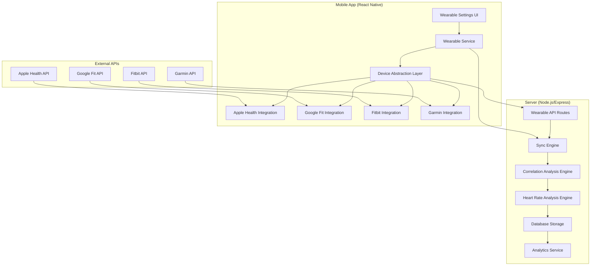
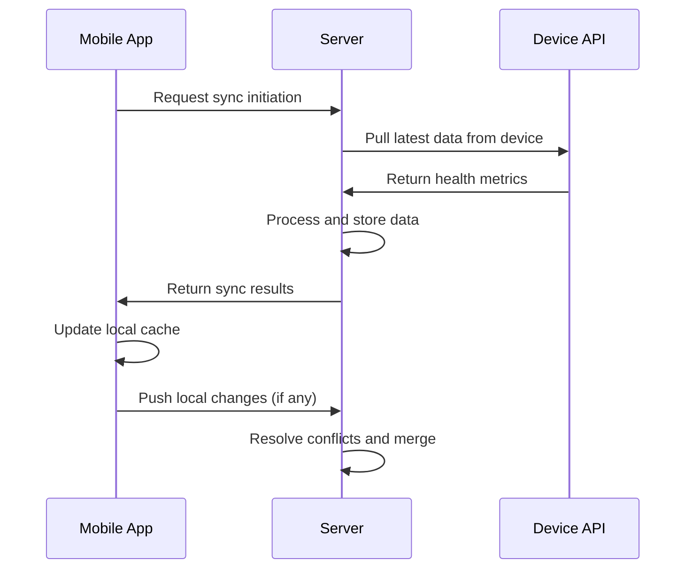
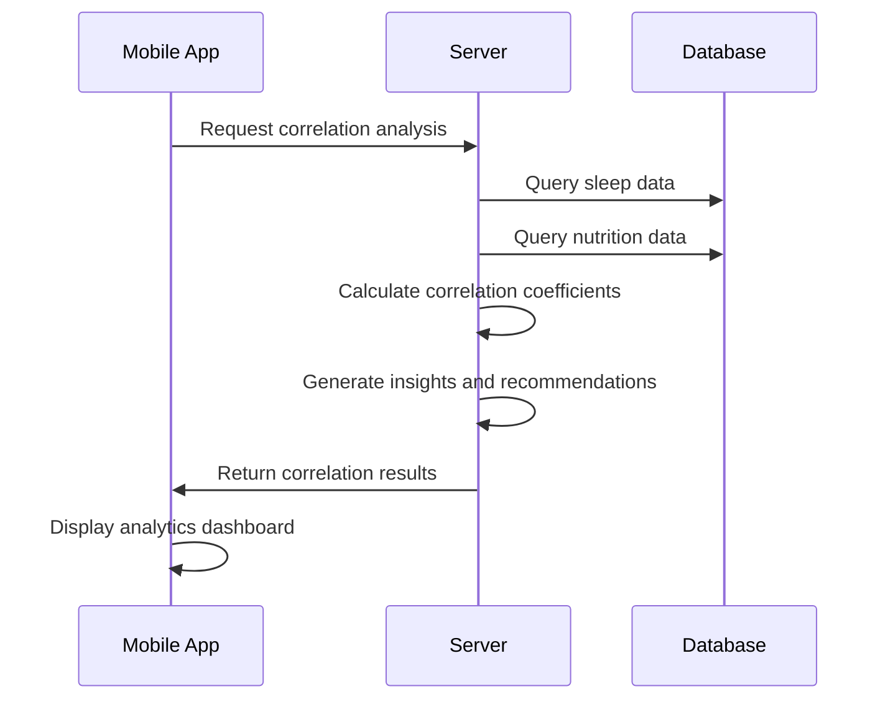

# Advanced Wearable Integration Architecture

## Overview

This document outlines the technical architecture for implementing comprehensive wearable device integration with the AI Calorie Tracker application. The solution will support two-way sync with Apple Health, Google Fit, and major fitness trackers (Apple Watch, Fitbit, Garmin) with advanced correlation analysis capabilities.

## System Architecture

### High-Level Architecture



## Database Schema Design

### Core Tables

#### 1. Wearable Devices
```sql
CREATE TABLE wearable_devices (
    id INT PRIMARY KEY AUTO_INCREMENT,
    user_id INT NOT NULL,
    device_type ENUM('apple_health', 'google_fit', 'fitbit', 'garmin', 'apple_watch') NOT NULL,
    device_name VARCHAR(100) NOT NULL,
    device_id VARCHAR(255) UNIQUE,
    is_connected BOOLEAN DEFAULT TRUE,
    last_sync_at TIMESTAMP,
    sync_frequency_minutes INT DEFAULT 60,
    is_two_way_sync BOOLEAN DEFAULT TRUE,
    auth_token_encrypted TEXT,
    refresh_token_encrypted TEXT,
    created_at TIMESTAMP DEFAULT CURRENT_TIMESTAMP,
    updated_at TIMESTAMP DEFAULT CURRENT_TIMESTAMP ON UPDATE CURRENT_TIMESTAMP,
    FOREIGN KEY (user_id) REFERENCES users(id)
);
```

#### 2. Health Metrics
```sql
CREATE TABLE health_metrics (
    id INT PRIMARY KEY AUTO_INCREMENT,
    user_id INT NOT NULL,
    device_id INT,
    metric_type ENUM(
        'steps', 'distance', 'calories_burned', 'heart_rate', 
        'sleep_duration', 'sleep_quality', 'activity_minutes',
        'resting_heart_rate', 'blood_pressure', 'weight',
        'body_fat', 'water_intake', 'workout_duration'
    ) NOT NULL,
    value DECIMAL(10,2) NOT NULL,
    unit VARCHAR(20) NOT NULL,
    source_timestamp TIMESTAMP NOT NULL,
    recorded_at TIMESTAMP DEFAULT CURRENT_TIMESTAMP,
    confidence_score DECIMAL(3,2),
    metadata JSON,
    FOREIGN KEY (user_id) REFERENCES users(id),
    FOREIGN KEY (device_id) REFERENCES wearable_devices(id)
);
```

#### 3. Sync Logs
```sql
CREATE TABLE sync_logs (
    id INT PRIMARY KEY AUTO_INCREMENT,
    user_id INT NOT NULL,
    device_id INT,
    sync_type ENUM('pull', 'push', 'two_way') NOT NULL,
    status ENUM('success', 'failed', 'partial', 'conflict') NOT NULL,
    records_processed INT DEFAULT 0,
    records_added INT DEFAULT 0,
    records_updated INT DEFAULT 0,
    records_failed INT DEFAULT 0,
    error_message TEXT,
    started_at TIMESTAMP DEFAULT CURRENT_TIMESTAMP,
    completed_at TIMESTAMP,
    duration_seconds INT,
    metadata JSON,
    FOREIGN KEY (user_id) REFERENCES users(id),
    FOREIGN KEY (device_id) REFERENCES wearable_devices(id)
);
```

#### 4. Correlation Analysis
```sql
CREATE TABLE correlation_analysis (
    id INT PRIMARY KEY AUTO_INCREMENT,
    user_id INT NOT NULL,
    correlation_type ENUM('sleep_nutrition', 'heart_rate_nutrition', 'activity_nutrition') NOT NULL,
    analysis_date DATE NOT NULL,
    correlation_score DECIMAL(3,2),
    confidence_level DECIMAL(3,2),
    insights JSON,
    recommendations JSON,
    created_at TIMESTAMP DEFAULT CURRENT_TIMESTAMP,
    FOREIGN KEY (user_id) REFERENCES users(id)
);
```

## Mobile App Architecture

### 1. Wearable Service Layer

```typescript
// mobile/src/services/wearableService.ts
export class WearableService {
  private deviceManager: DeviceManager;
  private syncEngine: SyncEngine;
  private correlationEngine: CorrelationEngine;
  
  constructor() {
    this.deviceManager = new DeviceManager();
    this.syncEngine = new SyncEngine();
    this.correlationEngine = new CorrelationEngine();
  }
  
  async connectDevice(deviceType: DeviceType, authData: AuthData): Promise<Device>;
  async disconnectDevice(deviceId: string): Promise<void>;
  async getConnectedDevices(): Promise<Device[]>;
  async syncData(deviceId: string, direction: 'pull' | 'push' | 'both'): Promise<SyncResult>;
  async getHealthMetrics(params: MetricQuery): Promise<HealthMetric[]>;
  async getCorrelationAnalysis(type: CorrelationType): Promise<CorrelationResult>;
}
```

### 2. Device Abstraction Layer

```typescript
// mobile/src/services/DeviceManager.ts
export abstract class BaseDevice {
  abstract deviceType: DeviceType;
  abstract isConnected: boolean;
  
  abstract connect(authData: AuthData): Promise<boolean>;
  abstract disconnect(): Promise<void>;
  abstract pullData(dateRange: DateRange): Promise<HealthMetric[]>;
  abstract pushData(metrics: HealthMetric[]): Promise<boolean>;
  abstract getCapabilities(): DeviceCapabilities;
}

export class AppleHealthDevice extends BaseDevice {
  // Apple Health specific implementation
}

export class GoogleFitDevice extends BaseDevice {
  // Google Fit specific implementation
}

export class FitbitDevice extends Base Device {
  // Fitbit specific implementation
}

export class GarminDevice extends BaseDevice {
  // Garmin specific implementation
}
```

### 3. Sync Engine

```typescript
// mobile/src/services/SyncEngine.ts
export class SyncEngine {
  async syncDevice(deviceId: string, direction: SyncDirection): Promise<SyncResult> {
    const device = this.deviceManager.getDevice(deviceId);
    const syncLog = await this.createSyncLog(deviceId, direction);
    
    try {
      const result = await this.performSync(device, direction);
      await this.updateSyncLog(syncLog.id, result);
      return result;
    } catch (error) {
      await this.updateSyncLog(syncLog.id, { status: 'failed', error: error.message });
      throw error;
    }
  }
  
  private async performSync(device: BaseDevice, direction: SyncDirection): Promise<SyncResult> {
    // Conflict resolution and data merging logic
  }
}
```

## Server Architecture

### 1. API Routes

```typescript
// server/src/routes/user/wearables.ts
export class WearableRoutes {
  // Device Management
  POST /api/user/wearables/connect
  DELETE /api/user/wearables/:deviceId/disconnect
  GET /api/user/wearables
  PUT /api/user/wearables/:device/settings
  
  // Data Sync
  POST /api/user/wearables/:device/sync
  GET /api/user/wearables/:device/sync-logs
  POST /api/user/wearables/:device/force-sync
  
  // Analytics
  GET /api/user/wearables/correlation/:type
  GET /api/user/wearables/insights
  GET /api/user/wearables/health-metrics
  
  // Settings
  GET /api/user/wearables/settings
  PUT /api/user/wearables/settings
}
```

### 2. Sync Engine (Server)

```typescript
// server/src/services/SyncEngine.ts
export class SyncEngine {
  async processSync(userId: number, deviceId: number, direction: SyncDirection): Promise<SyncResult> {
    const device = await this.getDevice(deviceId);
    const syncLog = await this.createSyncLog(userId, deviceId, direction);
    
    try {
      const result = await this.executeSync(device, direction);
      await this.analyzeCorrelations(userId);
      await this.updateSyncLog(syncLog.id, result);
      return result;
    } catch (error) {
      await this.handleSyncError(syncLog.id, error);
      throw error;
    }
  }
  
  private async executeSync(device: WearableDevice, direction: SyncDirection): Promise<SyncResult> {
    // Server-side sync logic with conflict resolution
  }
}
```

### 3. Correlation Analysis Engine

```typescript
// server/src/services/CorrelationEngine.ts
export class CorrelationEngine {
  async analyzeSleepNutritionCorrelation(userId: number, dateRange: DateRange): Promise<CorrelationResult> {
    const sleepData = await this.getSleepData(userId, dateRange);
    const nutritionData = await this.getNutritionData(userId, dateRange);
    
    const correlation = this.calculateCorrelation(sleepData, nutritionData);
    const insights = this.generateInsights(correlation);
    const recommendations = this.generateRecommendations(insights);
    
    return {
      correlation_score: correlation.score,
      confidence_level: correlation.confidence,
      insights,
      recommendations
    };
  }
  
  async analyzeHeartRateNutritionCorrelation(userId: number, dateRange: DateRange): Promise<CorrelationResult> {
    // Heart rate and nutrition correlation analysis
  }
}
```

## Integration Implementation Details

### Apple Health Integration

```typescript
// mobile/src/integrations/AppleHealthIntegration.ts
import HealthKit from 'react-native-health';

export class AppleHealthIntegration {
  private healthKit: HealthKit;
  
  constructor() {
    this.healthKit = new HealthKit({
      permissions: {
        activity: true,
        sleepAnalysis: true,
        heartRate: true,
        workouts: true,
        nutrition: true,
      }
    });
  }
  
  async getHeartRateData(dateRange: DateRange): Promise<HeartRateData[]> {
    return new Promise((resolve, reject) => {
      this.healthKit.getHeartRateSamples(
        {
          startDate: dateRange.start,
          endDate: dateRange.end,
          ascending: true
        },
        (error, results) => {
          if (error) reject(error);
          else resolve(results);
        }
      );
    });
  }
  
  async getSleepData(dateRange: DateRange): Promise<SleepData[]> {
    // Similar implementation for sleep data
  }
}
```

### Google Fit Integration

```typescript
// mobile/src/integrations/GoogleFitIntegration.ts
import GoogleFit from 'react-native-google-fit';

export class GoogleFitIntegration {
  private googleFit: GoogleFit;
  
  constructor() {
    this.googleFit = GoogleFit;
  }
  
  async authorize(): Promise<boolean> {
    return new Promise((resolve, reject) => {
      this.googleFit.authorize(
        {
          scopes: {
            activity: true,
            nutrition: true,
            body: true,
            location: true
          }
        },
        (error, result) => {
          if (error) reject(error);
          else resolve(result.success);
        }
      );
    });
  }
  
  async getDailySteps(date: Date): Promise<number> {
    // Implementation for daily steps
  }
}
```

## Data Flow Architecture

### 1. Two-Way Sync Process



### 2. Correlation Analysis Process



## Security and Privacy

### Data Encryption
- All wearable auth tokens encrypted at rest
- Health metrics encrypted in database
- Secure transmission via HTTPS
- OAuth 2.0 for third-party integrations

### Privacy Controls
- User consent for data sharing
- Granular permission settings per data type
- Data anonymization for analytics
- GDPR compliance features

## Error Handling and Resilience

### Sync Error Handling
- Automatic retry with exponential backoff
- Conflict resolution strategies
- Offline support with local caching
- Detailed sync logging for debugging

### Network Resilience
- Graceful degradation when APIs are unavailable
- Local data persistence during offline periods
- Sync queue management for failed attempts

## Performance Optimization

### Data Processing
- Batch processing for large datasets
- Incremental sync to minimize API calls
- Database indexing for fast queries
- Caching frequently accessed data

### Real-time Processing
- WebSocket connections for live updates
- Background sync processes
- Push notifications for important events

## Testing Strategy

### Unit Testing
- Device integration tests
- Sync engine tests
- Correlation algorithm tests
- Error handling tests

### Integration Testing
- End-to-end sync workflows
- Cross-platform compatibility
- API endpoint testing
- Database operation testing

### Performance Testing
- Load testing for sync operations
- Memory usage optimization
- Network latency handling
- Concurrent user testing

## Deployment and Monitoring

### Deployment Strategy
- Feature flags for gradual rollout
- Blue-green deployment for zero downtime
- Rollback procedures for critical failures
- Environment-specific configurations

### Monitoring
- Real-time sync status dashboard
- Error rate tracking and alerts
- Performance metrics collection
- User feedback integration

## Future Extensions

### Planned Features
- Support for additional wearable devices
- Advanced AI-powered insights
- Social sharing features
- Premium analytics reports

### Scalability Considerations
- Microservices architecture for scalability
- Database sharding for large datasets
- CDN integration for static assets
- Load balancing for high traffic