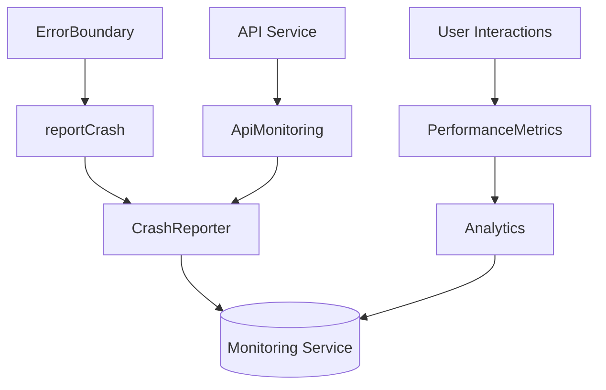

# Enhanced Monitoring System Documentation

## Overview
The monitoring system now provides comprehensive error tracking, crash reporting, and performance monitoring capabilities. Key components include:

1. **Error Boundaries** - Catch React component tree errors
2. **Crash Reporting** - Capture and report unhandled exceptions
3. **Performance Metrics** - Track API calls and user interactions
4. **Analytics Events** - Log key user flows and system events

## Architecture


## Key Components

### 1. ErrorBoundary (`src/components/ErrorBoundary.tsx`)
- Catches component rendering errors
- Displays user-friendly error UI
- Reports crashes to monitoring service

### 2. Monitoring Module (`src/utils/monitoring.ts`)
#### Crash Reporting
- `reportCrash(error, context)` - Reports errors with context
- Integrates with crash reporting services (Sentry/Crashlytics)

#### API Monitoring
- Tracks all API request/response cycles
- Measures request durations
- Logs API errors with full context

#### Performance Tracking
- `PerformanceMetrics.startTrace(name)` - Times operations
- `measureInteraction(name, operation)` - Wraps async operations

#### Analytics
- `logEvent(name, properties)` - Tracks custom events

## Implementation Details

### Error Boundary Usage
Wrap your app root with the ErrorBoundary:
```tsx
<ErrorBoundary>
  <App />
</ErrorBoundary>
```

### API Monitoring
All API calls are automatically tracked through the ApiService wrapper:
```ts
ApiMonitoring.trackRequest('/api/user', 'GET');
ApiMonitoring.trackResponse('/api/user', 'GET', 200, 150);
ApiMonitoring.trackError('/api/user', 'GET', error, 200);
```

### Performance Measurement
Time critical operations:
```ts
const trace = PerformanceMetrics.startTrace('login_flow');
// ... perform operations ...
trace.end();
```

Or wrap async operations:
```ts
const user = await PerformanceMetrics.measureInteraction(
  'load_user_data',
  () => fetchUser()
);
```

## Crash Reporting
Manual error reporting:
```ts
try {
  riskyOperation();
} catch (error) {
  reportCrash(error, { context: 'risky_operation' });
}
```

## Configuration
Set in `src/config.ts`:
```ts
export const ENABLE_LOGGING = __DEV__; // Disable in production
```

## Viewing Reports
- Development: Logs to console
- Production: Integrates with monitoring services