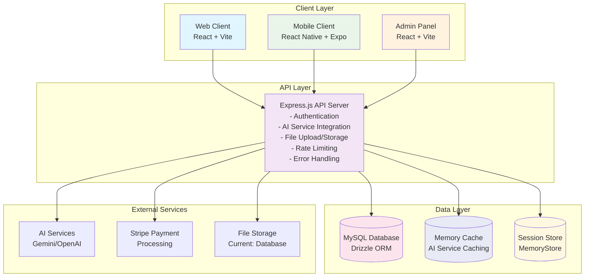
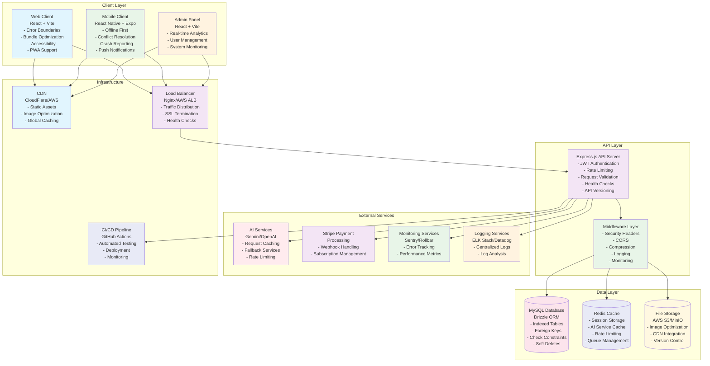
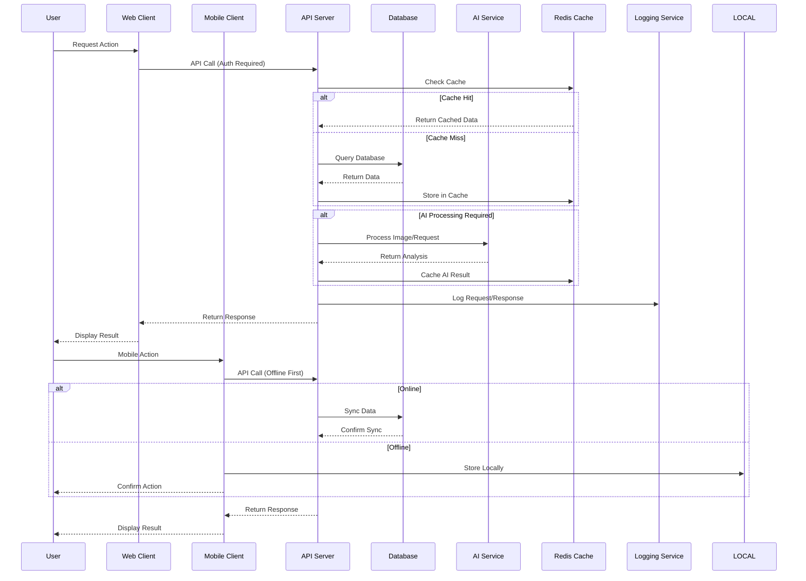
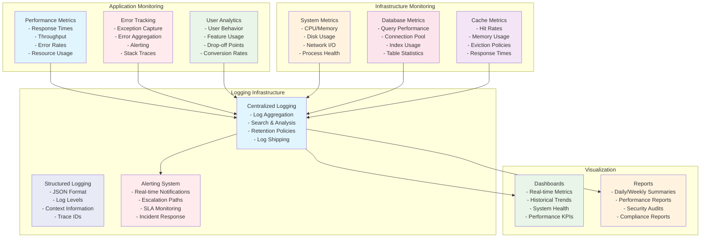
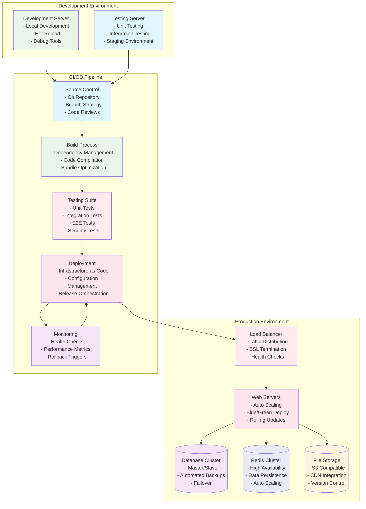
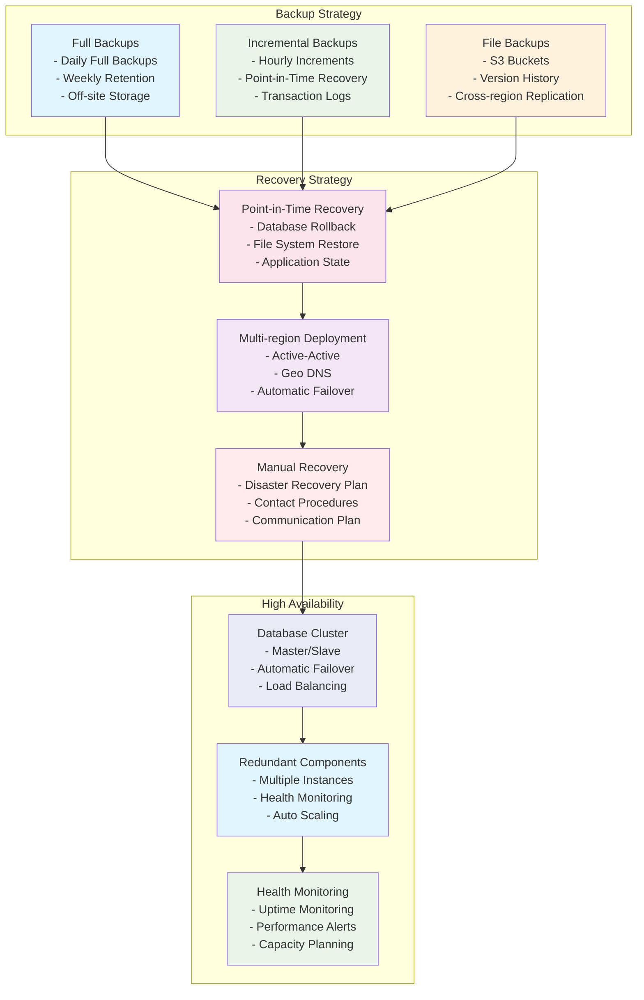

# AICalorieTracker System Architecture Diagram

## Current System Architecture

## Planned System Architecture

## Data Flow Architecture

## Security Architecture

```mermaid
graph TB
    subgraph "Security Layer"
        AUTH[Authentication<br/>- JWT Tokens<br/>- Session Management<br/>- Password Hashing]
        AUTHZ[Authorization<br/>- Role-Based Access<br/>- Resource Permissions<br/>- Admin Controls]
        VALID[Input Validation<br/>- Zod Schema<br/>- Sanitization<br/>- SQL Injection Protection]
        RATE[Rate Limiting<br/>- Auth Endpoints<br/>- API Endpoints<br/>- AI Service Calls]
        HEAD[Security Headers<br/>- CSP<br/>- CORS<br/>- HSTS<br/>- X-Frame-Options]
    end

    subgraph "Data Protection"
        ENC[Encryption<br/>- Data at Rest<br/>- Data in Transit<br/>- Session Encryption]
        SECURE[Secure Storage<br/>- Environment Variables<br/>- Secrets Management<br/>- Key Rotation]
    end

    subgraph "Network Security"
        FIREWALL[Firewall Rules<br/>- Port Restrictions<br/>- IP Whitelisting<br/>- DDoS Protection]
        SSL[SSL/TLS<br/>- Certificate Management<br/>- HSTS<br/>- Perfect Forward Secrecy]
    end

    subgraph "Mobile Security"
        PIN[Certificate Pinning<br/>- SSL Pinning<br/>- Root Certificate Trust]
        SECURE_STORE[Secure Storage<br/>- Keychain/Keystore<br/>- Biometric Authentication]
    end

    AUTH --> AUTHZ
    AUTHZ --> VALID
    VALID --> RATE
    RATE --> HEAD
    HEAD --> ENC
    ENC --> SECURE
    SECURE --> FIREWALL
    FIREWALL --> SSL
    SSL --> PIN
    PIN --> SECURE_STORE

    style AUTH fill:#ffebee
    style AUTHZ fill:#fce4ec
    style VALID fill:#f3e5f5
    style RATE fill:#e8eaf6
    style HEAD fill:#e1f5fe
    style ENC fill:#e8f5e8
    style SECURE fill:#fff3e0
    style FIREWALL fill:#ffebee
    style SSL fill:#fce4ec
    style PIN fill:#f3e5f5
    style SECURE_STORE fill:#e8eaf6
```

## Monitoring and Observability Architecture

## Deployment Architecture

## Disaster Recovery Architecture

This comprehensive architecture diagram shows the current state and planned improvements for the AICalorieTracker system. The diagrams illustrate the multi-layered approach to security, performance, reliability, and scalability that will be implemented throughout the system audit process.