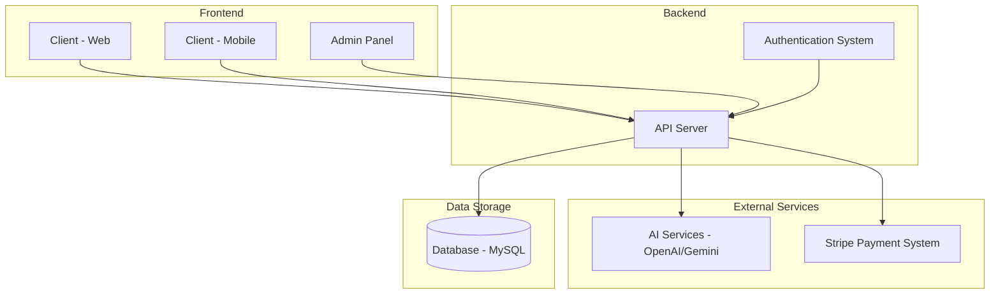

# AICalorieTracker System Architecture Analysis

## Overview
The AICalorieTracker is a multi-platform application consisting of:
1. Web client (React/Vite)
2. Mobile application (React Native/Expo)
3. Server API (Node.js/Express)
4. Database (MySQL with Drizzle ORM)
5. AI services (OpenAI/Gemini)

## System Architecture Diagram

## Component Analysis

### 1. Web Client (client/)
- Built with React and Vite
- Uses Tailwind CSS for styling
- Implements i18n for internationalization
- Uses React Query for data fetching
- Authentication handled through context providers

### 2. Mobile Application (mobile/)
- Built with React Native and Expo
- Uses React Navigation for routing
- Implements offline capabilities
- Uses SecureStore for sensitive data storage
- Has comprehensive error handling

### 3. Server API (server/)
- Built with Express.js
- Uses Drizzle ORM for database operations
- Implements session-based authentication
- Integrates with Stripe for payments
- Connects to AI services for food analysis

### 4. Database
- MySQL database
- Managed with Drizzle ORM
- Contains tables for users, meal analyses, weekly stats, and more
- Uses migrations for schema updates

### 5. AI Services
- Supports both OpenAI and Google Gemini
- Used for food image analysis
- Configurable through admin panel

## Identified Structural Issues

1. **Inconsistent Storage Implementation**: The system uses both a memory-based storage implementation for development and a database-based implementation for production. This could lead to inconsistencies between environments.

2. **Missing Error Handling in Critical Paths**: Some API endpoints lack proper error handling, which could lead to unhandled exceptions.

3. **Potential Performance Bottlenecks**: The meal analysis endpoints directly call AI services without any caching mechanism, which could lead to performance issues under load.

4. **Security Concerns**: API keys and sensitive configuration are stored in environment variables but may not be properly secured in all environments.

5. **Incomplete Admin Functionality**: Some admin routes have TODO comments indicating incomplete implementation.

## Recommendations

1. Implement a unified storage interface that works consistently across environments
2. Add comprehensive error handling to all API endpoints
3. Implement caching for AI analysis results to improve performance
4. Review and strengthen security measures for sensitive data
5. Complete the implementation of admin functionality